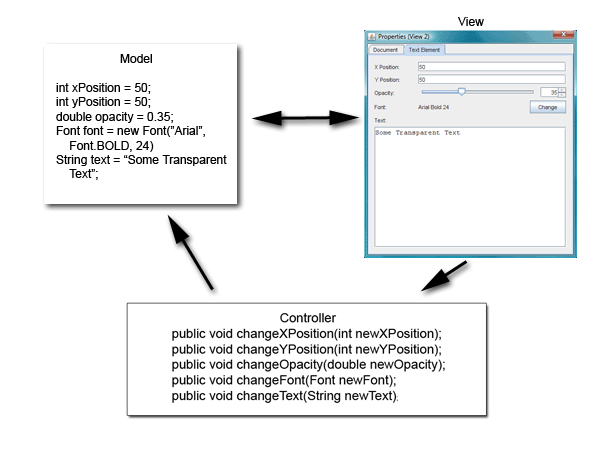
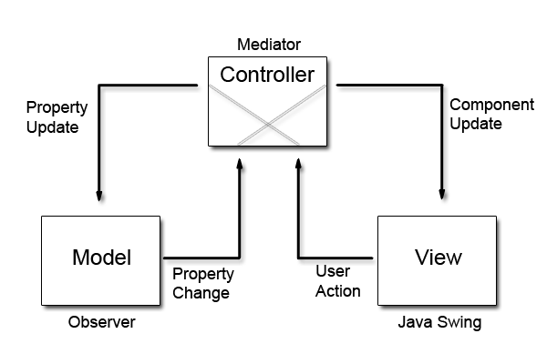

# Model-View-Controller (MVC)

[https://www.oracle.com/technical-resources/articles/javase/application-design-with-mvc.html](https://www.oracle.com/technical-resources/articles/javase/application-design-with-mvc.html)

Introducido por *Trygve Reenskaug* en 1979, y ayuda a desacoplar el acceso a la información y lógica de negocio de la forma en la cual será mostrada al usuario.

Tiene 3 elementos:

* **Model** - modelo representa la información y las reglas que accede y actualiza la información. En empresas grandes, un modelo sirve como una aproximación del software a procesos reales.

* **View** - vistas muestran el contenido de un modelo. Especifica exáctamente cómo la información del modelo debe ser representada. Si el modelo cambia, la vista debe actualizarse como se requiera. Utilizando *push model* la cual registra las vistas en si con el modelo para notificar cambios o *pull model*, la cual es responsable para llamar el modelo cuando este se necesita recibir información más actualizada.

* **Controller** - el controlador traduce interacciones del usuario con la vista en acciones que el modelo realizará. En una GUI cliente única, las interacciones de usuarios podrían ser botones, seleccions de menú, por otro lado, en aplicaciones empresariales, aparecen peticiones HTTP *GET* y *POST*. Dependiendo del contexto, un controlador puede también selecionar una nueva vista (como los resultados de páginas web) para representarlas hacia el usuario.


## Interacción entre componentes MVC

Una vez que el modelo, view y controlador son instanciados, ocurre lo siguiente:

La vista registra como un escucha al modelo, cualquier cambio de la información relacionada con el modelo inmediatamente resulta en una notificación de cambio que es recibido en la vista (ejemplo de modelo push). Notar que el modelo no es consciente de la vista o el controlador, simplemente emite notificaciones de cambios para todos los listeners interesados.

El controlador está atado a la vista, típicamente a acciones de usuarios en las vistas que invocan un método escucha registrado en la clase del controler.
El controller entrega una referencia al modelo adyacente. Una vez que interactúa con la vista, ocurre lo siguiente:

La vista reconoce la acción GUI, por ejemplo al pulsar un boton o arrastrar la barra de desplazamiento, ocurre usando un método listener que está registrado para ser llamado cuando una acción ocurre.

La vista llama al método apropiado en el controlador. El controlador accede al modelo, posiblemente actualizando de forma apropiada la acción del usuario.

Si el modelo se altera, se notifica a los escuchadores, como la vista, del cambio.


En algunas arquitecturas, el controlador puede también ser responsable para actualizar la vista. Esto es común en aplicaciones de tecnologías basadas en Java.





## Diseño más moderno MVC

Con un enfoque más moderno el MVC, ubica el controlador entre modelo y la vista.




La principal diferencia entre el diseño tradicional, es que las notificaciones de cambio de estado en objetos modelos son comunicados a la vista por medio del controlador.

Incluso, el controlador regula el flujo de información entre el objetos modelo y objetos vista en ambas direcciones.

Objetos vistas utiliza siempre las traducciones del controlador de acciones del usuario para actualizar el modelo. Y los cambios del modelo son comunicados a objetos vistas através de un objeto del controlador.

Cuando son incializados los tres componentes, la vistas y el modelo son registrados en el controlador.

Los usuarios interactuan con la vista, los eventos son similares:

La vista reconoce que se ha producido una acción de la GUI, por ejemplo, pulsar un botón o arrastrar una barra de desplazamiento, utilizando un método de escucha que está registrado para ser llamado cuando se produzca dicha acción.
La vista llama al método apropiado en el controlador.
El controlador accede al modelo, posiblemente actualizándolo de una manera adecuada a la acción del usuario.
Si el modelo ha sido alterado, notifica el cambio a los oyentes interesados. Sin embargo, en este caso, el cambio se envía al controlador.

¿Por qué adoptar este diseño? El uso de este MVC modificado ayuda a desacoplar más completamente el modelo de la vista. En este caso, el controlador puede dictar las propiedades del modelo que espera encontrar en uno o más modelos registrados con el controlador. Además, también puede proporcionar los métodos que efectúan los cambios de propiedad del modelo para una o más vistas registradas con él.


# Ejemplo MVC

En la construcción del modelo, vista, estos deben tener conocimiento del controlador, y el controlador debe conocer la vista y el modelo para poder que exista interacción entre ambos lados.

Por cada cambio en alguno de los extremos (vista o modelo) es por medio del controlador quien integra los cambios en cada unas de las partes.

Vista
```java
public class Vista {
	
	static Controller controller;

	public Vista(Controller con) {
		controller = con;
	}
	
	public void setMensaje(String str) {
		controller.setFrase(str);
	}
	public String getMensaje() {
		return controller.getFrase();
	}
	
	public void mostrarMensaje(String msg) {
		JOptionPane.showMessageDialog(null, msg);
	}
	
	
	public static void main(String[] args) {
		Controller con = new Controller();
		Vista vista = new Vista(con);
		

		vista.setMensaje("Mensaje 1");
		vista.mostrarMensaje(vista.getMensaje());
		
		
		vista.setMensaje("Mensaje 2");
		vista.mostrarMensaje(vista.getMensaje());
	}
}
```


Controlador
```java
public class Controller {

	Modelo modelo;
	Vista vista;
	
	public Controller() {
		modelo = new Modelo(this);
		vista = new Vista(this);
	}
	
	public void setFrase(String str) {
		modelo.setFrase(str);
	}
	
	public String getFrase() {
		return modelo.getFrase();
	}

}
```

Modelo
```java
public class Modelo {
	
	String frase = null;
	Controller controller;
	
	public Modelo(Controller con) {
		controller = con;
	}
	
	public void setFrase(String str) {
		frase = str;
	}
	
	public String getFrase() {
		return frase;
	}

}
```


