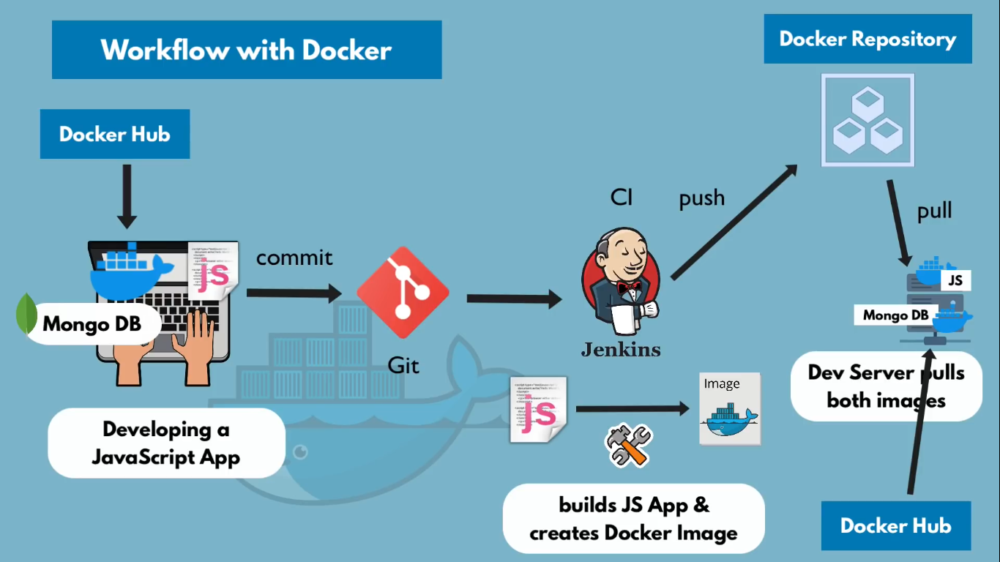
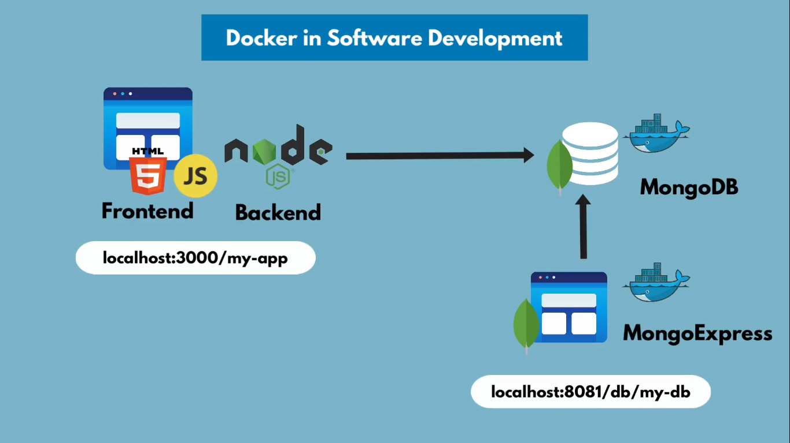

# Docker

[Docker cheatsheet](https://dockerlabs.collabnix.com/docker/cheatsheet/)
[Docker Compose cheatsheet](https://dockerlabs.collabnix.com/intermediate/docker-compose/compose-cheatsheet.html)


Plataforma abierta para desarrollo, envío y ejecución de aplicaciones. Permite separar la aplicación de la infraestructura para entregar el software rápidamente.

Docker está escrito en lenguaje [Go](https://golang.org/) y toma varias ventajas del kernel Linux para desplegar su funcionalidad. Docker usa tecnología llamada **namespaces** para proveer el espacio de trabajo aislado llamado **container**. Cuando se ejecuta un contenedor, Docker crea un grupo de *namespaces* para ese contenedor.

Los *namespaces* proveen de una capa de aislamiento, cada aspecto del contenedor se ejecuta en un *namespace* separado y su acceso está limitado a ese *namespace*. 

Pasos:
1. Se construye la app, con dependencias a usar.
2. Si la aplicación utiliza algún servicio, descargar la imagen desde Docker Hub.
3. Si la app necesita persistencia de los datos, construir *Volumes*.
4. Crear una red, esta red se debe asignar para que sea usada por el proyecto y los servicios que utilice, para que exista comunicación entre las imágenes dentro del contenedor.
5. Crear el fichero *Docker-Compose.yml* de la app, incluir la app, las dependencias y los servicios que utilizará.
6. Construir la planilla de la app, el *Dockerfile.
7. Construir la imagen del proyecto, `docker build`.
8. Ejecutar el proyecto mediante `docker compose -f` usando el fichero *YAML*.

## Puntos claves de Docker

* Docker Image : es una imagen del proyecto o servicio.

* Docker Container : es el espacio en el que se almacenan uno o varias imágenes docker, este se ejecuta y levanta los servicios en las imágenes.

* Docker Volume : es una interfaz entre el sistema de ficheros virtual y el sistema de ficheros físico (host local), se utiliza para almacenar los datos del contenedor siendo replicados en el host local. Una vez reiniciado el contenedor los datos son replicados desde el host local hacia el contenedor.

* Docker Network : permite crear, eliminar, conectar, desconectar, listar redes de contenedores.

* Docker Compose : es una herramienta para ejecutar un o múltiples contenedores, permite ahorrar tiempo evitando escribir comando `docker run` por cada servicio existente. Utiliza formato *YAML*, `.yml`.

* Dockerfile : fichero que permite crear imagen Docker mediante instrucciones.

* Docker build : construye una imagen Docker utilizando un fichero *Dockerfile*.

Para desplegar una aplicación desde una imagen Docker, se debe crear la imagen usando *Dockerfile*, para levantar los servicios se debe utilizar un fichero *Docker Compose* (`.yml`).


# Plataforma Docker

Docker provee la habilidad de empaquetar y ejecutar una aplicación en un entorno aislado llamado **container**. La aislación y se seguridad permiten ejecutar varios contenedores simultáneamente en un host.

Docker tiene herramientas y una plataforma para administrar el ciclo de vida de los contenedores:
* Desarrollar la aplicación y soportar los componentes usando contenedores.
* El contenedor es una unidad para distribuir y probar aplicaciones.
* Una vez listo, desplegar la aplicación en entorno de producción, como un contenedor o servicio de orquestación, funciona de la misma forma en un entorno de producción o local.

La portabilidad y su peso liviano hacen que la carga de trabajo sea administrada dinámicamente, escalando y apagando aplicaciones y servicios bajo demanda.


# Qué es un contenedor

Son es un espacio sandbox que contiene un sistema aislado  del SO host, son livianos y contienen todo lo necesario para ejecutar una aplicación, todo lo que se instala se hace en el contenedor no en el host.

Se ejecuta en un entorno *namespace*, característica que tiene Linux hace mucho tiempo y Docker se aprovecha de esta.

**Capas de imágenes**, mayoritariamente son **Linux Base Image** porque son de menor tamaño, existen basadas en Windows pero su tamaño es mayor.

Cada vez que se reinicia un contenedor, todo lo que se haya configurado en ese contenedor se pierde, esa información se pierde, no es persistente.

Acá entra **Docker Volumes** que permite la persistencia de los datos, fundamental para todas las aplicaciones sobre todo para aplicaciones que usan base de datos.

Un contenedor puede:

* Ser creado, iniciado, detenido, movido o borrado usando Docker API o CLI.
* Ejecutar en local machine, máquinas virtuales o en la nube.
* Es portable.
* Está aislado de otros contenedores, conteniendo sus propios softwares, binarios, y configuraciones.

## Container Image

La imagen contiene el sistema de fichero del contenedor, es un sistema de ficheros virtual y asilado. Contiene todo lo necesario para ejecutar una aplicación (dependencias, binarios, configuraciones, scripts, etc.).

La imagen contiene otras configuraciones para el contenedor como variables de entorno, comando por defecto para ser ejecutado y otras metadatas.


# Example Docker workflow




## Diferencias entre Docker Image y Docker Container

* **Docker Image** : contiene paquete de programa, la configuración del programa (servicio), script de inicio, por ejemplo, una imagen de *postgresql* contiene el software, fichero de configuración, script de inicio del servicio y sus dependencias.
*Artefacto* que puede ser movido entre contenedores.
No se ejecuta nunca, **Docker Image no se ejecuta**.
*Docker Hub* almacena imágenes NO contenedores.

* **Docker Container** : es un entorno de ejecución para *Docker Image*. Puede contener múltiples imágenes Docker,  es acá en donde se inicia la aplicación, crea el entorno para la aplicación.
**Docker Container si se ejecuta** con todas las imágenes necesarias para arrancar la aplicación. Tiene un sistema virtual de ficheros, utiliza el puerto **5000** por  defecto.


## Container Port y Host Port

**Container Port**, múltiples contenedores pueden ser ejecutados en el mismo host usando distintos puertos, pero las *Docker Image* utilizan el mismo puerto. ¿Cómo funciona?,

Los *Container Port* para cualquier aplicación, no se pueden usar, para levantar contenedores con diferentes puertos se debe usar:

```bash
docker run -p PuertoHost:PuertoContenedor containerDocker
```

**Host Port**, estos puertos se puede usar una sola vez por servicio o aplicación. Son los puertos que utilizan las aplicaciones para enviar/recibir información.


## Orden de las capas

Las imágenes están ordenadas jerárquicamente, estando la imagen de SO Linux al principio (de abajo hacia arriba) y la última  está la imagen de aplicación.
En la capas intermedias, están las imágenes de la aplicaciones que usarán estas capas.

Las capas que se descargan son las capas nuevas, es decir, las que no están instaladas en el sistema, de igual manera, las actualizaciones de los softwares que utiliza el contenedor se descargarán, el resto no.


Es una forma de *empacar* la aplicación con *todas* las *dependencias necesarias* y *configuración*.

*Artefacto portable*, fácil de compartir, mover.

Permite un desarrollo más eficiente.

Contenedores se almacenan en un **Repositorio de contenedores**, siendo repositorios privados o públicos (DockerHub).


# Cómo mejora el desarrollo de aplicaciones

Instalación son procesos distintos en distintos sistemas operativos.
Muchos pasos que pueden producir errores.
Al tener contener contenedores, no se necesita instalar ningún servicio directamente al sistema operativo, porque contenedores son un capa aislada del sistema operativo, teniendo todos los paquetes en esa capa asilada.

Un comando para instalar la aplicación.

Permite además tener dos versiones de la misma aplicación en la misma máquina y sin conflictos.

**Distintas *Docker Image* deben estar en distintos *Docker Containers* para ser ejecutadas en el mismo sistema.**


Desarrollo de aplicaciones

Antes de los contenedores, los desarrolladores creaban *artefactos* y escribían las instrucciones para instalarlo en el servidor, luego los operadores de sistema debían interpretar las instrucciones para poder instalarlo en el servidor, configurarlo y dejar disponible la aplicación, pero ocurren errores de versiones de dependencias, errores humanos de mal interpretación de instrucciones, mal configuración, dando como resultado pérdida de tiempo y esfuerzo en levantar dicha aplicación.

Después de los contenedores, los desarrolladores y operadores de sistemas trabajan un "solo fichero" o contenedor que tiene todo lo necesario para levantar la aplicación.

No se necesita configurar ningún entorno, excepto **Docker Runtime**.

El contenedor se envía al  *Docker repository* privado y este hará el resto.


# Arquitectura Docker

Usa arquitectura *cliente-servidor*. Cliente Docker habla con el *Docker daemon* el cual se encarga de construir, ejecutar y distribuir contenedores Docker. Un cliente local o remoto ejecutarán el mismo sistema.

La comunicación se establece mediante *REST API*, sobre UNIX sockets o una interfaz de red.

Otro cliente Docker es **Docker Compose**, que permite trabajar con aplicaciones que consisten en un grupos de contenedores.


## Docker Daemon

**dockerd**, escucha peticiones Docker API y maneja objetos Docker como imágenes, contenedores, redes, y volúmenes. Se comunica con otros demonios para manejar servicios Docker.

## Docker client
**docker** es la forma principal de interacción con Docker. Al ejecutar un comando este se envía a **dockerd**. Comando **docker** usa Docker API, se puede comunicar con más de un demonio.

## Docker Desktop

Aplicación para Mac, Windows, Linux que permite construir y compartir aplicaciones en contenedores. Incluye **dockerd**, **docker**, Docker Compose, Docker Content, Kubernetes, Credential Helper.

## Docker registries

Docker *registry* almacena imágenes Docker. [Docker Hub](https://hub.docker.com/) es un registro público, Docker por defecto utiliza *Docker Hub*, se puede establecer un respositorio privado de registros.

## Docker Objects

Al usar Docker, se está creando y usando imágenes, contenedores, redes, volúmenes, plugins, y otros objetos.

### Images

Una *image* es una planilla *read-only* con instrucciones para crear un contenedor Docker.

Una imagen puede estar basada en otra imagen, con personalizaciones adicionales. Por ejemplo, una imagen está basada en CentOS y se personaliza para instalar Apache web server y se agrega la configuración, luego se construye la imagen.

Para construir una imagen se debe crear un fichero **Dockerfile** que contiene los pasos para crear una imagen. Cada instruccipon del **Dockerfile** crea una capa en la imagen. A cambiar un **Dockerfile** se debe reconstruir la imagen, cambiando las capas que se han modificado. Es lo que hace tan liviando, rápido, y pequeño a Docker comparados con otras tecnologías de virtualización.

### Containers

Un contenedor es una instancia ejecutable de una imagen. Se puede crear, iniciar, detener, mover, borrar un contenedor usando Docker API o CLI. Un contenedor se puede conectar a más de una red, adjuntar un almacenamiento o crear una nueva imagen basada en el estado actual de la imagen.

Por defecto, cada contenedor está aislado de otros contenedores y de la máquina host. Se puede controlar ese aislamiento en la red, almacenamiento y otros subsistemas adyacentes de otros contenedores o de la máquina host.

Un contenedor es definido por su imagen, como también cualquier configuración que se provea cuando se crea un contenedor.

Cuando es removido, los cambios del estado que no se almacenan en un almacenamiento persistente se pierden.


# Docker vs Virtual Machine

| Docker | Virtual Machine |
|-|-|
| A nivel de Sistema Operativo | A nivel de OS Kernel y Aplicación |
| Diferente niveles de abstracción | Poca abstracción |
| Utiliza poco espacio porque utiliza una sola capa | Usa mucho espacio, dos capas (kernel y aplicación) debe instalar un sistema nuevo. |
| Es mucho más rápido | Es mucho más lento |
| Mayor compatibilidad | Menor compatibilidad |
| Contenedores docker basados en Linux no corren en Windows | Se puede crear una máquina Linux virtual. |


Sistemas Operativos tienen dos capas.
* Kernel sistema operativo - el kernel se comunica con el hardware.
* Aplicación.


En entorno Linux, todos usan el mismo Kernel pero el entorno gráfico que usan las distros son diferentes.

Por otro lado, las máquinas virtuales usan las capas de OS kernel y Aplicación.

En versiones previas de Windows 10 y Mac versiones antiguas.


# Instalación

Se puede instalar en múltiples plataformas.


* Linux - [https://docs.docker.com/desktop/install/linux-install/](https://docs.docker.com/desktop/install/linux-install/)
* Mac - [https://docs.docker.com/desktop/install/mac-install/](https://docs.docker.com/desktop/install/mac-install/)
* Windows - [https://docs.docker.com/desktop/install/windows-install/](https://docs.docker.com/desktop/install/windows-install/)


Existen dos versiones:
* *Docker Community Edition (CE)*
* *Docker Enterprise* y sus derivados empresariales.


Si se tiene múltiples cuentas en el mismo sistema operativo, se debe cerrar *Docker* que está ejecutándose en la cuenta y cerrar sesión. Luego, se puede abrir Docker en la otra cuenta. Con esto se evita conflictos.

En Windows, debe tener la *Virtualización* habilitada y comprobar si la versión de Windows es compatible.

En Linux, buscar las instrucciones de instalación para la  distribución que se está usando.

Se debe eliminar las instalaciones antiguas de *Docker* si se instala alguna nueva.

* Actualizar el sistema (*update*) e instalar *Docker*. Se puede instalar manualmente. Consultar documentación.

* Agregar el repositorio *Docker* al sistema de gestión de paquetes.


## Requisitos

### Docker Desktop
Entorno gráfico

1. Fedora
   * Sistema 64-bits
   * Fedora 36 o Fedora 37
2. Gnome Desktop se debe instalar extensión:
   * [AppIndicator and KStatusNotifierItem Support](https://extensions.gnome.org/extension/615/appindicator-support/)
  
### Docker Engine
Sin entorno gráfico, el soporte dura por 6 meses para versión *Stable*. Cada versión de *Docker Engine* se livera una vez por año.

Actualizaciones son retrocompatibles con la versión de ese *<year>.-<mes>*.

1. Fedora
   * Sistema 64-bits
   * Fedora 36 o Fedora 37


## Instalación en Fedora

[https://docs.docker.com/engine/install/fedora/](https://docs.docker.com/engine/install/fedora/)

1. Agregar repositorio Docker

```bash
sudo dnf -y install dnf-plugins-core

sudo dnf config-manager \
    --add-repo \
    https://download.docker.com/linux/fedora/docker-ce.repo
```

2. Instalar Docker Engine

```bash
sudo dnf install docker-ce docker-ce-cli containerd.io docker-buildx-plugin docker-compose-plugin
```

Verificar llaves GPG` 060A 61C5 1B55 8A7F 742B 77AA C52F EB6B 621E 9F35`.
Se crear grupo **docker**, no agrega ningún usuario, solo el grupo por defecto.

3. Iniciar, habilitar, detener Docker

```bash
sudo systemctl start docker

sudo systemctl enable docker

sudo systemctl stop docker
```

4. Verificar correcto funcionamiento.

```bash
sudo docker run hello-world
```

Mostrará un mensaje que se ejecutó correctamente, y los pasos que realizó para hacerlo.

Para ejecutar comando **docker** sin necesidad de permisos root, se debe agregar al grupo **docker**, el usuario tendrá acceso a los comandos sin autenticación.

```bash
sudo usermod -aG docker usuarioNombre
```

Está reservado solamente para usuario **root**, debido a que existe el riesgo de un ataque [Docker daemon attack surface](https://docs.docker.com/engine/security/#docker-daemon-attack-surface), **solamente usuarios de confianza deben tener control sobre demonio Docker**.


# Docker Network

*Docker* es una capa aislada del sistema operativo y cuenta con su propia red, para poder usar las aplicaciones dentro de contenedores debemos comunicarnos con esta red.

Cada contenedor tiene su propia red creada por defecto al momento de ejecutar `docker run`.

Para que exista comunicación entre la aplicación (Python, JavaScript, Java, etc.) y el servicio comoMongoDB, MySQL o de otro tipo, se debe agregar la aplicación al fichero **docker-compose.yml** y las imágenes deben estar en la misma red.

Los clientes se conectarán al puerto de la aplicación creada, al estar dentro del mismo contenedor, podrán comunicarse con las otras imágenes de aplicaciones sin problema, están en la misma red.

*Docker* provee redes para cada imagen *Docker*, para mostrar una lista de las redes disponibles.

```bash
docker network ls
```

Para que se comuniquen las diferentes imágenes deben estar en la misma red, por lo que se debe crear una red nueva y agregar estas imágenes para que utilicen esta red.

```bash
docker network create nombreNetwork
```

Cualquier contenedor que se quiera cambiar de red debe estar detenida y se debe establecer como parámetro al momento de ejecutarse nuevamente o ser incorporado al fichero *docker-compose.yml*.

Las redes creadas se pueden especificar en cada servicio dentro del fichero *YAML*, se puede establecer la lista de redes que se usarán y enlazarla al servicio (de forma similar que se listan los volúmenes y se asignan a los servicios que los usarán). 

## En fichero Docker Compose YAML

[https://docs.docker.com/compose/networking/](https://docs.docker.com/compose/networking/)

```yaml
[...]
service:
    database1:
        ports:
            - 2000:2000
        
        networks:
            - redBackend
            
networks:        
    redBackend:
        name: "red_sql_backend"
        
```


## Usando red con `docker run`

```bash
docker run -d \
     --network nombreNetwork --network-alias mysql \
     --v todo-mysql-data:/var/lib/mysql \
     -e MYSQL_ROOT_PASSWORD=secret \
     -e MYSQL_DATABASE=todos \
     mysql:8.0
```


# Docker Compose - docker compose

[https://docs.docker.com/get-started/08_using_compose/](https://docs.docker.com/get-started/08_using_compose/)
[https://docs.docker.com/compose/](https://docs.docker.com/compose/)
[https://docs.docker.com/compose/compose-file/](https://docs.docker.com/compose/compose-file/)
[https://docs.docker.com/compose/production/](https://docs.docker.com/compose/production/)
[https://github.com/compose-spec/compose-spec/blob/master/spec.md#external-1](https://github.com/compose-spec/compose-spec/blob/master/spec.md#external-1)

**Docker Compose es una herramienta** que permite definir múltiples contenedores en una aplicación, en lugar de ejecutar un comando *docker run* por cada servicio, se puede establecer un fichero con todos los servicios, ejecutar ese fichero y levantar todos los servicios. 

Permite ejecutar múltiples servicios, los comandos ingresados por consola se pueden escribir en un fichero *YAML*, los comandos y lo escrito en el fichero de *Docker Compose.yml* tendrán los mismo efectos, pero se hará de forma automática.

Al no entregar un fichero con formato *YAML* usando `docker compose -f`, `docker compose` buscará en el directorio actual de trabajo por un archivo **docker-compose.yml** (por defecto utilizará dicho fichero con ese nombre), si no existe no podrá crear los contendores. Si existe dos ficheros *YAML* uno llamado *app.yml* y otro *docker-compose.ym* se utilizará *docker-compose.yml*. 

Comentarios en *YAML* se utiliza **#**.

**Docker Compose** crea la red para que se comuniquen los servicios o aplicaciones que se escriben en el fichero *.yml*, con nombre por defecto *myapp_default*, revisar *docker ps*, *docker log hashID* y *docker network ls*.

A diferencia de línea de comando que se debe crear y asignar para cada comando *docker run* de servicios.

Se puede utilizar varios ficheros *YAML* para tener un orden de cada servicio, `docker compose -f service1.yml -f service2.yml up -d`

**En ficheros YAML la identación es muy importante**, si falta espacios no iniciará y generará un error.

Los registros de cada servicio se mezclarán en un mismo logs al usar *Docker Compose*.

* Al escribir mal una imagen a utilizar, se utilizará la útlima imagen que se usó con éxito. **Revisar bien la escritura de las imágenes y versiones que se estén usando**.


## Examinando fichero Docker Compose

[https://docs.docker.com/compose/compose-file/#compose-file](https://docs.docker.com/compose/compose-file/#compose-file)


## Sintaxis Docker Compose

Cada línea representa un comando, pueden tener múltiples líneas dentro del grupo.
Se debe respetar los espacios.

Preparando un docker compose de un proyecto que usa una app js, mongodb y mongo express.

*fichero_docker_compose.yml*

```yaml
version: '3.9'                                                     // version de docker compose
services:
    app:
        image: node:18-alpine
        command: sh -c "yarn install && yarn run dev"
        ports:
            - 3000:3000
        working_dir: /app
        volumes:
            - volumeApp:/app/data
    mongodb:                                                 // container name - servicio 1
        image: mongoImage                                     // nombre imagen que utiliza
        ports:
            - 27017:2717                                    // puerto
        environment:
            - MONGO..._USERNAME=admin  //  variable mongodb
            - ....
        volumes:
            - volumeSQL:/data/db
    mongo-express:                                    // servicio 2
        image: mongo-express
        ports:
            - 8080:8080
        environment:
            - ME_CONFIG_MONGODB_ADMINUSERNAME=admin
            - ....
        volumes:
            - volumeSQL:/data/db
            
volumes:
    - volumeApp
    - volumeSQL
```

*comando CLI*

```bash
docker run -dp 3000:3000 -w /app -v "$(pwd):/app" --network todo-app \
    ---mount type=volume, src=volumeApp, target=/app/data
  -e MYSQL_HOST=mysql \
  -e MYSQL_USER=root \
  -e MYSQL_PASSWORD=secret \
  -e MYSQL_DB=todos \
  node:18-alpine \
  sh -c "yarn install && yarn run dev"

docker run -d --name mongodb -p 27017:27017 --mount type=volume, src=volumeSQL, target=/data/db -e MONGO-INITDB_ROOT_USERNAME=admin -e MONGO-INITDB_ROOT_PASSWORD=password --net mongo-network mongoImage

docker run -d --name mongo-express -p 8080:8080 --mount type=volume, src=volumeSQL, target=/data/db  -e ME_CONFIG_MONGODB_ADMINUSERNAME=admin -e ME_CONFIG_MONGODB-ADMINPASSWORD=password -e ME_CONFIG_MONGODB_SERVER=mongodb --net mongo-network mongo-express
```

## Run Docker Compose

Para iniciar un fichero *Docker Compose* se debe ejecutar mediante `docker compose`.

Crea una red para que se comuniquen los contenedores.

Al detener docker compose, parará todos los contenedores del *fichero.yml*, se eliminarán todas las configuraciones nuevas creadas y se eliminará la red creada por *Docker Compose*, 

```bash
docker compose -f  fichero_docker_compose.yml -p nombre-identificatorio up -d
```
Opciones:
* -f fichero.yml : se ubica el fichero.yml.
* up  : crea e inicia todos los contenedores del fichero.yml.
* start  : inicia todos los servicios del fichero .yml.
* stop  : detiene todos los contenedores del fichero.yml.
* -p nombre  : nombre que identifica al contenedor en ejecución.
* -d  : deattach.
* --build  : compilará la imagen y luego iniciará los contenedores.


## Registros Docker Compose

Para mostrar información sobre los contenedores construidos se debe utilizar.

```bash
docker compose logs [opciones] hashServicios
```
Opciones:
* -f  : stream log.
* -t  : muestra timestamps.
* servicios  : corresponde a algún nombre de servicio para revisar.


## env_file - Variable de entorno

[https://docs.docker.com/compose/compose-file/#env_file](https://docs.docker.com/compose/compose-file/#env_file)
[https://docs.docker.com/compose/environment-variables/set-environment-variables/](https://docs.docker.com/compose/environment-variables/set-environment-variables/)

`env_file` define el fichero o los ficheros que contienen las variables de entorno que se usarán

`environment:` define las variables que utilizará la aplicación dentro de un fichero *docker-compose.yml*, con riesgos de seguridad.

Ejemplo de fichero *docker-compose.yml* y uso de variables.

*docker-compose.yml* 

```yaml
env_file:
    - ./.env.nombreservicio
```

*.env.nombreservicio*

```yaml
variable1=${keyApiSetting}
variable2=${keyApiSetting}
variable3=${keyApiSetting}
```


# Docker Volume

Persistencia de la información en Docker, imprescindible para aplicaciones que necesitan almacenar, manipular, crear información.

Cada vez que un *Docker Container* se reinicia, toda la información (ficheros de configuración, nuevos ficheros creados, datos nuevos) se borrará, y se tendrá un entorno nuevo.

* Cada vez que se crea un *volumen nuevo* y este se quiera adjuntar a una aplicación, este se debe incorporar al fichero *docker-compose.yml* o usar en el comando `docker run --mount type=volume,src=<volumen>,dst=</dir/contenedor/> `.

* Al utilizar en el fichero *docker-compose.yml* se debe utilizar la etiqueta **volumes:**, se debe declarar si es creado mediante `docker volume create` o por automáticamente al momento de la creación del contenedor y esta tomará el prefijo del nombre de la aplicación, en ambos casos se guardarán en el directorio `/var/lib/docker/volumes/[hashID|Nombre]/_data/`

```yaml
volumes:
    nombreVolumen:
        external: [false|true]
```
* *external: true* - volumen creado por `docker volume create`
* *external: false* - volumen creado automáticamente por *sudo docker compose -f fichero.yml up* al momento de la creación del contenedor.


## ¿Qué es Docker Volume?
[https://docs.docker.com/storage/volumes/](https://docs.docker.com/storage/volumes/)

Es un puente entre el sistema de ficheros virtual y el sistema de ficheros físicos (host).

Una directorio físico del sistema de fichero del host es **montado** dentro del sistema de fichero virtual de *Docker*.

La información es *automáticamente replicada* en el sistema local, una vez que el contenedor se detiene borra su información, en el *Volume* se mantiene.

Una vez que se levanta el contenedor, la *información es replicada* desde el directorio del sistema de fichero físico del host (directorio local) hacia el sistema de fichero virtual del contenedor.

## Ubicación de volúmenes

* Windows : `C:\ProgramData\docker\volumes`
* Linux : `/var/lib/docker/volumes` 
* Mac : `/var/lib/docker/volumes`

Cada volumen tiene un hash identificador único.

La información queda almacenada en la ruta *hashVolume/_data*, *_data*  es un directorio que en donde  se almacenan lo datos del sistema virtual de ficheros del contenedor en el disco del host local.

En Mac, se crea un entorno virtual de almacenamiento que se ejecuta en segundo plano, esto lo hace *Docker* automáticamente y para ingresar en el se debe ejecutar el comando *screen* y la ruta del terminal virtual.

## Volumen en Dockerfile

Se puede especificar un *punto de montaje en el lado del contenedor* usando el fichero *Dockerfile* utilizando instrucción *VOLUME*.

Instrucción *Volume* recibe una ruta que se utilizará para ser montado por el contenedor.

*Dockerfile*

```yaml
[...]
VOLUME /home/data
[...]
```

Esto se usa para forzar el uso o *indicar* que la imagen necesita de un sistema de ficheros físico y se debe incluir en el comando `docker run`. 


## Creación de Container Volume
[https://docs.docker.com/compose/compose-file/compose-file-v3/#external-1](https://docs.docker.com/compose/compose-file/compose-file-v3/#external-1)

Para crear un volumen se debe usar:

```bash
docker volume create nombreVolume
```

## Montar el Volume

```bash
docker run -dp 3000:3000 --mount type=volume,src=todo-db,target=/etc/todos getting-started
```

Opción *--mount* acepta multiples parámetros (key=value) separado por coma, tiene los siguiente opciones:

* type=volume  : tipo del volumen, otros tipos, bind, tmpfs.
* src|source=nombreVolume  : declara la fuente del volumen.
* dest|target=/path/dest/containerDir  : especifica el directorio destino.
* ro  : establece el volumen a solo lectura, por defecto false (rw).


## Inspeccionar el Volume

```bash
docker volume inspect nombreVolume
```


## Tipos de Docker Volume 

Existen 3 formas de tener de *Volumes*:

1. **Host Volumes** 
Decidir en donde el sistema de fichero del host se referenciará en el sistema de ficheros virtual.

```bash
docker run -v /home/local/localData:/path/dir/virtualData
```

* -v  rutaLocalDirectorio:rutaVirtualDirectorio  :  establece la ruta de **Host Volume** y la ruta virtual del sistema de fichero.


2. **Anonymous Volumes** 
Crear un *volume* que haga referencia al directorio del sistema virtual de ficheros.

Es un directorio con nombre *hash aleatorio*.

En esta opción, *Docker* se encarga de generar un directorio cuando se monta el contenedor, este volumen se llama **volúmenes anónimos**.

No se tiene referencia hacia el volumen generado automáticamente por *Docker*.

Una ruta del volumen en el host local sería */var/lib/docker/volumes/random-hash/_data* y solamente se necesita establecer la ruta del directorio del sistema de fichero virtual.

```bash
docker run -v /path/dir/virtualData
```

3. **Named Volumes**
Es una versión mejorada de *Anonymous Volumes*, en esta se especifica el nombre del directorio del sistema de fichero del host (físico).

Es un directorio con *nombre*.

En este se hace referencia al volumen físico por su nombre.

Por ejemplo, la ruta local es */var/lib/docker/volumes/random-hash/_data*, se entrega el nombre del volumen y la ruta del sistema virtual de fichero.

```bash
docker run  -v name:/path/dir/virtualData
```


## Docker Volumes en fichero docker-compose.yml

Dentro de cada servicio, se agrega el tag **volumes** y en este se agrega el tipo de *Docker Volume* utilizado.

Tag **volume** fuera de un servicio dentro de tag **service** se utiliza para listar y enlazar los volúmenes entre los servicios que lo utilizan, más de un servicio puede usar el mismo volumen.

Por ejemplo, usando **Named Volume**:

* *fichero-docker-compose.yml*

```yaml
version: '3.9'
services:
    mongodb:
        image: mongoImage
        ports:
            - 27017:2717
            
        volumes:
            - db-data:/data/db
    
    postgresql1:
        image: postrgresImage
        ports:
            - 5432:5432
           
        volumes:
            - db-postgresql:/var/lib/postgresql/data
            
    postgresql2:
        image: postrgresImage
        ports:
            - 5433:5432
           
        volumes:
            - db-postgresql:/var/lib/postgresql/data

volumes:
    db-data
        external: true
    db-postgresql
        external: false
```

* *db-data* es el nombre del volumen del equipo host (sistema de fichero físico) y este volumen se creó usando `docker volume create`, */var/lib/mysql/data* es la ruta del fichero dentro del sistema de ficheros virtual del contenedor.
* * db-postgresql* el volumen se creó automáticamente para el contenedor al momento de la construcción usando *docker compose -f fichero.yml up -d*.

Si se tiene múltiples *services*, después se agrega *volumes* con la lista de todos los nombres o rutas de los volúmenes del sistema de ficheros físicos y dentro de cara servicio se especifica cada volumen que usa y la ruta del sistema de fichero virtual que cada uno utilizará.

Se puede utilizar un mismo volumen en varios servicios, pudiendo compartir la información entre diferentes servicios.


# Dockerfile

[https://docs.docker.com/engine/reference/builder/](https://docs.docker.com/engine/reference/builder/)

[https://docs.docker.com/build/building/packaging/](https://docs.docker.com/build/building/packaging/)

Para empaquetar el proyecto debemos crear una imagen del proyecto, crear un **Dockerfile**.

**Dockerfile** es una planilla de instrucciones que permiten construir Docker Image.

Esta se escribe mediante *instrucciones* y estas representan comandos que se usarán para realizar las tareas indicadas.

Estas instrucciones se escriben con mayúsculas y los argumentos pueden escribir en texto plano, entre comillas, un array de comandos entre comillas.
Los strings deben ir entre comillas simples.

Se debe de cuidar de la identación para evitar errores al momento de compilar.

No se pueden repetir instrucciones.

**El fichero se debe llamar `Dockerfile`**, para cada *Docker Image* debe tener su **Dockerfile**. 

Ante cualquier cambio eventual en la aplicación, se debe sobre-escribir la planilla y re-generar la imagen.

**Si al momento de re-construir la imagen no se actualizan los datos utilizar `docker-compose build --no-cache -t tagname:version -f Dockerfile .`, con esto se forzará a la construcción sin usar el cache. **


## Sintaxis

```yaml
# comentario
INSTRUCCION argumentos argumento \
    argumentoOtro

```

Se puede escribir múltiples líneas de argumentos usando carácter escape `\`.

## Instrucciones de Dockerfile

[https://docs.docker.com/build/building/packaging/#dockerfile](https://docs.docker.com/build/building/packaging/#dockerfile)
[https://docs.docker.com/engine/reference/builder/](https://docs.docker.com/engine/reference/builder/)

*Dockerfile* contiene las instrucciones para crear una *Docker Image* de la aplicación.

Las instrucciones más utilizadas:

| Instrucciones | Description | Uso |
|-|-|-|
| FROM <image> | define la imagen base. | FROM imagen:version|
| RUN <comand> | ejecuta cualquier comando en la nueva capa al inicio de la imagen actual y realiza confirma el resultado. También se puede ejecutar comandos. | RUN  touch fichero.txt && mkdir directorio |
| WORKDIR <directory> | establece el directorio de trabajo para cualquier instrucción `RUN`, `CMD`, `ENTRYPOINT`, `COPY`, y `ADD` en el Dockerfile. | WORKDIR /ruta/dir|
| ADD <src> <dst> | copia nuevos ficheros y los agrega al contenedor, acepta wildcards Linux  | ADD *.py /home/app |
| ENTRYPOINT ["executable", "param1", "param2"] | permite configurar el contenedor que actuará como ejecutable, pudiendo ser un fichero bash o un comando, el fichero Linux debe terminar en *exec "$@"*  | ENTRYPOINT ["bash", "migrate_db.sh"] |
| ENV key="value" | establece entorno de variables mediante key=value. | ENV NAME="valor" |
| ARG <variable> | define variables que usuario puede entregar al momento de construir la imagen usando `docker build`, puede ser usado en $nombreARG del mismo nombre de una `ENV`. | ARG valorVariable |
| EXPOSE <port>/<tcp/udp> | especifica puertos de escucha de contenedor. | EXPOSE 8000/tcp |
| LABEL <key>=<value> | agrega metadata a la imagen. | LABEL description="un contenedor" |
| USER <user|UID>:<group|GID> | establece nombre de usuario o UID y opcionalmente grupo de usuario o GID que se usará por defecto en el estado actual. | USER usuario:grupo |
| VOLUME ["/path/dir"] | crea un punto de montaje en el contenedor. | VOLUME /directorio |
| ONBUILD <instrucciones> | agrega a la imagen instrucciones para ser ejecutadas al momento que otra imagen utiliza esta imagen, se ejecutan después de `FROM`. | ONBUILD ADD . /app/src |
| COPY <src> <dest> | copia los ficheros nuevos o directorios desde <src> y los agrega al sistema de fichero del contenedor en ruta <dest>. | COPY /path/dirLocal  /path/dirContenedor |
| SHELL ["comando", "param"] | permite usar shell por defecto. | SHELL ["/bin/bash", "-c"] |
| CMD <command> | permite definir el programa por defecto que se ejecutará cuando se inicie el contenedor basado en la imagen. Cada Dockerfile tiene un solo `CMD`. ["param1", "param2", ...]|


###  ENV y seguridad

* [https://stackoverflow.com/questions/22651647/docker-and-securing-passwords/22652670#22652670](https://stackoverflow.com/questions/22651647/docker-and-securing-passwords/22652670#22652670)

* [https://docs.docker.com/engine/reference/commandline/run/#/set-environment-variables-e-env-env-file](https://docs.docker.com/engine/reference/commandline/run/#/set-environment-variables-e-env-env-file)

`ENV`, en *Dockerfile* permite la construcción de una imagen con variables de entorno, pero si estas variables contienen información sensible como contraseñas, key, usuarios, entre otros, es un riesgo más aún si esta imagen se comparte públicamente.

**NO usar `ENV` con información sensible.**

Para ello, evitar poner estas variables y construir la imagen sin ellas.

Al momento de construir el contenedor usando `docker compose` utilizar un fichero privado `.env` que tendrá la información sensible o utilizar `docker run --env_file ficheroEnv imagen` o `docker run -e VAR1=VALOR1 -e VAR2=VALOR2 imagen`

```bash
$ docker run -e MYVAR1 --env MYVAR2=foo --env-file ./env.list ubuntu bash
VAR1=value1
VAR2=value2
```


## Creando un fichero Dockerfile

Se debe escribir mediante uso de *instrucciones*.

---

[https://docs.docker.com/engine/reference/builder/#dockerignore-file](https://docs.docker.com/engine/reference/builder/#dockerignore-file)

`.dockerignore`, fichero en la raíz del directorio del contexto, si existe, CLI modifica el contexto para excluir ficheros y directorios que coincidan con el patrón, previniendo el envío de ficheros grandes o con contenido sensible usando instrucciones `ADD` o `COPY`.

*Ejemplo `.dockerignore`*

```yaml
# commentario
*/temp*
*/*/temp*
temp?
```

| Regla | Comportamiento |
|-|-|
| # commentario | comentario, esto se ignora. |
| */temp* | excluye ficheros que inicien con *temp* y subdirectorios. |
| */*/temp* | excluye ficheros en cualquier en dos niveles de subdirectorio de la raíz de trabajo. | 
| temp? | excluye ficheros en directorio raíz con uno o más carateres *temp*, ejemplo, */tempa*, */tempb*. |


`docker compose build ` ignorará todo el contenido que coincida con el fichero `.gitignore`.

---

Para el caso de las variables de entorno estas se deben escribir sin entre comillas, deben estar tanto en el fichero *Dockerfile* como en el fichero *docker-compose.yaml*.

Ejemplo de una aplicación que use JavaScript, MongoDB, MongoExpress, se establece variable de entorno para la base de datos, se crea directorio de trabajo, se copia los archivos del directorio actual de desarrollo hacia el contenedor y finalmente se ejecuta el servidor *node*.

*Ejemplo de fichero Dockerfile*

```yaml
FROM node:13-alpine

RUN mkdir /home/app && touch testFile.txt

COPY ./app /home/app

CMD ["node", "server.js"]
```


El comando *copy current app folder files* es equivalente a *./app* (este directorio), por lo que, sería en comando Linux: *cp ./app /home/app*.  Por lo tanto, copia desde el equipo local hacia el directorio puesto en la planilla.


CMD = entrypoint command, solo puede ejecutar un solo comando a la vez, marca el fichero Docker para ejecutar el comando.


## Creando un Docker Image

Este paso lo hace un sistema Integración Continua como *Jenkins*, pero se puede hacer manualmente.

Capas de Docker Image de la aplicación JS.

```yaml
- app:1.0
- node:13-alpine      // FROM node:13-alpine
- alpine:3.10             // FROM alpine:3.10
```

Ahora que tenemos el fichero **Dockerfile** podemos construir el *Docker Image* mediante comandos:

```bash
docker build -t myApp-js:1.0 -f  /path/Dockerfile .
```

Cada vez que se modifique **Dockerfile** se debe re-construir la imagen Docker.


## Sintaxis

* `docker build`    : comando construcción imagen
* `-t myApp-js:1.0`   : -t tag, se le entrega el nombre y la versión
* `-f /path/Dockerfile`  : ruta del fichero Dockerfile.
* `.`  : ruta donde se construirá la imagen Docker.


## Verificando Docker Image

Debemos verificar si la imagen se construyó correctamente.

```bash
docker images
```

## Envía a repositorio Docker privado

Una vez finalizado el desarrollo JS, se envía al un Versión Control System, se inicia procesos de Integración Contínua Jenkins, Jenkins construye los artefactos desde el fichero **Dockerfile** para crear el *Docker Image* de la aplicación.
Luego Jenkins envía dicha imagen al repositorio privado para almacenar la imagen de la aplicación.

```bash
docker tag nombre_app:version dominio/Repositorio/repoDocker:version
```

---

* Mal uso de `docker tag`

```bash
sudo docker tag hashIDimage dominioRepositorio/repoDocker:django_app.1.0
```

* **Uso correcto de `docker tag`**

```bash
sudo docker tag hashIDimage dominioRepositorio/repoDocker:django_app_1_0
```

Para identificar mejor las distintas imágenes se puede utilizar `_` como reemplazo de puntos.

Diferentes nombres de `tag` crean imágenes diferentes, y al enviarla al repositorio se podrán identificar mejor.

---

```bash
docker push dominioRepositorioDocker/repoDocker:version
```


Dentro del repositorio, podemos obtener la imagen para probar localmente o montarla en un servidor.

```bash
docker pull myApp-js:1.0

docker run myApp-js
```


# Private Docker Repository

* Docker Registry
* Amazon ECR

Repositorio Docker, es un lugar en donde se almacenan las imágenes Docker construidas a partir del fichero *Dockerfile*.

Este repositorio puede ser público o privado, algunos ejemplos son **Docker Registry** y **Amazon ECR**.

Las imágenes se deben "marcar" mediante `docker tag` entregando un nombre, dirección del dominio del repositorio y el nombre:version de la imagen Docker.

Para enviar la imagen al repositorio se debe hacer uso de `docker login` y `docker push`. Los servicios como *Docker Registry* y *Amazon ECR* tienen sus propios mecanismos e instrucciones para realizar esta tarea.


## Compartir una imagen

1. Ingresar al repositorio mediante el comando login, dependiendo sistema de autenticación del repositorio.

2. Construir la imagen Docker si no se ha realizado aún. Recordar re-construirla si se ha modificado *Dockerfile*.

```bash
docker build -t nombreApp -f path/Dockerfile .
```

3. Agregar el *tag* a la imagen, guarda al nombre de la aplicación, el dominio del repositorio y la versión de la aplicación.

```bash
docker tag nombreApp:version dominioRepositorio/repoDocker:version
```

4. Enviarlo al repositorio.

Antes, se debe verificar el nombre de la imagen mediante `docker image`.

```bash
docker push dominioRepositorio/repoDocker:version
```

5. Ahora se mostrará dentro del repositorio de la aplicación.

6. Cualquier cambio en *Dockerfile*, se debe realizar desde el paso *2*.

También se puede usar `docker commit` para marcar los cambios realizados y enviar este estado al repositorio usando `docker push`.

```bash
sudo docker commit hashImage dominioRepositorio/repoDocker:app-1_0
```


## Pull image

En **Docker Container Repository** se debe crear una cuenta y hacer *login* usando un *token* de ingreso, la contraseña es el *token* generado.

En la máquina que recibe la imagen, se debe crear los volúmenes necesarios, las redes para levantar la aplicación.

```bash
sudo docker login -u usuarioDockerHub 
```

Luego se recupera la imagen.

```bash
sudo docker pull usuarioDockerHub/repositorioNombre:tagAppNombre
```

Se debe utilizar el fichero *docker-compose.yml* que se utilizó en el desarrollo de la imagen o se crea uno usando los servicios necesarios para la app.


## Nombre de imagen en Docker registries

De forma similar para *docker pull* y *docker push* en repositorios remotos.

Por defecto, apunta a *Docker Hub*, para repositorios privados se debe ingresar el dominio del repositorio privado.

El envío de la imagen creada al repositorio Docker, lo puede realizar *Jenkins* o manualmente.

Jenkins utiliza credencia para autenticarse en el repositorio.


## Sintaxis direcciones de repositorios e imagen

```
registryDomain/imageName:tag
```

* En DockerHub, simplifica el nombramiento de imagen en dicho repositorio.

```bash
docker pull mongo:4.2
docker pull docker.io/library/mongo:4.2
```

Son lo mismo, DockerHub acorta, pero hacen lo mismo.


* En Amazon ECR, debemos escribir el nombre del dominio del repositorio completo y el nombre de la app.

```bash
docker pull 1349571512331.dkr.ecr-eu-central-1.amazonaws.com/my.app:1.0
```


## Amazon ECR

Se puede crear un repositorio privado Docker en *Amazon*
usado **Amazon ECR o Amazon Elastic Container Registry**. 

En *Amazon ECR* cada imagen Docker tiene un repositorio.

Cada repositorio, tiene **tags** o versiones de una misma imagen Docker.

En otros servicios *Container Registry* podemos enviar todas las imágenes Docker de distintos servicios agrupados en un mismo lugar.

---

Pre-requisitos:

1. Instalar **AWS CLI**.
2. Configurar credenciales.

---

Antes de enviar se debe ingresar mediante el comando que se entrega en las instrucciones.

Para enviar una imagen al repositorio, se debe:

1. Seleccionar el repositorio.
2. Clic en *View push commands*.
3. Seguir las instrucciones mostradas.


# Desplegando aplicación

Una vez almacenada la imagen del proyecto en el repositorio Docker, se puede obtener para ser ejecutado localmente o en un servidor.

Para descargar en el servidor de desarrollo o en local, el *Docker Image* de la aplicación, esta debe contener en la sección *service* la imagen de la aplicación puntando al repositorio en donde está almacenada.

Tag *image: * por defecto apunta *Docker Hub* para ingresar otro dominio de repositorio privado, se debe agregar.

Por ejemplo, la imagen en una aplicación JavaScript que utilice MongoDB, Mongo Express, deben estar en el fichero *YAML* del contenedor. *image:* debe apuntar a la dirección de cada repositorio contenedor de la imagen que utiliza ya sea público o privado.

Recordar que por defecto utiliza *Docker Hub*, si no se entrega un dominio de repositorio Docker, este apuntará a *Docker Hub*.

En un entorno de desarrollo para desplegar la imagen Docker, se debe utilizar el fichero **Docker-Compose** (*fichero.yml*).


# Comandos Docker

## docker login

Ingresa al repositorio Docker, ingresando las credenciales.
Por defecto apunta a **https://registry-1.docker.io/** por defecto, se debe crear una cuenta en *Docker Hub*.

Cuando se ingresa las credenciales se almacenan en el fichero **$HOME/.docker/config.json** en Linux (si se utiliza *sudo* esta se guarda en */root/.docker/config.json*) o **%USERPROFILE%/.docker/config.json** en Windows.

```bash
docker login -u username -p
```
Opciones:
* `-u userName` : ingresar el nombre usuario.
* `-p`  : ingresa la contraseña o token de usuario.

## docker run

Descarga el contenedor si no existe en sistema (pull) y la ejecuta (run).

Se debe especificar el nombre de la "capa" de aplicación y la versión, en formato **nombre:version**.
Por defecto, se descarga la versión más reciente.

Por defecto, utiliza el mismo puerto, para levantar distintas imágenes se debe especificar puertos diferentes.

Algunas imágenes necesitan parámetros como usuario, contraseña, se debe leer la documentación sobre dicha imagen.

```bash
docker run [nombreContenedor]:[version]

docker run -p PuertoHost:PuertoContenedor --name nameContainer --network nameNetwork -v [contenedor]:[version]
```
Opciones:
* `--env VARIABLE1=valor1 VARIABLE2=valor2`  : establece variable de la imagen.
* `--env-file FICHERO.ENV`  : utiliza un fichero de variables de entorno.
* `-d`  : *detach*, ejecuta el contenedor en segundo plano, retorna un hash id.
* `-p PuertoHost:PuertoContenedor`  : *PuertoHost* puerto diferente para cada versión de *Docker Image* por este escucha. *PuertoContenedor* que utiliza el contenedor interno es el mismo para distintas imágenes.
* `--name  nameContainer`  : nombre del contenedor cuando se comienza a ejecutar.
* `-h nameHost`  : establece nombre del host que alberga el contenedor, este es usado dentro del contenedor.
* `--net nameNetwork`  : establece la red a utilizar.
* `--network-alias aliasNetwork`  : establece alias de red en el contenedor.
* `-v nameVolume:/path/volume/dst`  : establece volumen del contenedor.
* `-w workDir`  : directorio de la aplicación, por defecto es */*


### Crear contenedor Docker desde imagen Docker

Con `docker run` se crea un contenedor Docker nuevo y es este el que se ejecuta, no las imágenes Docker..


## docker ps

Lista todos los contenedores *Docker*.
Campos: *Container ID*, *IMAGE*, *Command*, *Created*, *Status*, *Ports*

```bash
docker ps
```

Opciones:
* `-a`  : muestra todos los contenedores en running o stopped.
* `-s`  : muestra el tamaño total de los contenedores.


## docker image

Administra imagenes Docker.

```bash
docker image [opciones]
```

Opciones:
* `ls`  : lista las imagenes
* `history hashImage`  : muestra historial de imagen.
* `rm hashImage`  : elimina una o varias imágenes.
* `tag nombreTag hashImage`  : alias `docker tag`, establece tag a la imagen.


## docker images

Lista todos los *Docker Image* dentro del repositorio Docker.

```bash
docker images
```

Opciones:
* `-a`  : muestras todas las imágenes incluidas las intermedias (estas se ocultan por defecto).
* `-q`  : solamente muestra image ID.


## docker build

Construye imagen Docker desde un *Dockerfile*.

```bash
docker build -f path/Dockerfile -t tagDockerImage pathDockerImageContainer
```

Opciones:
* `-f path`  : ruta del fichero *Dockerfile*.
* `--label label`  :  establece un metadata a la imagen.
* `-t nombreTagApp:versionApp`  : crea un tag a la imagen Docker.
* `pathDockerImageContainer`  : ruta del directorio contenedor del proyecto, por defectp se usa `.` indica directorio actual.


# docker compose

```bash
docker compose -f  fichero_docker_compose.yml -p nombre-identificatorio up -d
```

Opciones:
* `-f fichero.yml` : se ubica el fichero.yml.
* `up`  : crea e inicia todos los contenedores del fichero.yml.
* `start`  : inicia todos los servicios del fichero .yml.
* `stop`  : detiene todos los contenedores del fichero.yml.
* `-p nombre`  : --project-name, nombre que identifica al contenedor en ejecución.
* `-d`  : deattach.
* `--build`  : compilará la imagen y luego iniciará los contenedores.


## docker inspect
[https://docs.docker.com/engine/reference/commandline/inspect/](https://docs.docker.com/engine/reference/commandline/inspect/)

Muestra información bajo nivel de objetos Docker.

```bash
docker inspect [opciones] nombre|id
```

Opciones:
* `-f stringFormat` : json, consultar documentación
* `--type=tipoObjeto nombreObjeto`  : se puede mostrar el tipo de objeto y el nombre del objeto, *--type=volume myVolume*. 


## docker pull

Obtiene imagen Docker desde el repositorio Docker. Por defecto usa **Docker Hub**, para usar otro repositorio se debe entregar el dominio del repositorio, el nombre de la imagen y su versión (*dominioRepo/myapp:1.0*). 

```bash
docker pull nombreDockerImagen:Version
```


## docker push

Envía la imagen Docker al repositorio.

```bash
docker push dominioRepositorio/repoDocker:version
```

## docker commit

Debe existir un contenedor previamente, similarmente a *git commit*, marca una versión determinada de la aplicación y se puede enviar al repositorio.

```bash
docker commit [nombreImagen|hashID] dominioRepositorio/repoDocker:version
```


## docker start

Inicia la ejecución del contenedor.
Se puede usar el nombre del contenedor o su hash id.

```bash
docker start nombreContenedor:Version

docker start hashContainerID
```


## docker stop

Detiene la ejecución del contenedor.

```bash
docker stop hashContainerID
```

## docker top

Muestra procesos en ejecución de un contenedor

```bash
sudo docker top hashContainerID
```


## docker rm

Se debe detener el contenedor y luego eliminarlo
Se debe eliminar un contenedor antes de eliminar una imagen Docker.

```bash
docker rm hashContainerID

docker rmi hashImageID
```

Opciones:
* `rm`  : remove un o varios containers. 
* `rmi` : remove una o varias images. 

> Recordar usar `docker images`, `docker ps -a`, se puede utilizar `grep` para filtrar contenido.


## docker logs

Muestra registro Docker utilizando hash ID del contenedor, para fines depurativos. 

```bash
docker logs [hashContainerID|nameContainer]
```

Opciones:
* `-f`  : stream, vista interactiva del registro, permite marcar los logs (ingresar líneas) no interferirá con el log, simplemente actúa como marcas.
* `-t`  : muestra timestamps.


## docker exec -it

Permite ejecutar comandos en un contenedor en ejecución.

Ejecuta *shell* del contenedor, es un *sistema virtual de ficheros* del contenedor propio en el que se puede ejecutar comandos Linux limitados, los suficientes para depuración. 
El propósito de esto, es tener la disponibilidad de manejar configuraciones de la aplicación dentro del contenedor como variables de entorno, configuraciones específicas, etc.
*exit* para salir.

```bash
docker exec -it [hashContainerID|nameContainer] [shell]
```

Opciones:
* `-it`  : interactive terminal
* shell  : puede ser */bin/bash*, */bin/sh*, depende de la imagen.


## docker network

Lista redes disponibles.
*Network ID* *Name* *Driver* *Scope*

```bash
docker network ls
```

### Crear red docker

```bash
docker network create nombreNetwork
```

### Conectar a red

```bash
docker network connect nombreNetwork
```

### Desconectar una red

```bash
docker network disconnect nombreNetwork
```

### Eliminar una red

```bash
docker network rm nombreNetwork
```

### Inspeccionar una red

```bash
docker network inspect nombreNetwork
```

### Purgar todas las redes

```bash
docker network prune
```

## docker volume

Administra volúmenes Docker.

```bash
docker volume ls
```
Opciones:
* `-ls`  : lista los volúmenes Docker creados. 

### docker volume create

Crea un volumen en el host local, directorio por defecto **/var/lib/docker/volumes**.

```bash
docker volume create [opciones] nombreVolume
```

Opciones:
* `-d`  : establece driver al volumen, por defecto "*local*".
* `--label etiqueta`  : establece metadata al volumen.
* `-o`  : establece opciones específicas al driver.

### docker volume inspect

Muestra información detallada de uno o más volúmenes.

```bash
docker volume inspect [opcion] nombreVolume
```

Opciones:
* `-f  stringFormato`  : muestra información en formato 'json' o 'TEMPLATE'.

### docker volume rm

Elimina uno o más volúmenes, no se puede eliminar volúmenes que se estén usando por contenedores.

```bash
docker volume rm [opcion] nombreVolume
```

Opciones:
* `-f`  : fuerza eliminación.


## docker cp

Copia ficheros y directorios entre un contenedor y un sistema de ficheros local.

```bash
docker cp [OPTIONS] CONTAINER:SRC_PATH DEST_PATH

docker cp [OPTIONS] SRC_PATH CONTAINER:DEST_PATH
```

Opciones:
* `--archive`, `-a`  : modo archivo, copia todo la información uid/gid.
* `--folow-link`, `-L`  : siempre sigue enlace simbólico en *SRC_PATH*.
* `--quiet`, `-q`  : suprime salida de progreso durante la copia.
* `--help`  : ayuda.


\pagebreak


# Ejercicio Proyecto

Aplicación JavaScript utiliza MongoDB que es un imagen Docker descargada de *Docker Hub*, la aplicación se conecta al contenedor MongoDB.
Se envían los cambios a *Git* (Version Control System), desencadena una accion *CI* (Continuous Integration) como Jenkins y este construye y genera artefactos para la aplicación y se crea una imagen Docker de la aplicación JavaScript.
Esta imagen de la aplicación JavaScrpt se envía al repositorio privado Docker.
Ahora se puede obtener esa imagen de la aplicación, en el servidor de desarrollo obtiene la imagen de la aplicación JavaScript y MongoDB para que levante con éxito, la imagen de la aplicación JavaScrip del repositorio privado y MongoDB de repositorio Docker Hub.

```
(local dev)
  App JS
   |     |
   |     |--------> Git  -----> Jenkins 
   |                                     |- build   
MongoDB                        |- genera artefactos
(pull DockerHub)            |
                                          |
                         Private repository Docker
                                           |
                                         pull image app JS 
                                                      |
pull image MongoDB  ---  Server Dev
          Docker Hub                       |
                                                      |
                                     | ---------------------------- |
                                     |  Run Application JS  |
                                     | ---------------------------- |
```


## Stack

* JavaScript
* MongoDB
* Mongo Express




