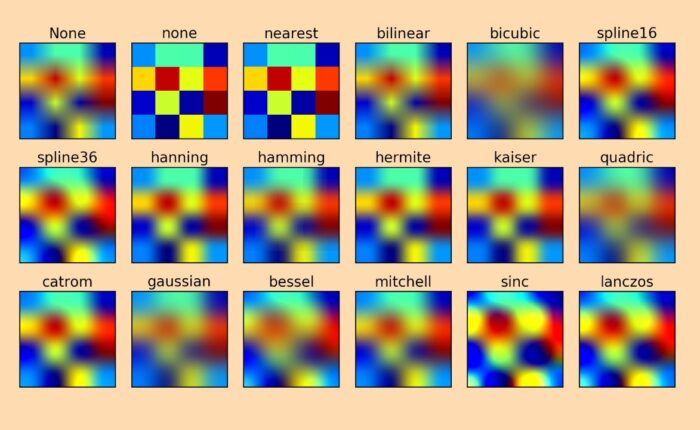

# Escalar

> [Documentación - FFmpeg Scale](https://ffmpeg.org/ffmpeg-filters.html#scale)
> [Scale FFmpeg wiki](http://trac.ffmpeg.org/wiki/Scaling)


Cambiar la relación de aspecto del video e imágenes.

| Resoluciones | Dimensiones | Scale |
|-|-|
| 4320p (8K) | 7680 × 4320 | 7680:4320 |
| 2160p (4K) | 3840 × 2160 | 3840:2160 |
| 1440p (2K) | 2560 × 1440 | 2560:1440 |
| 1080p (HD) | 1920 × 1080 | 1920:1080 |
| 720p (HD) | 1280 × 720 | 1280:720 |
| 480 píxeles (SD) | 854 × 480 | 854:480 |
| 360p (SD) | 640 × 360 | 640:360 |
| 240p (SD) | 426 × 240 | 426:240 |


Ejemplo de uso `scale=200:100` o `scale=200x100`.


## Escalado simple

```
ffmpeg -i input.avi -vf scale=320:240 output.avi
```


## Manteniendo relación de aspecto

```
ffmpeg -i input.jpg -vf scale=320:-1 output_320.png
```

## Algoritmos de escalado

> [Fuente](https://write.corbpie.com/a-guide-to-upscaling-or-downscaling-video-with-ffmpeg/)

Se puede establecer algoritmos usando la opción `-sws_flags` por defecto usa algoritmo `bicubic`, entre los más usados son `bicubic` y `lanczos`.


* ‘fast_bilinear’ : Select fast bilinear scaling algorithm.
* ‘bilinear’ : Select bilinear scaling algorithm.
* ‘bicubic’ : Select bicubic scaling algorithm.
* ‘experimental’ : Select experimental scaling algorithm.
* ‘neighbor’ : Select nearest neighbor rescaling algorithm.
* ‘area’ : Select averaging area rescaling algorithm.
* ‘bicublin’ : Select bicubic scaling algorithm for the luma component, bilinear for chroma components.
* ‘gauss’ : Select Gaussian rescaling algorithm.
* ‘sinc’ : Select sinc rescaling algorithm.
* ‘lanczos’ : Select Lanczos rescaling algorithm. The default width (alpha) is 3 and can be changed by setting param0.
* ‘spline’ : Select natural bicubic spline rescaling algorithm.
* ‘print_info’ : Enable printing/debug logging.
* ‘accurate_rnd’ : Enable accurate rounding.
* ‘full_chroma_int’ : Enable full chroma interpolation.
* ‘full_chroma_inp’ : Select full chroma input.
* ‘bitexact’ : Enable bitexact output. 

>
> En caso de producirse errores, usar `-vf scale=W:H:flags=algoritmo`
>


### Comparación de algoritmos




### Uso

```
ffmpeg -i input.mp4 -vf scale=2560:1440:flags=lanczos output.mp4
```


