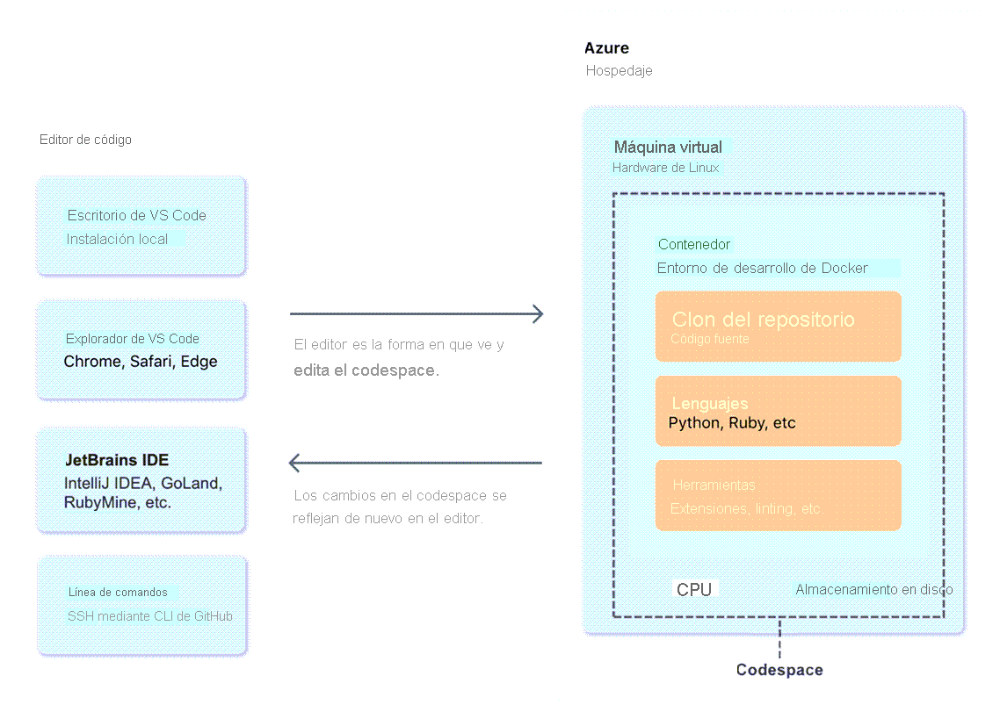

# Github

**GitHub** es una plataforma en la nube que usa **Git** como tecnología principal. Simplifica el proceso de colaborar en proyectos y proporciona un sitio web, herramientas de línea de comandos y un flujo global que permite a los desarrolladores y usuarios trabajar juntos. **GitHub** actúa como el "repositorio remoto" mencionado anteriormente en la sección **Git**.

Las características principales de GitHub incluyen:

* Issues : es usado para crear informes de errores, solicitudes de características, aclaraciones sobre la documentación, etc.
* Ramas : varias personas puedan trabajar simultáneamente en el mismo código de manera controlada.
* Commit : varias personas puedan trabajar simultáneamente en el mismo código de manera controlada.
* Debates
* Solicitudes de incorporación de cambios : es un mecanismo que sirve para indicar que las confirmaciones de una rama están listas para combinarse en otra.
* Notificaciones : eventos que se producen en un flujo de trabajo determinado.
* Etiquetas : proporcionan una manera de categorizar y organizar las incidencias y las solicitudes de incorporación de cambios en un repositorio.
* Acciones : proporcionan funcionalidad de flujo de trabajo y automatización de tareas en un repositorio, CI/CD. [Github Actions](https://docs.github.com/actions/learn-github-actions/understanding-github-actions)
* Clonación y bifurcación : se realiza una copia del repositorio y de su historial en el equipo local. Bifurcar un repositorio, se realiza una copia del repositorio en la cuenta de GitHub, el repositorio `origin` se denomina **ascendente**, permite realizar cambios sin afectar al original, al crear una pull-request se está solicitando al `origin`. 
* Horquillas
* Proyectos


## Diferencias entre Git y Github

**Git** es un sistema de control de versiones distribuido (DVCS) que varios desarrolladores y otros colaboradores pueden usar para trabajar en un proyecto.

**GitHub** es una plataforma en la nube que usa Git como tecnología principal.


# GitHub Codespaces

> [Github Codespaces - doc](https://docs.github.com/en/codespaces/overview)

GitHub Codespaces es un entorno de desarrollo instantáneo basado en la nube que usa un contenedor para proporcionar lenguajes, herramientas y utilidades comunes para el desarrollo.

Cada Codespace de Github se ejecuta en un contenedor Docker que a su vez se ejecuta en una máquina virtual.

Al configurar un entorno de desarrollo personalizado para su proyecto, puede tener una configuración de codespace repetible para todos los usuarios del proyecto.

El ciclo de vida de un codespace comienza cuando se crea y termina cuando se elimina. Puede desconectarse y reconectarse a un codespace activo sin que esto afecte a sus procesos en ejecución. También puede detener y reiniciar un codespace sin perder los cambios que haya realizado en su proyecto.

Existen cuatro formas de crear un codespace:

* Desde una plantilla de GitHub o desde cualquier repositorio de plantillas de GitHub.com para iniciar un nuevo proyecto.
* Desde una rama del repositorio para el trabajo de nuevas características, desplegarlo desde la sección `Code`, `Codespace`, *`+`*, en Github (teniendo un máximo de 2 activas para versiones free).
* Desde una solicitud de cambios abierta para explorar el trabajo en curso.
* Desde una confirmación en el historial de un repositorio para investigar un error en un punto específico del tiempo.




Al crear un codespace de GitHub tienen lugar cuatro procesos:

1. Se asignan al codespace una máquina virtual y almacenamiento.
2. Se crea un contenedor.
3. Se establece una conexión con el codespace.
4. Se realiza una configuración posterior a la creación.

El guardado es automático por medio de la web. Por medio de Visual Studio Code escritorio se debe activar el autoguardado.

Este trabajo se guarda en una máquina virtual, pudiendo ser detenido y retomado más adelante. Al eliminar el codespace se pierde todo trabajo relacionado. Para guardar los cambios se deben confirmar y enviarlos al repositorio remoto o publicar el trabajo en uno nuevo si ha creado el codespace a partir de una plantilla.

Para retomar un trabajo se debe ir a [https://github.com/codespaces](https://github.com/codespaces) o dentro del repositorio donde está el codespace presionar **`,`** y seleccionar **Reanudar**.

El tiempo de espera por defecto es 30 minutos de inactividad, guardando los últimos cambios realizados.

Puede recompilar el codespace para implementar cambios en la configuración de contenedor de desarrollo. Al recompilar el contenedor en un codespace, los cambios realizados fuera del directorio /workspaces se borran. Los cambios realizados dentro del directorio /workspaces, incluido el clon del repositorio o la plantilla desde la que ha creado el codespace, se conservan al recompilar.

Puede crear un codespace para una tarea determinada. Después de enviar los cambios a una rama remota, puede eliminar ese codespace de forma segura.

Si intenta eliminar un codespace con confirmaciones de GIT sin enviar, el editor le notifica que tiene cambios que no se han enviado a una rama remota.

Los codespaces detenidos que permanecen inactivos durante un período de tiempo especificado se eliminan automáticamente. Los codespaces inactivos se eliminan después de 30 días, pero puede personalizar los intervalos de retención de codespaces.


Codespace se puede personalizar, estableciendo configuración para los siguientes parámetros:

* Sincronización de configuración: puede sincronizar la configuración de Visual Studio Code (VS Code) entre la aplicación de escritorio y el cliente web de VS Code.
* Dotfiles: puede usar un repositorio dotfiles para especificar scripts, preferencias del shell y otras configuraciones.
* Cambiar un codespace de nombre: al crear un codespace, se le asigna un nombre para mostrar generado automáticamente. Si tiene varios codespaces, el nombre para mostrar le ayuda a diferenciar entre ellos. Puede cambiar el nombre para mostrar del codespace.
* Cambiar el shell: puede cambiar el shell en un codespace para mantener su configuración habitual. Al trabajar en un codespace, puede abrir una nueva ventana de terminal con un shell de su elección, cambiar el shell predeterminado para las nuevas ventanas de terminal o instalar un nuevo shell. También puedes usar dotfiles para configurar el shell.
* Cambiar el tipo de máquina: puede cambiar el tipo de máquina que ejecuta el codespace para usar los recursos adecuados para el trabajo que lleva a cabo.
* Establecer el editor predeterminado: puede establecer el editor predeterminado para codespaces en su página de configuración personal. Establezca el editor de su preferencia para que, al crear un codespace o abrir un codespace existente, se abra en el editor predeterminado.
    * Visual Studio Code (aplicación de escritorio)
    * Visual Studio Code (aplicación cliente web)
    * JetBrains Gateway: para abrir codespaces en un IDE de JetBrains
    * JupyterLab (interfaz web para Project Jupyter)
* Establecer la región predeterminada: puede configurar la región predeterminada en la página de configuración de perfil de GitHub Codespaces para personalizar el lugar donde se conservan sus datos.
* Establecer el tiempo de espera: un codespace dejará de ejecutarse después de un período de inactividad. De manera predeterminada, este período es de 30 minutos, pero puede especificar un período de tiempo de espera predeterminado más largo o más corto en su configuración personal en GitHub. La configuración actualizada se aplica a los codespaces que cree o a los ya existentes la próxima vez que los inicie.
* Configuración de eliminación automática: los codespaces inactivos se eliminan de forma automática. Puede elegir cuánto tiempo se conservan los codespaces detenidos, hasta un máximo de 30 días.


# Custom Image

> [dev-container - doc](https://docs.github.com/en/codespaces/setting-up-your-project-for-codespaces/adding-a-dev-container-configuration/introduction-to-dev-containers)

`devcontainer.json` es un fichero que contiene la configuración personalizada del contenedor Codespace, este se ubica dentro del proyecto en la carpeta principal de este en la ruta completa debe ser `.devcontainer/devcontainer.json`.

El contenido de este fichero determina los frameworks, herramientas, extensiones, port forwarding. Típicamente contiene una referencia a un fichero Dockerfile.

Se puede establecer varios `devcontainer.json` bajo el subdirectorio `.devcontainer`, por ejemplo:

* `.devcontainer/database-dev/devcontainer.json`
* `.devcontainer/gui-dev/devcontainer.json`

## Ejemplo de configuración

```json
{
  // Name this configuration
  "name": "Codespace for Skills!",
  // Use the base codespace image
  "image": "mcr.microsoft.com/vscode/devcontainers/universal:latest",

  "remoteUser": "codespace",
  "overrideCommand": false
}
```

# Personalizar Codespace

En un formato, *json*, se puede establecer extensiones Visual Studio Code, agregar requisitos de host, nuevas características, etc.

Por ejemplo:

```json
{
  // Name this configuration
  "name": "Codespace for Skills!",
  // Use the base codespace image
  "image": "mcr.microsoft.com/vscode/devcontainers/universal:latest",

  "remoteUser": "codespace",
  "overrideCommand": false,

    // Customization
    // Add the IDs of extensions you want installed when the container is created.
    "customizations": {
        "vscode": {
            "extensions": [
                "GitHub.copilot"
            ]
        },
        "codespaces": {
            "openFiles": [
                "codespace.md"
            ]
        }
    },
    "postCreateCommand": "echo '# Writing code upon codespace creation!'  >> codespace.md"
}
```

Con lo anterior, se establece el uso de extensión "GitHub.copilot" para Visual Studio Code, además en el codespace, se abrirá el fichero *codespace.md*.


## Ficheros Dotfiles

Ficheros Dotfiles controlan la configuración de aplicaciones y shells del sistema.

Para habilitarlos en el codespace, se debe:

1. Ir a **Settings**
2. Ir a la sección **Code, planning, and automation**, hacer clic en **Codespaces**.
3. En **Dotfiles**, seleccionar **Automatically install dotfiles**, con esto se instalarán automáticamente el contenido de estos ficheros (scripts) cada vez cuando se crea un nuevo codespace.
4. Seleccionar el repositorio en la sección **Select repository** que contenga los ficheros dotfiles.

Recordar dar permisos de ejecución para los scripts, agregarlos y enviar los cambios si no se ha realizado.

## Administrar Codespace

Ir a **[https://github.com/codespaces](https://github.com/codespaces)**, se podrá detener, eliminar, retomar, e iniciar codespaces.


# Github Copilot

GitHub Copilot es la primera herramienta (de pago) para desarrolladores de inteligencia artificial a escala del mundo que puede ayudarle a escribir código más rápidamente y con menos trabajo. GitHub Copilot extrae el contexto de los comentarios y el código para sugerir líneas individuales y funciones completas al instante.

El modelo de lenguaje preentrenado generativo de GitHub Copilot usa la tecnología de OpenAI Codex y lo crea OpenAI.

OpenAI Codex tiene un amplio conocimiento de cómo las personas usan código, y es más capaz que GPT-3 en la generación de código, en parte, porque se entrenó en un conjunto de datos que incluye una mayor concentración de código fuente público.

GitHub Copilot X se extiende más allá del editor y se convierte en un asistente de inteligencia artificial fácilmente accesible durante todo el ciclo de vida de desarrollo. GitHub Copilot X es la visión del futuro del desarrollo de software con tecnología de IA que adopta los modelos GPT-4 más recientes de OpenAI.

GitHub Copilot y request-pull, rellena automáticamente estas etiquetas en función del código cambiado. A continuación, los desarrolladores pueden revisar o modificar la descripción sugerida.

GitHub lanza GitHub Copilot for Docs, responde preguntas de usuarios sobre la documentación.

* *Configuración*, *Código, planeamiento y automatización*.
* [Copilot for Visual Studio Code](https://marketplace.visualstudio.com/items?itemName=GitHub.copilot)

En VS Configuración, extensiones, seleccion Copilot.

Mediante el uso de *tabulación* para sugerencias y *ctrl + enter* para autocompletar.


## Github Copilot en Codespace

* En repositorio
    * `Code`
        * `Codespace`
        * `+`

* En Codespace
    * Extensiones
        * GitHub Copilot

## Cómo configurar GitHub Copilot

Para usar GitHub Copilot, necesita lo siguiente:

* Cree una cuenta de GitHub. Ya que Copilot es un servicio de GitHub, necesita una cuenta de GitHub para usar el servicio.
* Regístrese. Debe registrarse en Copilot a través de su página web.
* En GitHub, seleccione su perfil y, a continuación, vaya a la configuración en la que, en Copilot, puede habilitar el acceso o registrarse para obtener una prueba gratuita.
* Para usar GitHub Copilot, debe instalarlo como una extensión en el IDE.
* Las extensiones están disponibles para los IDE principales, como Visual Studio, Visual Studio Code.
