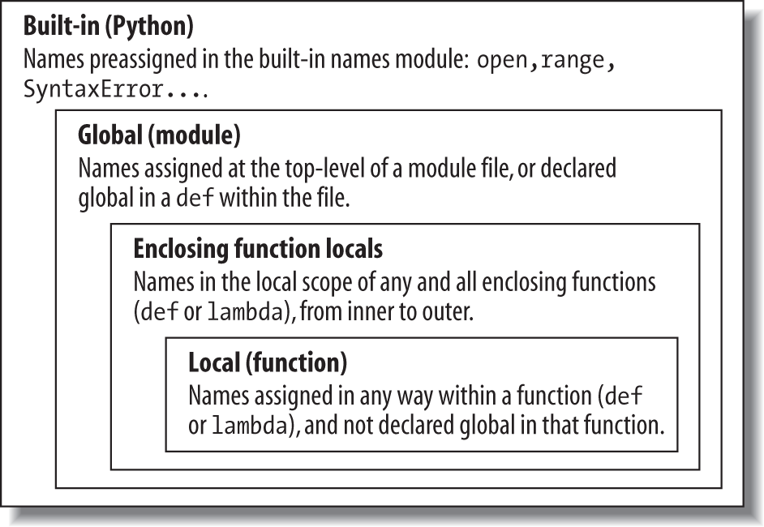
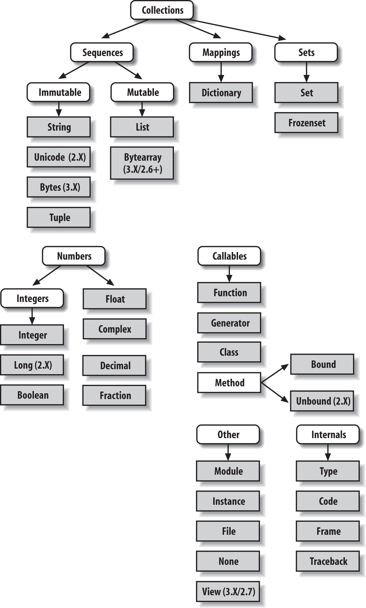
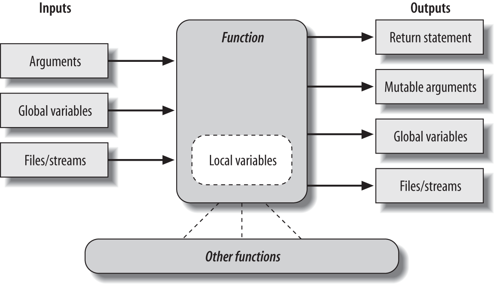

# Python

Cualidades:

* Calidad de software, enfocado en legibilidad, coherencia y calidad.
* Productividad en desarrollo.
* Portabilidad.
* Gran soporte librerías.
* Integración de componentes.


Fortalezas:

* Orientado a objetos y programación funcional.
* Es gratis.
* Portable
* Poderoso.
* Tipado dinámico.
* Administración de memoria automática.
* Gran soporte al lenguaje.
* Herramientas y tipos incorporados
* Variedad de librerías y utilidades de terceros.
* Fácil de usar y aprender


# Código Python

Al escribir el **codigo fuente** y ejecutarlo, se convierte ese código en **byte code** y lo encamina a la **virtual machine** de Python.

Esta conversión se hace por detrás, no se ve. Es una traducción de lenguaje de alto nivel a lenguaje de bajo nivel.

* *.py*  :  ficheros código fuente Python.
* *.pyc*  :  ficheros byte code Python.

Guardados en directorio *__pycache__* en versiones de Python 3.2+.

# Python **Virtual Machine**

En breve, es solo un gran código de loop que itera sobre las instrucciones *byte code*.

```
source  ->  byte code  ->  runtime
m.py              m.pyc              PVM
```

Es parte del sistema Python, es el último paso y se llama *Python Interpreter*.

# Alternativas de implementacion Python

* `CPython`  :  estándar, base de ANSI C.
* `Jython`  :  enfocado en integración con Java, consiste en clases que compilan código Python (se sigue escribiendo Python) a Java y enrutan el byte code a la Java Virtual Machine.
* `IronPython`  :  diseñado para integrar aplicaciones con .NET, C#. Permite a Python actuar en componentes cliente y servidor.
* `Stackless`  :  mejora la implementacion CPython, hace posible a arquitecturas stack más pequeñas, provee opciones multiproceso eficientemente. *microthreads* es una implementación más liviana y eficiente que estándar thread de Python.
* `PyPy`  :  otro CPython, enfocado en rendimiento. Compilador *JIT* (just-in-time), provee de un *sandbox* para ejecutar código no confiable en ambientes seguros, 


# Frozen Binaries

Es básicamente, un empaquetado del *byte code*, con el *Python Virtual Machine* y cualquier fichero Python que el programa necesite, en un único paquete (algo así como un ".exe").

* *`py2exe`* genera ejecutables Python para Windows solamente.
* *`PyInstaler`* genera ejecutables para Linux, Mac y Windows.
* *`py2app`* solo para Mac.
* *`freeze`* y *`cx_freeze`*, genera ejecutables multiplataformas Python 3.X.

Útil para generar ejecutables de aplicaciones de escritorio GUI.

Frozen binaries no tienen la misma salida de un compilador verdadero.


# Linux environments

Iniciar el fichero Python con `#!/usr/bin/env python`, para usar ese fichero como un ejecutable.

\pagebreak

# Keywords

```python
>>> import keyword
>>> keyword.kwlist
['False', 'None', 'True', 'and', 'as', 'assert', 'break', 'class', 'continue', 'def', 'del', 'elif', 'else', 'except', 'finally', 'for', 'from', 'global', 'if', 'import', 'in', 'is', 'lambda', 'nonlocal', 'not', 'or', 'pass', 'raise', 'return', 'try', 'while', 'with', 'yield']
```

# Built-ins

```python
>>> import builtins
>>> dir(builtins)
['ArithmeticError', 'AssertionError', 'AttributeError', 'BaseException', 'BaseExceptionGroup', 'BlockingIOError', 'BrokenPipeError', 'BufferError', 'BytesWarning', 'ChildProcessError', 'ConnectionAbortedError', 'ConnectionError', 'ConnectionRefusedError', 'ConnectionResetError', 'DeprecationWarning', 'EOFError', 'Ellipsis', 'EncodingWarning', 'EnvironmentError', 'Exception', 'ExceptionGroup', 'False', 'FileExistsError', 'FileNotFoundError', 'FloatingPointError', 'FutureWarning', 'GeneratorExit', 'IOError', 'ImportError', 'ImportWarning', 'IndentationError', 'IndexError', 'InterruptedError', 'IsADirectoryError', 'KeyError', 'KeyboardInterrupt', 'LookupError', 'MemoryError', 'ModuleNotFoundError', 'NameError', 'None', 'NotADirectoryError', 'NotImplemented', 'NotImplementedError', 'OSError', 'OverflowError', 'PendingDeprecationWarning', 'PermissionError', 'ProcessLookupError', 'RecursionError', 'ReferenceError', 'ResourceWarning', 'RuntimeError', 'RuntimeWarning', 'StopAsyncIteration', 'StopIteration', 'SyntaxError', 'SyntaxWarning', 'SystemError', 'SystemExit', 'TabError', 'TimeoutError', 'True', 'TypeError', 'UnboundLocalError', 'UnicodeDecodeError', 'UnicodeEncodeError', 'UnicodeError', 'UnicodeTranslateError', 'UnicodeWarning', 'UserWarning', 'ValueError', 'Warning', 'ZeroDivisionError', '_', '__build_class__', '__debug__', '__doc__', '__import__', '__loader__', '__name__', '__package__', '__spec__', 'abs', 'aiter', 'all', 'anext', 'any', 'ascii', 'bin', 'bool', 'breakpoint', 'bytearray', 'bytes', 'callable', 'chr', 'classmethod', 'compile', 'complex', 'copyright', 'credits', 'delattr', 'dict', 'dir', 'divmod', 'enumerate', 'eval', 'exec', 'exit', 'filter', 'float', 'format', 'frozenset', 'getattr', 'globals', 'hasattr', 'hash', 'help', 'hex', 'id', 'input', 'int', 'isinstance', 'issubclass', 'iter', 'len', 'license', 'list', 'locals', 'map', 'max', 'memoryview', 'min', 'next', 'object', 'oct', 'open', 'ord', 'pow', 'print', 'property', 'quit', 'range', 'repr', 'reversed', 'round', 'set', 'setattr', 'slice', 'sorted', 'staticmethod', 'str', 'sum', 'super', 'tuple', 'type', 'vars', 'zip']
```

# Sentencias

Python automáticamente cierra cada línea de código con `;`, por lo que se pueden omitir.

```python
x = 1;

# es lo mismo

x = 1
```

`;` es un separador de cada línea, en lenguajes como C, Java, son obligatorios.

Python utiliza identación (espacios en blanco) como delimitadores de las sentencias, no se debe incluir llaves para sentencias.

Ejemplo, Java.

```java
if (x > y) {
    x = 1;
    y = 2;
}
```

Ejemplo, **Python**

```python
if x > y:
    x = 1;
    y = 2;
```

En caso de fallas en la identación, se declarará un error de sintáxis.

# Asignación de sentencias

* Asignaciones crean referencias a Objetos.
* Nombres son creados con la primera asignación.
* Nombres pueden ser asignado después que sea referenciado.
* Algunas operaciones realizan asignaciones implícitamente.


# Alcances  métodos y clases



Regla *LEGB*:

* `L` - function: local
* `E` - enclosing function locals: *def* y *lambda*
* `G` - module: global
* `B` - Python: built-in

Clases dentro de un método tiene alcance local, esta puede retornar una instancia de esa clase o la clase misma.

```python
def generate():
        class Spam:                                   # alcance local, dentro del metodo
                count = 1
                def method(self):
                        print(Spam.count)
        return Spam()                        # Retorna una instancia

generate().method()
```


El problema en el código anterior, `def` no tiene alcance dentro de `class`, y mediante `self` de la clase se puede operar la clase en sí mediante un `def`.

Para evitar este limitación se debe  crear la clase fuera y la función debe retornar una instancia.

```python
def generate():
        return Spam()

class Spam:
        count = 1
        def method(self):
                print(Spam.count)

generate().method()
```

Es recomendado, porque el código tiene a ser simple en general y evita clases y funcione anidadas.

Las clases anidadas es de ayuda en contexto de cierre, donde el alcance de la función retiene el *estado* usado por la clase o método. El siguiente código, métodos anidados tienen acceso por su propio alcance, encerrando el alcance global del módulo, cualquier cosa guardada en `self` de la clase y la clase en sí vía no local.

```python
# Global scope
X = 99                             # X and func assigned in module: global

def func(Y):                    # Y and Z assigned in function: locals
    # Local scope
    Z = X + Y                     # X is a global
    return Z

func(1)                            # func in module: result=100
```

```python
X = 88                        # Global X

def func():
    X = 99                    # Local X: hides global, but we want this here

func()
print(X)                      # Prints 88: unchanged
```

```python
X = 88                           # Global X

def func():
    global X
    X = 99                       # Global X: outside def

func()
print(X)                         # Prints 99
```

```python
>>> def generate(label):
                class Spam:         # Returns a class instead of an instance
                        count = 1
                        def method(self):
                                print("%s=%s" % (label, Spam.count))
                return Spam

>>> aclass = generate('Gotchas')
>>> I = aclass()
>>> I.method()
Gotchas=1
```

# Unpacking variables

```python
>>> seq = [1, 2, 3, 4]

>>> a, b, c, d = seq

>>> print(a, b, c, d)
1 2 3 4

>>> a, b = seq
ValueError
```

`*` indica todos los demás.

```python
>>> a, *b = 'spam'
>>> a, b
('s', ['p', 'a', 'm'])

>>> a, *b, c = 'spam'
>>> a, b, c
('s', ['p', 'a'], 'm')

>>> a, *b, c = range(4)
>>> a, b, c
(0, [1, 2], 3)

>>> S = 'spam'
>>> S[0], S[1:]
('s', 'pam')

>>> S[0], S[1:3], S[3]
('s', 'pa', 'm')
```

##  Asignación Incrementado

```
X += Y         X &= Y         X −= Y           X |= Y
X *= Y         X ^= Y          X /= Y           X >>= Y
X %= Y        X <<= Y        X **= Y        X //= Y
```

# Sentencias multilínea

```python
if a == b and c == d and   \
    d == e and f == g:
        print('olde')

if (a == b and c == d and
    d == e and e == f):
        print('new')

x = 1 + \
      2
```

# Argumentos

Argumentos son pasados por *asignación*.

* Argumento son pasados automáticamente asignando Objetos a variables locales. Los Objetos son pasados como argumentos nunca se pasan copias.
* Nombres de argumentos dentro de la función no afectan al que lo invoca.
* Cambiar un argumento de Objeto mutable en una función puede impactar al que lo invoca.

* Argumentos inmutables son efectivamente pasado "por valor". Enteros y Strings son pasados por referencia en lugar de copias.
* Argumentos mutables son efectivamente pasados "por puntero". Listas y diccionarios se pasa la referencia.

| Sintaxis | ubicación | descripción |
|-|-|-|
| `func(value)` | Caller | Normal argument: matched by position |
| `func(name=value)` | Caller | Keyword argument: matched by name |
| `func(*iterable)` | Caller | Pass all objects in iterable as individual positional arguments |
| `func(**dict)` | Caller | Pass all key/value pairs in dict as individual keyword arguments |
| `def func(name)` | Function | Normal argument: matches any passed value by position or name |
| `def func(name=value)` | Function | Default argument value, if not passed in the call |
| `def func(a, b=1, c=1)` | Function | a argument is required, b and c is optional. |
| `def func(*name)` | Function | Matches and collects remaining positional arguments in a tuple |
| `def func(**name)` | Function | Matches and collects remaining keyword arguments in a dictionary |
| `def func(*other, name)` | Function | Arguments that must be passed by keyword only in calls |
| `def func(*, name=value)` | Function | Arguments that must be passed by keyword only in calls |

```python
>>> def f(a, *pargs, **kargs):
...         print(a, pargs, kargs)
>>> f(1, 2, 3, x=1, y=2)
1 (2, 3) {'y': 2, 'x': 1}
```

# Variables, Objetos y referencias

Una variable tiene 3 elementos:

* Crea una variable, toda variable debe ser explicitada o escrita antes de usarse.
* Los tipos de las variables, son las referencias a los tipos de objetos.
* Uso de la variable, cuando se llega a una variable, esta es reemplazada por el objeto.

Las variables siempre enlazan a objetos nunca a otras variables, pero los objetos pueden contener enlaces a otros objetos.

Los enlaces de variable a objetos en Python se llaman **references** (referencia a la ubicación en memoria del objeto).


Cada vez que se crea un nuevo valor en el script, Python crea un nuevo objeto (con un pedazo de memoria) para representar el valor. Internamente cachea y reusa ciertos cosas de objetos inmutables, como números pequeños y strings.


| Object type | Category | Mutable? |
|-|-|-|
| Numbers (all) | Numeric | No |
| Strings (all) | Sequence | No |
| Lists | Sequence | Yes |
| Dictionaries | Mapping | Yes |
| Tuples | Sequence | No |
| Files | Extension | N/A |
| Sets | Set | Yes |
| Frozenset |Set | No |
| bytearray | Sequence | Yes |

## Jerarquía Objetos



## Python Garbage Collection

Cuando un nombre es asignado a un nuevo objeto, Python reclama el espacio en memoria usado anteriormente para el nuevo valor, esto es el *Gargabe Collection*.

Internamente, Python mantiene seguimiento de cada referencia a ese objeto, y cuando la cantidad cae a 0, el espacio en memoria usado se reclama, en un ciclo repetitivo. Esto permite, preocuparse de otras cosas en lugar de la administración de la memoria.

Python Garbage Collection está basado en *reference counters*.

Módulo **gc** - *This module provides access to the garbage collector for reference cycles.*

## del

Borra referencias

```python
del data[k]
del data[i:j]
del obj.attr
del variable
```

## Referencias compartidas

Referencias compartidas o *shared object*, ocurre cuando dos o más variables apuntan al mismo objeto.

Por ejemplo:

```python
a = 3
b = a 
```

En este caso, *a* apunta a un objeto Int de valor 3, *b* apunta hacia *a*, por lo que tiene acceso al mismo objeto.

Pero si *a* cambia de valor, *b* mantiene la referencia a 3.

```python
# ocurre una reasignación de la variable "a", tomando el valor anterio de "a" y aumentando en 3, dando el nuevo "a" un valor de 6.
a = a + 3
```

## Referencias compartidas y cambios in-place

Tipos *mutables*, como *list*, *dict*, *sets*, pueden cambiar sus valores en el momento y ser replicados en las referencias que tengan.

```python
l1 = [2, 3, 4]
l2 = l1

l1[0] = 24

l1
[24, 3, 4]

l2
[24, 3, 4]
```

En el ejemplo anterior, la lista *l1* se alteró reemplazando el valor de índice 0 a "24", por lo que en las variables que apunta al *list* cambiaron.

El objeto *list* no ha cambiado su tipo, aún sigue siendo un *list* solamente se cambio su contenido.

Para poder cambiar independientemente cada asignación nueva, se debe crear una copia (existen dos tipos de copias, copias superficiales y profundas, las primeras crean una especie de referencia a la original, sin usar espacio en memoria, la segunda crea un nuevo objeto con el contenido original usando nuevo espacio en memoria).

## Referencias compartidas e Igualdad

Python internamente cachea y reusa enteros y strings pequeños. Espacio en memoria de Objetos son reclamados cuando no tienen referencias.

Para comprobar si dos referencias de objetos tienen el mismo valor, se puede usar operador **==** (operador de equivalencia de valor) o **is** (comprueba la igualdad de identidad entre objetos comparando las referencias implementadas), ambos retornan booleano.

```python
>>> L = [1, 2, 3]
>>> M = [1, 2, 3]
>>> L == M            # igualdad en contenido
True
>>> L is M              # Diferentes objetos, ambos son 'list' pero objetos distintos
False


>>> X = 42
>>> Y = 42
>>> X == Y               # igualdad en contenido
True
>>> X is Y                # mismo objeto, objeto int 42 reusado.
True
```


\pagebreak

# Tipos mutables e inmutables

* Inmutables  :  **numeros**, **string**, **tuplas**, **frozensets**
* Mutables : **listas**, **diccionarios**, **sets**, **bytearrays**

# Generator de Funciones y Expresiones

Python provee de herramientas que producen resultados solamente cuando se necesiten, en lugar de todo de una vez. Leer líneas de ficheros a pedido o bajo demanda, funciones `map` y `zip` que producen items bajo demanda, son algunos ejemplos.

>
> Generadores son mejores en uso de memoria y rendimientos que iteradores. Distribuyen el tiempo requerido para producir la series de valores a través de bucle de iteraciones.
>

Generadores son iteradores de objetos únicos. 

Permiten, en casos avanzados, guardar el estado entre iteraciones en objetos de clases, con generadores, variables pueden ser accedidas en alcances de funciones sean guardadas y restauradas automáticamente.

* <u>**Generador de funciones**</u>  :  son sentencias `def` normales, pero usan keyword `yeild` para retornar los resultados en el momento, suspendiendo y resumiendo sus estados entre cada uno. Generan y retornan un nuevo *generator object*. Generan automáticamente método `__next__` o `next()` (Python 2.X) para iniciar la función o retomarla, eleva `StopIterator` cuando llega al final.

* <u>**Generador de expresiones**</u>  :  son similares a listas de comprensión, pero retornan un objeto que producen resultados bajo demanda en lugar de construir una lista. Generan y retornan un nuevo *generator object*, comienza con un loop o retoman desde el último y eleva `StopIterator` al finalizar.

Ambos constructores retornan una lista una de una vez, ayudan a ahorrar memoria y permiten que el tiempo de cómputo se divida entre las peticiones.

## Generator de funciones: `yield` vs `return`

* Suspensión de estado  :  a diferencia de funciones normales que retornan un valor al terminar, generador de funciones automáticamente suspende y resumen las ejecuciones y estado al rededor del punto de generación de valor. El estado, cuando se suspende, incluye la ubicación en código y el alcance local, reteniendo información de las variables locales entre resultados, permitiendo que las funciones sean retomadas. `yield` suspende la función y envía los valores devuelta al caller, pero retiene el estado para permitir retomarlo.

* Protocolo de iteración de integración  :  el iterador de objetos define un método *__next__*, el cual retorna el siguiente item en la iteración y eleva una excepción `StopIteration` para finalizar la iteración, un iterador de un objeto se obtiene inicialmente con la función built-in `iter`, por medio de este paso no-abierto a objetos que son dueños.
    `for` y todos los iteradores, usan este protocolo de iteración para iterar una secuencia, si el protocolo es soportado (si no, la iteración vuelve repetidamente indexando la secuencia).
    

Funciones que contienen `yield` son compilados especialmente como *generadores*, no son funciones normales, son construidos para retornar un objeto con los métodos del protocolo de iteración.

Pueden tener `return`, al final del bloque `def`, simplemente termina la generación de valores, técnicamente, elevan una excepción `StopIteration`. *__next__* resumen la función y ejecuta hasta que el siguiente resultado `yield` sea retornado o `StopIteration` sea elevado.

### Ejemplo

```python
>>> def gen(N):
...     for i in range(N):
...             yield i ** 2
... 
>>> for i in gen(5):
...     print(i, end=" - ")
... 
0 - 1 - 4 - 9 - 16 -

>>> gen(5)
<generator object gen at 0x7fe8c1dbb530>

>>> next(x)
0
>>> next(x)
1
>>> next(x)
4 
>>> next(x)
9
>>> next(x)
16
>>> next(x)
Traceback (most recent call last):
  File "<stdin>", line 1, in <module>
StopIteration

>>> def ups(line):
            for sub in line.split(','):    # Substring generator
                yield sub.upper()

>>> tuple(ups('aaa,bbb,ccc'))     # All iteration contexts
('AAA', 'BBB', 'CCC')

>>> {i: s for (i, s) in enumerate(ups('aaa,bbb,ccc'))}
{0: 'AAA', 1: 'BBB', 2: 'CCC'}
```

## Generador de Expresiones

Generador de funciones es muy útil, eventualmente se puede expandir a otras herramientas. La combinaciones entre iterables y listas de compresión crean una nueva herramienta: *generador de expresiones*.

Las variables de los generadores tienen alcance local, no chocan con las variables exteriores, a diferencia de la `list`, `dict`, `set` por comprensión, o bucle `for`.

Sintácticamente, son listas por comprensión, pero en lugar de usar `[ ]` usan `( )`.

```python
>>> [i ** 2 for i in range(4)]
[0, 1, 4, 9]

>>> (i ** 2 for i in range(4))
<generator object <genexpr> at 0x7fe8c1dbb530>

>>> list(i ** 2 for i in range(4))
[0, 1, 4, 9]

>>> x = (i ** 2 for i in range(4))        
>>> next(x)
0
>>> next(x)
1
>>> next(x)
4
>>> next(x)
9
>>> next(x)
Traceback (most recent call last):
  File "<stdin>", line 1, in <module>
StopIteration
```

En lugar de construir una lista en memoria con los resultados, retornan un *generator object*, elemento iterable automáticamente. 

No se ve el `next()` iterador bajo la generación de expresión porque bucle `for`, lo desencadenan automáticamente, de igual forma las funciones built-in `sum`, `map`, `sorted`, listas por comprensión, `any`, `all` y `list`. Como iterables, generador de expresiones pueden aparecer en cualquiera de estos contextos de iteración solo como el resultado del llamado de un generador de función.

### Generador de expresión anidado

```python
>>> list(x * 2 for x in (abs(x) for x in (−1, −2, 3, 4)))
[2, 4, 6, 8]
```

### Combinando generador de expresiones

Se debe mantener el principio **KISS**, y recordar que <u>simple es mejor que complejo</u>.

```python
>>> import math
>>> list(map(math.sqrt, (x ** 2 for x in range(4))))
[0.0, 1.0, 2.0, 3.0]


>>> list(abs(x) * 2 for x in (−1, −2, 3, 4))
[2, 4, 6, 8]

>>> list(math.sqrt(x ** 2) for x in range(4))
[0.0, 1.0, 2.0, 3.0]

>>> list(abs(x) for x in (−1, 0, 1))
[1, 0, 1]
```

### Porque usar Generador de expresión

Son una optimización de espacio de memoria, no requieren que se construyan enteramente la lista resultante de una vez, como las listas de comprensión. Al igual que Generador de funciones, dividen su trabajo entre resultados en pequeñas partes cada vez, ellos producen (`yield`) resultados en formas fraccionadas en lugar de esperar el resultado completo en una única llamada.

Es recomendable usarlos, cuando el resultado es muy grande o en aplicaciones donde no se pueden esperar por resultados. En pequeños trabajos pueden ser significativamente lentos en comparación con listas de comprensión.

### Generador de expresión vs `map`

Generador de expresión son equivalente a `map` (Python 3.X) porque generan el resultado en petición.

```python
>>> list(map(abs, (−1, −2, 3, 4)))
[1, 2, 3, 4]

>>> list(abs(x) for x in (−1, −2, 3, 4))
[1, 2, 3, 4]
```

### Generador de expresión vs `filter`

`filter` es un iterable que genera resultados en petición. Un generador de expresión con una cláusula `if` es opcionalmente equivalente.

```python
>>> line = 'aa bbb c'

>>> ''.join(x for x in line.split() if len(x) > 1)
'aabbb'

>>> ''.join(filter(lambda x: len(x) > 1, line.split()))
'aabbb'
```

Pero al agregar `map` (o cualquier otro built-in) ese `filter` se vuelve más complejo que un generador de expresión.

```python
>>> ''.join(x.upper() for x in line.split() if len(x) > 1)
'AABBB'

>>> ''.join(map(str.upper, filter(lambda x: len(x) > 1, line.split())))
'AABBB'
```

Por lo que, conviene usar *generador de expresión* por su sencillez de lectura y entendimiento.

### Comprensión, Set y Dict

```python
>>> {x * x for x in range(10)}                       # Set comprehensions
{0, 1, 4, 81, 64, 9, 16, 49, 25, 36}

>>> set(x * x for x in range(10))                  # Generator expression to Set
{0, 1, 4, 81, 64, 9, 16, 49, 25, 36}

>>>

>>> {x: x * x for x in range(10)}                    # Dict comprehensions
{0: 0, 1: 1, 2: 4, 3: 9, 4: 16, 5: 25, 6: 36, 7: 49, 8: 64, 9: 81}

>>> dict((x, x * x) for x in range(10))             # Generator expression to Dict
{0: 0, 1: 1, 2: 4, 3: 9, 4: 16, 5: 25, 6: 36, 7: 49, 8: 64, 9: 81}

>>> x
NameError: name 'x' is not defined
```

### Comprensión extendida, Set y Dict

Así como listas de comprensión y generadores, comprensión `dict` y `set` soportan `if` para filtrar elementos.

```python
>>> [x * x for x in range(10) if x % 2 == 0]
[0, 4, 16, 36, 64]

>>> {x * x for x in range(10) if x % 2 == 0}
{0, 16, 4, 64, 36}

>>> {x: x * x for x in range(10) if x % 2 == 0}
{0: 0, 8: 64, 2: 4, 4: 16, 6: 36}


>>> [x + y for x in [1, 2, 3] for y in [4, 5, 6]]
[5, 6, 7, 6, 7, 8, 7, 8, 9]

>>> {x + y for x in [1, 2, 3] for y in [4, 5, 6]}
{8, 9, 5, 6, 7}

>>> {x: y for x in [1, 2, 3] for y in [4, 5, 6]}
{1: 6, 2: 6, 3: 6}


>>> {x + y for x in 'ab' for y in 'cd'}
{'ac', 'bd', 'bc', 'ad'}

>>> {x + y: (ord(x), ord(y)) for x in 'ab' for y in 'cd'}
{'ac': (97, 99), 'bd': (98, 100), 'bc': (98, 99), 'ad': (97, 100)}

>>> {k * 2 for k in ['spam', 'ham', 'sausage'] if k[0] == 's'}
{'sausagesausage', 'spamspam'}

>>> {k.upper(): k * 2 for k in ['spam', 'ham', 'sausage'] if k[0] == 's'}
{'SAUSAGE': 'sausagesausage', 'SPAM': 'spamspam'}
```


### `yield from` - Python 3.3

Python 3.3 introduce una sintáxis extendida para `yield` que permite delegación para un subgenerador usando `from`.

```python
>>> def both(N):
                for i in range(N): yield i
                for i in (x ** 2 for x in range(N)): yield i
>>> list(both(5))
[0, 1, 2, 3, 4, 0, 1, 4, 9, 16]


#
# yield from  - python 3.3
#
>>> def both(N):
                yield from range(N)
                yield from (x ** 2 for x in range(N))

>>> list(both(5))
[0, 1, 2, 3, 4, 0, 1, 4, 9, 16]

>>> ' : '.join(str(i) for i in both(5))
'0 : 1 : 2 : 3 : 4 : 0 : 1 : 4 : 9 : 16'
```

Este cambio se realizó para dejar aún más explícito el código y soporta todos los contextos de uso de generador.

Permite a los generadores se dividan en sub-generadores como funciones únicas para ser divididos en múltiples sub-funciones. 

## Generadores y librerías de herramientas

Librerías de herramientas estándar Python genera valores, incluyendo analizador de emails, y estándar *directory walker*, el cual eleva una tupla del  directorio actual, subdirectorio y ficheros.

```python
>>> import os
>>> for (root, subs, files) in os.walk('.'):
            for name in files:
                if name.startswith('call'):
                    print(root, name)

. callables.py
.\dualpkg callables.py

>>> G = os.walk(r'C:\code\pkg')
>>> iter(G) is G
# single-scan iterator: iter(G) optional
True
>>> I = iter(G)
>>> next(I)
('C:\\code\\pkg', ['__pycache__'], ['eggs.py', 'eggs.pyc', 'main.py', ...etc...])
>>> next(I)
('C:\\code\\pkg\\__pycache__', [], ['eggs.cpython-33.pyc', ...etc...])
>>> next(I)
StopIteration
```

## Generador en clases

Con clases se tiene acceso a una lógica rica y opciones de estructurado de datos, como herencia, para codificar métodos, las clases también pueden crear un comportamiento de iteración mucho más explícito que el "mágico" generador de objetos asociados con tipo built-in y generador de funciones y expresiones.

Métodos implementados (opcionalmente) en clases como *`__iter__`* ejecutan la función built-in `iter`, que retornan un objeto si existe un método *`__next__`* para ejecutar `next` built-in.

```python
class Algo:
    def __init__(...): ...         # en iter(): retornan self u objeto suplementario
    def __next__(...): ...       # en next(): retornan self u objeto suplementario
```

Alternativamente, métodos iterables pueden usar `yield` para convertirse en generadores creando automáticamente método *`__next__`*.

Método *`__getitem__`* es una opción fallback para iteración, no es tan flexible como *`__iter__`* y *`__next__`*, pero tiene ventajas en codificando secuencias.

Las instancias generadas de estas clases pueden ser usadas en `for` y otros contextos de iteradores. 

\pagebreak

# Tipos y operaciones

| Tipo de datos (built-in) | Nombre | Descripción |
|-|-|
| str() | string | |
| int() | integer | |
| float() | float | |
| oct() | octal | |
| hex() | hexadecimal | |
| True, False | boolean | |


# `int` - Enteros

Sistema binario, la forma que se almacenan los números, y realizan operaciones con ellos.

enteros (int)
punto flotante (float)

**type()** entrega el tipo de dato que se consulta.

### Convertir binario a entero

```python
>>> int('1101', 2)
13
```

### Convertir entero a binario

```python
>>> bin(13)
'0b1101'
```

# `oct` - Numero octal

oct()
Representación octa, prefijo zero-o, ejemplo: 83 octal 0o123.

# `hex` - hexadecimal

hex()
Representación hexadecimal, prefijo zero-x, ejemplo: 291 hex 0x123.

# `float` - Punto flotante

Exponente : E
ejemplo: 300000000 = 3E8

base puede ser int o float
exponente debe ser int

# `str` - String

Entre comillas simples, dobles, uso de caracter salida `\` para carácteres especiales.

Python siempre almacena texto decodificado de string en formato neutral, en memoria, los string no se tienen que codificar, son un objeto string.

Python 3.3+ usa esquema con 1,2 o 4 bytes por carácter dependiendo del contenido del string. El tamaño es elegido basado en el largo del caracter Unicode más largo en representación del string. Esto permite un uso del espacio de forma eficiente en muchos casos. Python tiene soporte completo *UCS-4* para todas las plataformas.

Python 3.X tiene 3 tipos de objetos string:
* `str` representación decodificado de texto Unicode (ASCII inclído).
* `bytes` representación de data binaria.
* `bytearray` una forma mutable de `byte`.

```python
>>> B = b'spam'
>>> S = 'eggs'
>>> type(B), type(S)
(<class 'bytes'>, <class 'str'>)
>>> B
b'spam'
>>> S
'eggs'
```

String multilíneas se deben utilizar comillas simples triples o comillas dobles triples.

No se puede concatenar valores de diferentes tipos, por ejemplo, valores `int` y `str`

| Operacion | Interpretación |
|-|-|
| S = '' | Empty string |
| S = "spam's" | Double quotes, same as single |
| S = 's\np\ta\x00m' | Escape sequences |
| S = """...multiline...""" | Triple-quoted block strings |
| S = r'\temp\spam' | Raw strings (no escapes) |
| B = b'sp\xc4m' | Byte strings |
| U = u'sp\u00c4m' | Unicode strings |
| S1 + S2 | Concatenate, |
| S * 3 | repeat |
| S[i], S[-i] | Index, inverse |
| S[i:j:z] | slice, i to j, jumping in z |
| len(S) | length |
| "a %s parrot" % kind | String formatting expression |
| "a {0} parrot".format(kind) |String formatting method |
| S.find('pa') | search |
| S.rstrip() | remove whitespace, |
| S.replace('pa', 'xx') | replacement, |
| S.split(',') | split on delimiter, |
| S.isdigit() | content test, |
| S.lower() | case conversion, |
| S.endswith('spam') | end test, |
| 'spam'.join(strlist) | delimiter join, |
| S.encode('latin-1') | Unicode encoding, |
| B.decode('utf8') | Unicode decoding, etc. |
| for x in S: print(x) | Iteration, membership |
| 'spam' in S |  |
| [c * 2 for c in S] |  |
| map(ord, S) |  |
| re.match('sp(.*)am', line) | Pattern matching: library 're' module |

| Escape | Significado |
|-|-|
| `\newlineIgnored` | (continuation line) |
| `\\Backslash`  | (stores one \) |
| `\'` | Single quote (stores ') |
| `\"` | Double quote (stores ") |
| \a | Bell |
| \b | Backspace |
| \f | Formfeed |
| \n | Newline (linefeed) |
| \r | Carriage return |
| \t | Horizontal tab |
| \v | Vertical tab |
| \xhh | Character with hex value hh (exactly 2 digits) |
| \ooo | Character with octal value ooo (up to 3 digits) | 
| \0 | Null: binary 0 character (doesn’t end string) | 
| \N{ id } | Unicode database ID |
| \uhhhh | Unicode character with 16-bit hex value |
| \Uhhhhhhhh | Unicode character with 32-bit hex valuea | 
| \other | Not an escape (keeps both \ and other) |

### Métodos String
| | |
|-|-|
| S.capitalize() | S.ljust(width [, fill]) |
| S.casefold() | S.lower() |
| S.center(width [, fill]) | S.lstrip([chars]) |
| S.count(sub [, start [, end]]) | S.maketrans(x[, y[, z]]) |
| S.encode([encoding [,errors]]) | S.partition(sep) |
| S.endswith(suffix [, start [, end]]) | S.replace(old, new [, count]) |
| S.expandtabs([tabsize]) | S.rfind(sub [,start [,end]]) |
| S.find(sub [, start [, end]]) | S.rindex(sub [, start [, end]]) |
| S.format(fmtstr, *args, **kwargs) | S.rjust(width [, fill]) | 
| S.index(sub [, start [, end]]) | S.rpartition(sep) | 
| S.isalnum() | S.rsplit([sep[, maxsplit]]) |
| S.isalpha() | S.rstrip([chars]) |
| S.isdecimal() | S.split([sep [,maxsplit]]) |
| S.isdigit() | S.splitlines([keepends]) |
| S.isidentifier() | S.startswith(prefix [, start [, end]]) |
| S.islower() | S.strip([chars]) |
| S.isnumeric() | S.swapcase() |
| S.isprintable() | S.title() |
| S.isspace() | S.translate(map) |
| S.istitle() | S.upper() |
| S.isupper() | S.zfill(width) |
| S.join(iterable) | |


### Raw String

En un string, **r**, apaga los carácteres escape.

```python
>>> print(r'\033[21;21m')
\033[21;21m
```

### ord

Retorna código Unicode de un carácter.

```python
>>> ord("s")
115
```

### chr

Retorna string Unicode de un carácter con ordinal.

```python
>>> chr(155)
's'
```

### `%` - formato string

Estructura

```
%[(keyname)][flags][width][.precision]typecode
```

| Código | Descripción |
|-|-|
| %s | String (or any object’s str(X) string) |
| %r | Same as s, but uses repr, not str |
| %c | Character (int or str) |
| %d | Decimal (base-10 integer) |
| %i | Integer |
| %u | Same as d (obsolete: no longer unsigned) |
| %o | Octal integer (base 8) |
| %x | Hex integer (base 16) |
| %X | Same as x, but with uppercase letters |
| %e | Floating point with exponent, lowercase |
| %E | Same as e, but uses uppercase letters |
| %f | Floating-point decimal |
| %F | Same as f, but uses uppercase letters |
| %g | Floating-point e or f |
| %G | Floating-point E or F |
| %% | Literal % (coded as %%) |

```python
>>> x = 1.23456789
>>> '%e | %f | %g' % (x, x, x)
'1.234568e+00 | 1.234568 | 1.23457'


>>> '%(qty)d more %(food)s' % {'qty': 1, 'food': 'spam'}
'1 more spam'

>>> food = 'spam'
>>> qty = 10
>>> vars()
{'food': 'spam', 'qty': 10, ...plus built-in names set by Python... }
>>> '%(qty)d more %(food)s' % vars()
'10 more spam'
```

### `.format()` - formato string

```python
>>> template = '{0}, {1} and {2}'
>>> template.format('spam', 'ham', 'eggs')
'spam, ham and eggs'# By position

>>> template = '{motto}, {pork} and {food}'
>>> template.format(motto='spam', pork='ham', food='eggs')
'spam, ham and eggs'

>>> template = '{motto}, {0} and {food}'
>>> template.format('ham', motto='spam', food='eggs')
'spam, ham and eggs'

>>> template = '{}, {} and {}'
>>> template.format('spam', 'ham', 'eggs')
'spam, ham and eggs'

>>> '{0:d}'.format(999999999999)
'999999999999'
>>> '{0:,d}'.format(999999999999)
'999,999,999,999'

>>> '{:,.2f}'.format(296999.2567)
'296,999.26
```

### Conversión de tipos de string

* `str.encode()` traduce a bytes raw y `bytes(string, encoding` traduce a `str`.
* `bytes.decode()` traduce bytes raw a `str` y `str(Bytes, encoding)` traduce `str` a `bytes`.

```python
>>> S = 'eggs'
>>> S.encode()
b'eggs'
>>> bytes(S, encoding='ascii')
b'eggs'

>>> B = b'spam'
>>> B.decode()
'spam'
>>> str(B, encoding='ascii')
'spam'
```

### Codificación del Sistema

```python
import sys

sys.getdefaultencoding()
```

### String Unicode

* "\uhhhh"  :  Unicode character with 16-bit hex value.
* "\Uhhhhhhhh"  :  Unicode character with 32-bit hex values. 


### Códificación en ficheros Python

Python por defecto usa *utf-8*, pero se puede establecer otra codificación agregando al inicio del fichero:

```python
# -*- coding: latin-1 -*-
```

Es una buena práctica usar está línea en los proyectos.


# `bool`

True o False
1, 0

| Object | Value |
| "spam" | True |
| "" | False |
| [1, 2] | True |
| [] | False |
| {'a': 1} | True |
| {} | False |
| 1 | True |
| 0.0 | False |
| None | False |

<br>

# `list`

* Coleccion ordenadas de objetos arbitrarios.
* Accedidos por indice
* Tamaño variable
* Arbitrariamente anidable
* Secuencia mutable
* Array de referencias a Objetos.

| Operaciones | Descripción |
|-|-|
| L = [] | An empty list |
| L = [123, 'abc', 1.23, {}] | Four items: indexes 0..3 |
| L = ['Bob', 40.0, ['dev', 'mgr']] | Nested sublists |
| L = list('spam') | List of an iterable’s items, list of successive integers |
| L = list(range(-4, 4)) | |
| L[i] | Index, index of index, slice, length |
| L[i][j] | |
| L[i:j] | |
| len(L) | |
| L1 + L2 | Concatenate, repeat |
| L * 3 | |
| for x in L: print(x) | Iteration, membership |
| 3 in L | | 
| L.append(4) | Methods: growing |
| L.extend([5,6,7]) |  | 
| L.insert(i, X) | | 
| L.index(X) | methods: searching |
| L.count(X) | | 
| L.sort() | Methods: sorting, reversing, | 
| L.reverse() | copying (3.3+), clearing (3.3+) |
| L.copy() | |
| L[:] | |
| L.clear() | |
| L.pop(i) | Methods, statements: shrinking |
| L.remove(X) | |
| del L[i] | |
| del L[i:j] | |
| L[i:j] = [] | |
| L[i] = 3 | Index assignment, slice assignment |
| L[i:j] = [4,5,6] | |
| L = [x**2 for x in range(5)] | List comprehensions and maps |
|list(map(ord, 'spam') | |

## list comprehension

> Expresión generador

Se puede conseguir el mismo resultado usando `map`, la diferencia radica que lista por comprensión mapea <u>una expresión sobre una secuencia o iterable<u>. Y `map`, aplica una función sobre un iterable.

Listas por comprensión es recomendado usar cuando se aplica una expresión arbitrariamente a un iterable en lugar de una función.

Requiere de menos código escrito que `map` o `lambda`.

Aplicable para matrices, teniendo en cuenta la dimensiones *x* e *y* para operar los valores necesarios.

**Recordar principio <u>KISS (Keep It Simple, Stupid)</u>, entre más complejas las operaciones, más complejo es entender que está haciendo.**

`map` es dos veces más rápido que `for`, pero listas por comprensión es más rápido que `map`.

### Sintaxis

```python
[ expression for target1 in iterable1 if condition1
                       for target2 in iterable2 if condition2 ...
                       for targetN in iterableN if conditionN ]
```

```python
[i for i in lista_invitados]

# nested for comprension
>>> [x + y for x in 'abc' for y in 'lmn']
['al', 'am', 'an', 'bl', 'bm', 'bn', 'cl', 'cm', 'cn']


# matrices
>>> M = [[1, 2, 3],
                 [4, 5, 6],
                 [7, 8, 9]]
>>> N = [[2, 2, 2],
                 [3, 3, 3],
                 [4, 4, 4]]

>>> [row[1] for row in M]
[2, 5, 8]

>>> [[col + 10 for col in row] for row in M]
[[11, 12, 13], [14, 15, 16], [17, 18, 19]]
```


## Matrices

```python
>>> matrix = [[1, 2, 3], [4, 5, 6], [7, 8, 9]]
>>> matrix[1]
[4, 5, 6]
>>> matrix[1][1]
5
>>> matrix[2][0]
7
```

# `tuple`

* Colección ordenada de objetos arbitrarios
* Accedido por índice
* Secuencia inmutable
* Tamaño variable
* Heterogéneo
* Arbitrariamente anidable
* Array de referencia a Objetos

```python
>>> t = (1, 2, 3, 4)
>>> t = (42)
42
>>> t = (42, )
(42, )
```

| Operaciones comunes | Descripción |
|-|-|
| T = ('Bob', ('dev', 'mgr')) | Nested tuples |
| T = tuple('spam') | Tuple of items in an iterable |
| T[i] | Index, index of index, slice, length |
| T[i][j] | |
| T[i:j] | |
| len(T) | Concatenate, repeat |
| T1 + T2 | |
| T * 3 | Iteration, membership |
| for x in T: print(x) | |
| 'spam' in T | |
| [x ** 2 for x in T] | Methods search, count |
| T.index('Ni') | |
| T.count('Ni') | |
| namedtuple('Emp', ['name', 'jobs']) | Named tuple extension type de 'collections.namedtuple' |

# `dict`

Key: Value

* Accedido por llave (key).
* Collección si orden de objetos arbitrarios
* Tamaño variable
* Heterogéneo
* Arbitrariamente anidable
* Mapa mutable
* Tabla de referencias a Objetos (hash tables).

```python
D = {'food': 'Spam', 'quantity': 4, 'color': 'pink'}

D = {}
D['name'] = 'Bob'
D['job'] = 'dev'
D['age'] = 40

dict(name='Bob', job='dev', age=40)

dict(zip(['name', 'job', 'age'], ['Bob', 'dev', 40]))
```

| Operacion comunes | Descripción |
|-|-|
| D = {} | Empty dictionary |
| D = {'name': 'Bob', 'age': 40} | Two-item dictionary |
| E = {'cto': {'name': 'Bob', 'age': 40}} | Nesting |
| D = dict(name='Bob', age=40) | Alternative construction techniques: | 
| D = dict([('name', 'Bob'), ('age', 40)]) | keywords, key/value pairs, zipped key/value pairs, key lists |
| D = dict(zip(keyslist, valueslist)) | |
| D = dict.fromkeys(['name', 'age']) | |
| D['name'] | Indexing by key |
| E['cto']['age'] | |
| 'age' in D | Membership: key present test |
| D.keys() | Methods: all keys, |
| D.values() | all values, |
| D.items() | all key+value tuples, |
| D.copy() | copy (top-level), |
| D.clear() | clear (remove all items), |
| D.update(D2) | merge by keys, |
| D.get(key, default?) | fetch by key, if absent default (or None), |
| D.pop(key, default?) | remove by key, if absent default (or error) |
| D.setdefault(key, default?) | fetch by key, if absent set default (or None), |
| D.popitem() | remove/return any (key, value) pair; etc. |
| len(D) | Length: number of stored entries |
| D[key] = 42 | Adding/changing keys |
| del D[key] | Deleting entries by key |
| list(D.keys()) | Dictionary views |
| D1.keys() & D2.keys() | |
| D.viewkeys(), D.viewvalues() | Dictionary views |
| D = {x: x*2 for x in range(10)} | Dictionary comprehensions |

## Dict comprehension

> Expresión generador

Diccionario por comprensión tiene dos expresiones separadas por una coma par key, value.

```python
>>> a = 'python'
>>> b = [1,2,3,4,5,6]
>>> {i: j for i,j in zip(a, b)}
{'p': 1, 'y': 2, 't': 3, 'h': 4, 'o': 5, 'n': 6}
```

# `set`

Útil para filtrar duplicados, operaciones matemáticas, lógicas como buscar diferentes entre dos sets o listas convertidas en sets, concatenar sets.

## set comprehensions

```python
>>> {x * x for x in range(10)}
{0, 1, 4, 81, 64, 9, 16, 49, 25, 36}
```


<br>

# `None`

Objeto `None`, considerado *False*.

Es un objeto real y usa una memoria. No quiere decir "undefined".

<br>

# Files

`open()` abre un fichero y se debe cerrar con el método `.close()` una vez terminado.

`with open()` cierra automáticamente el fichero.

Modos *r*, *w*, *a*, *rb*, *wb*, *ab*. Codificación *encoding='utf-8'*

```python
with open(fichero.txt, 'r', encoding='utf-8') as file:
    for line in file.readlines():
        print(line.strip())
```

| Operaciones | Descripción |
|-|-|
| output = open(r'C:\spam', 'w') | Create output file ('w' means write) |
| input = open('data', 'r') | Create input file ('r' means read) |
| input = open('data') | Same as prior line ('r' is the default) |
| aString = input.read() | Read entire file into a single string |
| aString = input.read(N) |Read up to next N characters (or bytes) into a string |
| aString = input.readline() | Read next line (including \n newline) into a string |
| aList = input.readlines() | Read entire file into list of line strings (with \n) |
| output.write(aString) | Write a string of characters (or bytes) into file |
| output.writelines(aList) | Write all line strings in a list into file |
| output.close() | Manual close (done for you when file is collected) |
| output.flush() | Flush output buffer to disk without closing |
| anyFile.seek(N) | Change file position to offset N for next operation |
| for line in open('data'): use line | File iterators read line by line |
| open('f.txt', encoding='latin-1') | Unicode text files (str strings) |
| open('f.bin', 'rb') | bytes files (bytes strings) |

```python
file = open(filename, mode)
file.método()

with open(filename, mode) as file:
    file.método()
```


#`class` - Clases

Las clases son objetos mutables, son compartidos por variables simples, las variables globales son compartidas por funciones, objetos a nivel de módulos son compartidos por múltiples importadores, y argumentos de función mutables son compartidos por el llamante y el llamado.

Los atributos de clases son compartidos por todas las instancias vía herencia.

Keyword **class**

```python
class Wow(object):
    def __init__(self, name):
        self.name = name
    def print(self):
        print(self.name)
```

Python soportan 3 formas en métodos de clase, con diferentes protocolos de argumentos.

* *Método de Instancia*, pasa un objeto de instancia `self` (default).
* *Método Estático*, no pasa objeto extra (vía `staticmethod`).
* *Método de Clase*, pasa un objeto de clase (vía `classmethod`, y herencia en metaclases).
* *Método de Metaclase*, unico, avanzado y técnicamente distinto, se comporta similarmente a un *Método de Clase* explícitamente declarado.

# Operadores

```
+
-
*
/
//
%
**
```

* Orden de operación matemáticas: Papomudas

| Priority | Operator | |
|-|-|
| 1 | ** | |
| 2 | +, - | unary |
| 3 	*, /, //, %| | 
| 4 	+, - | binary |


# Funciones matemáticas

`pow()`
`abs()`
`round()`

\pagebreak


# `global`

Declara una variable con alcance global.

```python
>>> x = None
>>> def algo():
...         global x
...         x = 20
...
>>> print(x)
None
>>> algo()
>>> print(x)
20
```

# `def`

Definición de funciones.

Principios:

* Usar argumentos para entrada y `return` para salida. Permite un aislamiento de las dependencias externas.
* Usar variables `global` solamente cuando se necesite realmente. Dificulta depuración, cambio y reuso.
* *Cohesión*, cada función debe tener un único y definido propósito.
* *Tamaño*, cada función debe ser relativamente pequeña.
* Evitar variables cambiantes en otros módulos directamente.

```python
def func():
    pass

class Algo(object):
    def metodo():
        pass
```




## Nested `def`

```python
X = 99                 # Global scope name: not used

def f1():              # Enclosing def local
    X = 88
    def f2():
        print(X)       # Reference made in nested def
    f2()
f1()                      # Prints 88: enclosing def local
```

## Callback

Es una función que se pasa como argumento a otra función. El término se utiliza comúnmente en el contexto de funciones de devolución de llamada (callback functions), que son funciones que se pasan como argumentos a otras funciones y que se ejecutarán más tarde en algún punto específico del programa.

Son una forma de lograr programación asíncrona y permiten la ejecución de código en respuesta a eventos, como la finalización de una operación de entrada/salida, la recepción de datos, etc.

Son comunes en situaciones donde no queremos bloquear el hilo principal de ejecución y queremos realizar tareas de fondo o responder a eventos de manera asíncrona. Por ejemplo, en programación de GUI, manejo de eventos en servidores web, etc.

```python
>>> def operacion_asincrona(datos, callback):
...     # Realizar alguna operación asincrónica, por ejemplo, procesar datos
...     resultado = datos * 2
...     # Llamar al callback con el resultado
...     callback(resultado)
... 
>>> # Función de callback
>>> def imprimir_resultado(resultado):
...     print(f"El resultado es: {resultado}")
... 
>>> # Uso del callback
>>> operacion_asincrona(5, imprimir_resultado)
El resultado es: 10
```


# `return`

Retorna un valor, dentro de una función, método, `while`.

```python
def func():
    return None
```


# Recursión

Son funciones que se llaman a sí mismas directa o indirectamente formando una especie de loop.

Se usa en sentencias procedurales para simplificar estructuras de bucles.

Pueden ser alternativa a iteraciones y bucles simples.

Hay que tener cuidado en la implementación y ejecución de recursiones, implementar quiebres para evitar un bucle infinito.

```python
>>> def mysum(L):
...        print(L)
...        if not L:
...            return 0
...        else:
...            return L[0] + mysum(L[1:])
...
>>> mysum([1, 2, 3, 4, 5])
[1, 2, 3, 4, 5]
[2, 3, 4, 5]
[3, 4, 5]
[4, 5]
[5]
[]
15
```

```python
>>> def mysum(L):
...        if not L: return 0
...            return nonempty(L)    # Call a function that calls me
...
>>> def nonempty(L):
...        return L[0] + mysum(L[1:])    # Indirectly recursive
...
>>> mysum([1.1, 2.2, 3.3, 4.4])
11.0
```


# `print`

Imprime valores a un stream, por defecto en *sys.stdout*.

```python
print([object, ...][, sep=' '][, end='\n'][, file=sys.stdout][, flush=False])
```


```python
print('The Killer', joke)


# print Error
>>> import sys
>>> print('Bad!', file=sys.stderr)
```

## Hard Way - print

```python
>>> import sys
>>> sys.stdout.write('hello world\n')
hello world
```

## Print custom

```python
#!python
import sys

def print3(*args, **kargs):
    sep = kargs.pop('sep', ' ')
    end = kargs.pop('end', '\n')
    file = kargs.pop('file', sys.stdout)
    if kargs:
        raise TypeError('extra keywords: %s' % kargs)
    output = ''
    first = True
    for arg in args:
        output += ('' if first else sep) + str(arg)
        first = False
    file.write(output + end)
```

# `if/elif/else`

Condicional, se pueden anidar.
Los paréntesis son opcionales.

```python
if "python" in text:
    if a == b and c == d and
d == e and f == g:
print('olde'print(text)


if ("python" in text):
    print(text)
```

# Operadores `and`, `or`, `is`, `not`

| x and y | x e y |
| x or  y| x o y |
| not  y| no y |
| x is y| x es y | 
| x is not y | x no es y |
| x in y | x en y |
| x not in y | x no en y |


# `for`

Itera sobre elementos en una secuencia. Se pueden anidar, con cuidado.

```python
for x in mylist:
    print(x)
else:
    sentencia       # opcional, se ejecuta si no se rompe por break
```

# `while`

Bucle repetido mientras sea *True*. Se pueden anidar, con cuidado.

```python
while X > Y:
    print('hello')
else:
    sentencia        # opcional, se ejecuta si no se rompe con break
```

# `pass`

Operador *null*, cuando se ejecuta no pasa nada. Útil para sentencias sintácticas que no necesitan código.

```python
while True:
    pass
```

# `break`

Rompe el loop *for* o *while*.

```python
while True:
    if exittest(): break
```

# `continue`

Continúa con el siguiente ciclo del loop.

```python
while True:
    if skiptest(): continue
```

# `try/except/finally`

Manejo de excepciones.

```python
try:
    action()
except:
    print("una excepción")
finally:
    print("siempre se ejecutará al final")
```

# `raise`

Eleva una excepción cuando ocurra un error para que sea elevada en otra parte del código.

```python
raise EndSearch(location)
```

# `assert`

Comprueba depuración.

```python
assert X > Y, 'X too small'
```


# `input`

Entrada del usuario mediante teclado.

```python
msg = input("Mensaje :")
print(msg)
```

Se puede usar en bucles *for* o *while*, condicionales para crear programas interactivos.

# `zip`

Mezcla elementos iterables (list, tuples) del mismo tamaño, creando nuevas listas, tuplas y diccionarios.

```python
>>> l1 = [1, 2, 3]
>>> l2 = ["a", "b", "c"]
>>> l3 = [4, 5, 6]
 
>>> list(zip(l1, l2, l3))
[(1, 'a', 4), (2, 'b', 5), (3, 'c', 6)]

>>> dict(zip(l1, l2))
{1: 'a', 2: 'b', 3: 'c'}
```

# `map`

Crea un iterador que calcula funciones usando argumentos de cada iterable.

`map` es dos veces más rápido que `for`, pero listas por comprensión es más rápido que `map`.

Retorna un objeto *map*, se puede realizar un casteo (cambio de tipo) a list, tuple, dict.

```python
map(function, *iterables)
```

```python
>>> a = "python"
>>> x = list(map(ord, a))
>>> x
[112, 121, 116, 104, 111, 110]

>>> list(map(chr, x))
['p', 'y', 't', 'h', 'o', 'n']

>>> dict(zip(a, list(map(ord, a))))
{'p': 112, 'y': 121, 't': 116, 'h': 104, 'o': 111, 'n': 110}
```

En este ejemplo, función *ord* y *chr* toman un argumento y *map* toma cada elemento y usa en la función.


# `lambda`

Crea un Objeto, y lo retorna como un resultado.

* `lambda` es una expresión no una sentencia.
* el cuerpo de `lambda` es una única expresión no un bloque de código.

```python
lambda argument1, argument2, argumentN : expression using arguments
```

```python
>>> y = lambda x : x ** 2
>>> y(10)
100

>>> list(filter((lambda x: x > 0), range(-5, 5)))
[1, 2, 3, 4]
```

# `filter`

Itera un elemento usando una función dada.

```python
>>> def algo(x):
...          if x > 5:
...               return x
...
>>> list(filter(algo, range(0,11)))
[6, 7, 8, 9, 10]

>>> list(filter(bool, ['spam', '', 'ni']))
['spam', 'ni']
```


# `enumerate`

Retorna un objeto *enumerate*, con índice y el elemento pasado.

```python
enumerate(iterable, start=0)
```

```python
>>> a = 'python'
>>> list(enumerate(a))
[(0, 'p'), (1, 'y'), (2, 't'), (3, 'h'), (4, 'o'), (5, 'n')]
```

# `range`

Secuencia de enteros.

```python
range(start, stop[, step])
```

```python
>>> list(range(0, 10))
[0, 1, 2, 3, 4, 5, 6, 7, 8, 9]

>>> list(range(0, 10, 2))
[0, 2, 4, 6, 8]
```

# `list.sort()`

Método de `list` para ordenar la lista en el lugar, no retorna una nueva lista, si no que ordena la misma.

```python
list.sort(*, key=None, reverse=False)
```

```python
>>> a = [5, 2, 3, 1, 4]
>>> a.sort()
>>> a
[1, 2, 3, 4, 5]
>>> ['a', 'A', 'b', 'c'].sort()
>>>
>>> a = ['a', 'A', 'b', 'c']
>>> a.sort()
>>> a
['A', 'a', 'b', 'c']
>>> a = ['a', 'A', 'b', 'c']
>>> a.sort(key=str.lower)
>>> a
['a', 'A', 'b', 'c']
```

# `sorted`

Retorna una nueva lista de elementos iterables.

```python
sorted(iterable, /, *, key=None, reverse=False)
```

```python
>>> student_tuples = [
...     ('john', 'A', 15),
...     ('jane', 'B', 12),
...     ('dave', 'B', 10),
... ]
>>> sorted(student_tuples, key=lambda student: student[2])
[('dave', 'B', 10), ('jane', 'B', 12), ('john', 'A', 15)]
```

# `any`

Retorna `True` si cualquier elemento iterable es verdadero, si está vacía retorna `False`.

```python
>>> any([1, 2, 3])
True
>>> any([])
False
>>> any([True, False])
True
```

# `all`

Retorna `True` si todos los elementos iterables son verdaderos o si el iterable está vacío.

```python
>>> all([True, False])
False
>>> all([])
True
>>> all([1, 2, 3])
True
```

# `sum`

Suma el contenido del elemento iterable de izquierda a derecha y retorna el total. No está permitido strings.

```python
sum(iterable, /, start=0)
```

```python
>>> sum([1,2,3])
6
>>> sum([1,2,3], start=10)
16
```

# `max`

Retorna el item más grande del elemento iterable.

```python
max(iterable, *, key=None)
max(iterable, *, default, key=None)
max(arg1, arg2, *args, key=None)
```

```python
>>> max([1,2,3])
3
>>> max([1,2,3], [4,5,6])
[4, 5, 6]
>>> max(1, 6)
6
```

# `min`

Retorna el item más pequeño del elemento iterable.

```python
min(iterable, *, key=None)
min(iterable, *, default, key=None)
min(arg1, arg2, *args, key=None)
```

```python
>>> min(1, 6)
1
>>> min([1,2,3], [4,5,6])
[1, 2, 3]
```


# Documentación

Permiten otros programadores, usuarios dar a conocer cómo funciona el código, cómo extenderlo, usarlo.

## comentarios

```python
# comentarios
```

## Docstrings

Son strings que están al inicio de la función, método, clase. Son explicaciones del trabajo que realiza dicho elemento, son automáticamente guardados por Python en los objetos correspondientes en el atributo `__doc__`.

```python
def algo():
    """una funcion"""
    pass
```

## `dir()`

Retorna atributos de módulos, clases.

```python
class Algo(object):
    pass

dir(Algo)
['__class__', '__delattr__', '__dict__', '__dir__', '__doc__', '__eq__', '__format__', '__ge__', '__getattribute__', '__gt__', '__hash__', '__init__', '__init_subclass__', '__le__', '__lt__', '__module__', '__ne__', '__new__', '__reduce__', '__reduce_ex__', '__repr__', '__setattr__', '__sizeof__', '__str__', '__subclasshook__', '__weakref__']
```

## `help()`

```python
help("sys")

help(dict)
```

## `isinstance(obj, other)`

Retorna True o False si es instancia de clase.

```python
>>> A = 1
>>> isinstance(A, int)
True
```

## `issubclass(cls, other)`

Retorna True o False si es una subclase.

```python
>>> class A(object): pass
... 
>>> class B(object): pass
... 
>>> a = A()
>>> b = B()
>>> issubclass(A,B)
False
>>> issubclass(a.__class__, b.__class__)
False
```

## pydoc

Genera documentación en HTML.

```python
python -m pydoc -b
```

\pagebreak

# Modulos y Paquetes

Keyword `import`, `from`.

Módulos proveen una forma fácil de organizar componentes en un sistema para servir como paquetes contenidos de paquetes conocidos como <u>*namespaces*</u>.

* Re-uso de código.
* Sistema de *namespace* particionando. Fundamentalmente solo los nombres de los paquetes y esos paquetes son *contenidos* a si mismos. No se pueden ver un nombre en otro fichero, a no ser de `import` ese fichero.
* Implementación de servicios o data compartidos.
* Los módulos son objetos


## `import`

1. Encuentra el fichero del módulo : Python ubica el fichero del módulo por sentencia `import`, al inicio del fichero.
2. Compilar a byte code : después de encontrar el fichero, crea un byte code si es el archivo es de una versión diferente de Python, si usa la misma versión no compila el fichero *.py*. 
3. Ejecuta el código del módulo para construir el objeto que se definen en él.

Python 3.2+ crea un directorio *__pycache__* donde guarda los ficheros *byte code* *.pyc*, en las versiones anteriores, los ficheros *.pyc* se crean en el mismo directorio que los ficheros *.py*.

### `as`

Extensión de sentencia `import` y `from`, se utiliza para dar un alias al módulo importado.

```python
import modulename as name

from modulename import module as mod
```


## Module Search path

Python revisa:

1. Directorio home del programa (automático).
2. Directorio **PYTHONPATH** (si está  establecido) : es una lista de nombre de directorios que contienen ficheros Python, se pueden agregar todos los directorios que se quieran y Python extenderá la búsqueda a esas rutas.
3. Directorio estándar de librerías : busca en directorios estándar de librerías, no necesitan agregar a **PYTHONPATH**.
4. Contenidos de cualquier fichero *.pth* (si están presentes) : menos usado, permite agregar directorios a la búsqueda, una por línea, terminando con `.pth`.
5. Directorio *site-packages* de extensiones de terceros : por convención, es el lugar donde residen las extensiones de terceros, se pueden importar sin agregar rutas.

```python
>>> import sys
>>> sys.path
['', '/usr/lib64/python310.zip', '/usr/lib64/python3.10', '/usr/lib64/python3.10/lib-dynload', '/home/UseR/.local/lib/python3.10/site-packages', '/usr/lib64/python3.10/site-packages', '/usr/lib/python3.10/site-packages']
```

## Uso de módulo

Fichero *.py*
```python
def printer(x):
    print(x)
```

Importar el módulo

```python
>>> import module1
>>> module1.printer('Hello world!')
Hello world!


>>> from module1 import printer
>>> printer('Hello world!')
Hello world!


>>> from module1 import *
>>> printer('Hello world!')
Hello world

# importa "modulo" estando en el mismo directorio, "." indica current directory
>>> from .modulo import *

# importa desde el paquete parent del módulo, ".." indica parent directory
>>> from .. import algo
```

* Sentencia de módulos se ejecuta al primer `import`.
* Niveles superiores crean atributos de modulo.
* Módulos *namespaces* pueden ser accedido vía `__dict__` o `dir(modulo)`.
* Módulos tienen único alcance.
* Importación relativa `.` o `..` funcionan solamente dentro del mismo paquete.
* Importación relativa funciona solamente con `from`.

## `__init__.py`

`__init__.py` sirve como gancho al momento de inicializar el paquete, declara un directorio como paquete Python, genera *namespace* del módulo para un directorio, e implementa el comportamiento `from *` (ejemplo `from .. import *`) para importar.

El directorio contenedor del paquete se puede omitir `__init__.py`.

```python
root\
        system1\
                __init__.py
                utilities.py
                main.py
                other.py
        system2\
                __init__.py
                utilities.py
                main.py
                other.py
        system3\
                __init__.py
                myfile.py
```

Por cada directorio debe existir un fichero `__init__.py`, para que funcione `import`.

`__init__.py` puede tener código Python, este se ejecutará automáticamente al importar el módulo.

Inicialización del paquete : Python al importar un paquete, ejecuta `__init__.py`.

Declaración de usabilidad del módulo : `__init__.py` declara un directorio como paquete Python.

Inicialización del namespace del módulo : la ruta del directorio se convierte en un objeto anidado después de un `import`.

Sentencia `from *` : se puede usar `__all__` en `__init__.py` para definir que ficheros se exportarán al usar `from *`, de no incluir se exportan todos los ficheros.

## `__future__` - module

Módulo de futuros cambios en el lenguaje de Python que puede potencialmente romper el código existente y usualmente introducido gradualmente en Python.

## Variable `__name__` y `__main__`

Ampliamente usado en ficheros Python. `__name__` es un grupo de string `"__main__"` cuando inicial el fichero.
Si el fichero está siendo importado, `__name__` el grupo de nombre del módulo conocido por sus clientes.

```python
def tester():
        print("It's Christmas in Heaven...")

if __name__ == '__main__':        # Only when run
        tester()                                 # Not when imported
```

Importando el módulo:

```python
>>> import runme
>>> runme.tester()
It's Christmas in Heaven...
```

`__name__` variable sirve como un *modo de uso* permitiendo el código para ser enganchado por una librería importable y al inicio del script.

Al final `__name__` del fichero es probablemente el patrón más común y simple protocolo de prueba en Python. Adicionalmente, `__name__` se escribe ficheros para utilidades command-line y librerías como herramientas.

* Fichero un_modulo

```python
def una_funcion():
    print("Current: ", __name__)
    return "desde función"

if __name__ == '__main__':
    print(una_funcion())
```

* Bash

```bash
$ python un_modulo.py 
Current:  __main__
desde función
```

* Python Console

```python
>>> from un_modulo import una_funcion
>>> una_funcion()
Current:  un_modulo
'desde función'
```

# Símbolos Unicode

Unicode es una especificación que guía para listar cada carácter usado por los lenguajes humanos con cada carácter con su código único.

## Sintáxis

```python
\u[codeUnicode]
```
## Ejemplo

```python
>>> '\u00A3'
'£'
>>> '\u00A5'
'¥'
>>> '\xA5'
'¥'
```

\pagebreak

# Class y OOP

`class` son la herramienta principal de Python en Programación Orientado a Objetos (OOP). OOP ofrece una forma diferente y programación de forma efectiva, minimizando la redundancia y permite escribir nuevos programas personalizando el código existente.

* Clases  :  `class`, sirven como fábricas. Los atributos proveen comportamiento, información y funciones que serán heredadas de todas las instancias generadas.
* Instancias  :  representan un elemento en el dominio del programa. Los atributos guardan información que varía por objeto.

*Superclase* es la clase padre que compartirá todos los atributos y métodos con las *subclases*, estas últimas pueden sobre-escribir el comportamiento de las *superclases* implementando los métodos y re-asignando los atributos. En un <u>Árbol jerárquico</u>.

```python
class C2: ...                                          # Make class objects (ovals)
class C3: ...

class C1(C2, C3):                                 # sub-classes, multiple inherit
        def setname(self, who):            # Assign name: C1.setname
            self.name = who                    # Self is either I1 or I2

I1 = C1()                            # Make instance objects (rectangles)
I2 = C1()                            # Linked to their classes

I1.setname("bob")
I2.setname("sue")
print(I1.name)
```

* Instancia -  establece los atributos del objeto.
* Comportamiento - los métodos de la clase indican el comportamiento del objeto.
* Operator overloading - brinda comportamiento con tipos "built-in" Python.
* Comportamiento personalizado - es la redefinición de los métodos de la clase para especializarla.
* Constructor personalizado - agrega lógica a la inicialización del objeto. 

## Ventajas de Programación Orientada a Objetos

* Reuso de código: soportado por herencia, permite personalizar el programa en lugar de empezar uno nuevo desde cero.
* Encapsulación: envuelve su detalle de implementación detrás de interfaces del objeto aislado del usuario.
* Estructura: la clase provee nuevo alcance local, que minimizan los choques de nombres. Provee un lugar natural para escribir y mirar para implementar el código para administrar el estado del objeto.
* Mantención: las clases promueven el **code factoring**, el cual minimiza la redundancia, mediante la estructura y reuso de código soportados por las clases.
* Consistencia: clases y herencia permite implementar interfaces comunes, permitiendo una depuración fácil, comprensión y mantensión.
* Polimorfismo: permite la flexibilidad del código ampliamente aplicable, incluso más reusable.


## Por qué usar Clases

Permite definir la forma de realizar cosas, reflejándose en objetos reales en un dominio de programas.

En códigos en mundo real se siguen modelos de estructuras y relaciones. Existen dos aspectos en OOP que son muy usados, (existen más):

* *Herencia*  :  propiedades en común son implementadas solamente una vez y re-usar en otros objetos. Herencia Múltiple, es cuando se utiliza varios objectos para construir un objeto, teniendo acceso a las propiedades de los objetos padres.
* *Composición*  :  objetos compuestos de otros objetos, que definen su propio comportamiento y relaciones.
* *Polimorfismo*  :  el código debe preocuparse de lo que hará el objeto. Un único objeto puede tener múltiples estados y comportamientos, básicamente es la capacidad de los objetos de una clase, en responder de diferentes maneras a un solo mensaje, está estrechamente relacionada a la herencia, y que mayormente sucede gracias a este.

Todas las clases heredan del objeto `object`, ya sea que esté explícitamente en el código o no.

```python
# Explícitamente
class unaClase(object):
        pass


# Implícitamente
class unaClase():
        pass
```

Por ejemplo, una sistema GUI, tiene interfaces que son escritos como colección de widgets (botones, labels, etc.) los cuales son dibujados en sus contenedores respectivos (composición). Pudiendo escribir nuestros widgets, personalizarlos y especializarlos (herencia).


Cada objeto creado tiene un *namespace* distinto.

## Re-usabilidad del código

Las clases permiten escribir una vez y re-usar en cada subclase. Permite reducir los posibles errores, y la cantidad de código escrito.

*Factoring code* permite eliminar la repetición de código, optimizando el mantenimiento.

## Atributos

Son las "variables" del objeto, son los que mantienen los valores de cada instancia creada.

Existen dos tipos:

* Atributos de clase  :  son variables que se comparten en todas las instancias de subclases creadas.
* Atributo de instancia  :  son las variables que son propias del objeto creado, no se heredan a subclases.

```python
>>> class UnaClase(object):
...     a = "atributo de clase"
...     def __init__(self):
...             self.b = "atributo instancia"
...
```

Para acceder a atributos de un objeto, se utiliza la notación punto.

```python
>>> a = UnaClase()  
>>> a.a
'atributo de clase'
>>> a.b
'atributo instancia'
```

### Validación de atributos

Para poder realizar una validación de los datos antes de establecer los atributos, se pueden usar:

* **Descriptores** creando clases usando los métodos `__set__`, `__get__`, `__delete__` para establecer el validador correspondiente, y esta clase se debe aplicar a un atributo.

* **Decoradores** como `@property` aplicado a un método de la clase para poder usarlo como atributo dentro de este estará el validador.

* **Operadores sobre-cargados** como `__getattr__`, `__setattr__`, `__delattr__` para establecer el validador y manejar el valor del atributo, pudiendo usar `__dict__` para acceder, modificar, eliminar los atributos de la instancia usando `self`, para `__getattribute__` se debe usar la superclase en la que se manejará la asignación del atributo, en caso de no tener, se usará `object` y usando los métodos `__setattr__`, `__getattribute__`.

#### Interceptando atributos

`__getattr__` y `__getattribute__` son ideales para el patrón de diseño *delegación*.

El siguiente código una forma de patrón de diseño *delegación*:

* clase *Person*, 

```python
class Person:
        def __init__(self, name, job=None, pay=0):
                self.name = name
                self.job = job
                self.pay = pay
        def lastName(self):
                return self.name.split()[-1]
        def giveRaise(self, percent):
                self.pay = int(self.pay * (1 + percent))
        def __repr__(self):
                return '[Person: %s, %s]' % (self.name, self.pay)
```

* clase *Manager* usa *object* y delega a la superclase en lugar de heredar.

```python
class Manager:
        def __init__(self, name, pay):
                self.person = Person(name, 'mgr', pay)         # objeto Person
        def giveRaise(self, percent, bonus=.10):
                self.person.giveRaise(percent + bonus)         # intercepta y delega
        def __getattr__(self, attr):
                return getattr(self.person, attr)                       # delega todos los otros 'attrs'
        def __repr__(self):
                return str(self.person)                                       # sobrecarga 'str'
```

* Uso de las clases *Manager*, *Person*.

```python
>>> sue = Person('Sue Jones', job='dev', pay=100000)
>>> print(sue.lastName())
Jones
>>> sue.giveRaise(.10)
>>> print(sue)
[Person: Sue Jones, 110000]
>>>
>>> tom = Manager('Tom Jones', 50000)         # Manager.__init__
>>> print(tom.lastName())                                # Manager.__getattr__ -> Person.lastName
Jones
>>> tom.giveRaise(10)                                       # Manager.giveRaise -> Person.giveRaise
>>> print(tom)                                                    # Manager.__repr__ -> Person.__repr__
[Person: Tom Jones, 555000]
```

El método `lastName` no está definido en `Manager` y es enrutado por `__getattr__` al objeto `Person` integrado en `Manger`.


## Métodos

Determinan el comportamiento del objeto, este recibe un parámetro por defecto, `self`. Puede recibir más parámetros, estos pueden tienen alcance local, a pesar de estar dentro del mismo objeto, pudiendo establecer nuevos valores a atributos ya establecidos al construir el objeto en `__init__`, estos métodos se llaman *setters*.

```python
class UnaClase(object):

        def metodo(self, ...):                    # método
                pass
```

Los métodos o atributos privados (prefijo `__`) no pueden ser accedidos desde fuera, por lo que se debe implementar métodos *getters* que retornan el valor privado del objeto.

## `self`

Indica a la propia instancia, en otros lenguajes como Java, JavaScript, se usa *this*.

Se utiliza tanto para declarar atributos y poder invocarlo en cualquier parte del propio objeto.

```python
self.atributo = valor
```

Como para usar métodos del mismo objeto.

```python
def metodo(self):
        pass

def otroMetodo(self):
        self.metodo()
```

## Method chaining

Cuando un método de una clase termina con `return self`, generalmente significa que el método está diseñado para permitir la **encadenación de métodos**.

En Python, <u>el valor devuelto por un método puede ser utilizado como el objeto al que pertenece el método, lo que permite encadenar llamadas a métodos en una sola expresión.</u>

Por ejemplo, supongamos que tienes una clase llamada `MiClase` con un método llamado `hacer_algo`, y este método termina con `return self`:

```python
class MiClase:
    def hacer_algo(self):
        # Realizar alguna operación
        print("Haciendo algo")
        # Devolver el objeto actual (self) para permitir la encadenación
        return self
```

Ahora, puedes encadenar llamadas a este método en una sola línea:

```python
objeto = MiClase()

# Encadenar llamadas a hacer_algo
objeto.hacer_algo().hacer_algo().hacer_algo()
```

En este ejemplo, cada llamada a `hacer_algo` modifica el estado del objeto y devuelve `self`, permitiendo encadenar más llamadas.

Este patrón se conoce como "patrón fluente" o "chaining" y se utiliza para hacer que el código sea más legible y expresivo. Sin embargo, no es necesario utilizar `return self` al final de todos los métodos; depende del diseño y de la intención del desarrollador.


## Constructor

Es un método de la clase que permite inicializar un objeto de forma automática al llamarla, opcionalmente se puede usar parámetros para establecer atributos.

El método `__init__()` es el constructor del objeto en Python, este recibe 1 parámetro por defecto `self`, y se puede usar parámetros que se usarán para declarar atributos. 

```python
class C1(C2, C3):
    def __init__(self, who):
            self.name = who
```

Python tiene un solo constructor `__init__` por instancia, no se ejecuta los constructores de superclase automáticamente. Por lo cual, se debe llamar el constructor de la superclase usando `super` o llamando el constructor de las superclases manualmente, pasar los argumentos si los requiere.

## `super`

`super` es una función "built-in" Python, que permiten llamar de vuelta a métodos superclase.

Con herencia múltiple en Python, `super` puede enmascarar problemas y desalentar el código explícito que ofrece más control.

* Sin usar `super`

```python
>>> class C:
                def act(self):
                        print('spam')
>>> class D(C):
                def act(self):
                        C.act(self)                 # Name superclass explicitly, pass self
                        print('eggs')
>>> X = D()
>>> X.act()
spam
eggs
```

* Usando `super`, usando métodos la superclase.

```python
class C:
        def act(self):
                print('spam')

class D(C):
        def act(self):
                super().act()                  # Reference superclass, omite 'self'
                print('eggs')
X = D()
X.act()
spam
eggs
```

* Herencia múltiple y uso de `super`, solamente elige la primera superclase y sus métodos, toma la superclase más a la izquierda (la primera clase en *MRO*). Depende del orden de la herencia el uso de los métodos llamados.

```python
>>> class A:
                def act(self):
                        print("A")

>>> class B:
                def act(self):
                        print("B")

>>> class C(A, B):
                def act(self):
                        super().act()

>>> c = C()
>>> c.act()
A
>>> class C(B, A):
                def act(self):
                        super().act()
>>> c = C()
>>> c.act()
B
>>> class C(A, B):
                def act(self):
                        A.act(self)
                        B.act(self)
>>> c = C()
>>> c.act()
A
B
```

A medida que una clase tenga más de una superclase, `super` está propenso a errores e incluso es inutilizable.

`super` no funciona completamente con **operadores sobrecargados** (`__X__`), se debe llamar al operador de la clase directamente `Clase.__X__`

### Casos de uso

* Si la superclase cambia y es difícil llamar a la expresión, es posible despachar usando `super`.

```python
>>> class X:
                def m(self): print('X.m')
>>> class Y:
                def m(self): print('Y.m')
>>> class C(X):
                def m(self): super().m()

>>> i = C()
>>> i.m()
X.m
>>> C.__bases__ = (Y,)
>>> i.m()
Y.m
```

Es equivalente, sin el uso de `super`.

```python
>>> class C(X):
                def m(self): C.__bases__[0].m(self)
>>> i = C()
>>> i.m()
X.m
>>> C.__bases__ = (Y,)
>>> i.m()
Y.m
```


* Cuando existe un árbol de herencia múltiple puede despachar al mismo nombre del método de las clases, `super` provee un protocolo para enrutar ordenadamente el llamado.

Dependiendo del orden de la herencia, se ejecutará los métodos, usando `.__mro__` se puede ver el orden de las superclases.

```python
>>> class A:
                def other(self): print('A.other')
>>> class Mixin(A):
                def other(self): print('Mixin.other'); super().other()
>>> class B(A):
                def method(self): print('B.method')
>>> class C(Mixin, B):
                def method(self): print('C.method'); super().other(); super().method()
>>> C().method()
C.method
Mixin.other
A.other
B.method
>>> C.__mro__
(<class '__main__.C'>, <class '__main__.Mixin'>, <class '__main__.B'>,
<class '__main__.A'>, <class 'object'>)
>>>
>>>
>>> class C(B, Mixin):
                def method(self): print('C.method'); super().other(); super().method()
>>> C().method()
C.method
Mixin.other
A.other
B.method
>>> C.__mro__
(<class '__main__.C'>, <class '__main__.B'>, <class '__main__.Mixin'>,
<class '__main__.A'>, <class 'object'>)
```

**Recordar: explícito es mejor que implícito. Si la implementación es difícil, es una mala idea.**

```python
>>> class C(Mixin, B):
                def method(self): print('C.method'); Mixin.other(self); B.method(self)
>>> X = C()
>>> X.method()
C.method
Mixin.other
A.other
B.method
```


## Setters y Getters

En las clase los métodos que establecen atributos se denominan *setters* y a los que retornan información son *getters*.

Permite acceso a atributos privados y normales de la clase.

```python
class C1(C2, C3):
    def __init__(self, who):            # Constructor y Setter
            self.name = who
    def name(self):
            return self.name             # Getter
```

Los objetos tienen `getter`, `setter` y `deleter` para asignar propiedades correspondiente a métodos y retornando una copia de la propiedad.

```python
class Person:
        def __init__(self, name):
                self._name = name
        @property
        def name(self):
                "name property docs"
                print('fetch...')
                return self._name
        @name.setter
        def name(self, value):
                print('change...')
                self._name = value
        @name.deleter
        def name(self):
                print('remove...')
                del self._name
```

## Encapsulación

Es la técnica que permite encerrar atributos y métodos a una clase y solo a dicha clase, no se pueden acceder directamente desde fuera, solamente se pueden interactuar mediante *setters*  y *getters* si están disponibles.

Empiezan con doble guión bajo y seguido del nombre del atributo o método.

### Sintáxis:

* Atributos pseudo-privados

```python
__atributo_privado = valor
```

* Métodos pseudo-privados

```python
def __metodo_privado(self):
        pass
```

## Herencia

Las superclases determinan el comportamiento general de un objeto, y las subclases pueden especializar dicho comportamiento o sobre-escribir el comportamiento heredado desde la superclase (polimorfismo), sin perder la esencia.

Python permite herencia múltiple, a diferencia de Java. Pero se debe tener cuidado, debido a que entre más "padres" existan más difícil será la depuración de errores.

Se conoce como *árbol jerárquico* al diagrama en que se ordenan las superclases y subclases.

Por defecto, todos los objetos heredan implícitamente de *object*.

```python
>>> class UnaClase(object):
...             atributo = "Desde Superclase"
...
>>> class OtraClase(UnaClase):
...             sub = "subclase"
...
>>> OtraClase.sub
'subclase'
>>> OtraClase.atributo
'Desde Superclase'
```

#### Herencia múltiple

En herencia múltiple el orden importa, se usará los métodos de la primera superclase, la más a la izquierda.

`super` usará los métodos de la primera clase incluso si tienen los mismo nombres de método. Para poder usar los métodos de una superclase determinada se debe usar el nombre de esa clase *Clase.metodo()*.


### Clase `Object`

Tiene los métodos, que son heredados por cada objeto creado en Python.

```python
['__class__', '__delattr__', '__dir__', '__doc__', '__eq__', '__format__', '__ge__', '__getattribute__', '__gt__', '__hash__', '__init__', '__init_subclass__', '__le__', '__lt__', '__ne__', '__new__', '__reduce__', '__reduce_ex__', '__repr__', '__setattr__', '__sizeof__', '__str__', '__subclasshook__']
```

### Especialización de métodos

La herencia en las subclases permite sobre-escribir métodos heredados desde superclases, simplemente implementando el mismo nombre del método de la superclase y cambiando el código interno de este.

No quiere decir que se modifique el método de la superclase, solamente cambia el método que usa la subclase.


## Abstracción - clases abstractas

Es una clase en la cual los métodos no tienen código, es decir, no implementan comportamiento hacia el objeto, simplemente entrega una "especie de mapa" de construcción que se deben implementar en las subclases.

En las subclases se deben implementar todos los métodos de la superclase abstracta, de lo contrario se elevará una excepción cuando se busque la herencia.

Los métodos de las clases abstractas pueden elevar una sentencia **assert** o elevar una excepción "built-in" `NotImplementedError`.

En Python 3.X, para declarar una clase abstracta definidas por el usuario, deben heredar desde la superclase **`ABCMeta`** e implementar el decorador **`abstractmethod`** ambos del módulo **`abc`**.

```python
from abc import ABCMeta, abstractmethod

class Super(metaclass=ABCMeta):

        @abstractmethod
        def method(self, ...):
                pass
```

Las clases abstractas no puede ser instanciadas, las subclases deben implementar todos los métodos declarados en la clase abstracta.

## Clase anidadas

Las clases dentro de otras clases, específicamente, dentro de métodos de una clase, tienen alcance local, es decir, dentro del mismo método de la clase. Esto se puede modificar y crear una clase global usando el keyword `global`.

Las variables que usa la clase anidada dentro del método, tienen el valor que el método tiene acceso, es decir, alcance local.

Ahora `self` de la clase anidada, se refiere a la propia clase anidada, no a la clase contenedora.

```python
X = 1

def nester():
        X = 2
        print(X)                                     # local X = 2
        class C:
                X = 3                                  # local class X = 3
                print(X)
                def method1(self):
                        print(X)                      # local X = 2
                        print(self.X)               # local class self.X = 3
                def method2(self):
                        X = 4                            # local X = 4
                        print(X)
                        self.X = 5                     # local class self.X = 5
                        print(self.X)
        I = C()
        I.method1()
        I.method2()

print(X)
nester()                                                # Rest: 2, 3, 2, 3, 4, 5
```


## Operator overloading

> [Special Methods Python - doc](https://docs.python.org/3/reference/datamodel.html#special-method-names)

*Operator overloading* permite a objetos asociados a clases interceptar y responder a operaciones que trabajen con tipos *built-in* como sumar, slicing, mostrar en pantalla, calificar, etc.

* Permite a clases interceptar operaciones Python.
* Clases pueden sobrecargar todos los operadores Python.
* Clases pueden sobrecargar operaciones built-in como print, llamado de funciones, acceso a atributos, etc.
* Sobrecargas hace que las instancias actúen como si fueran tipos "built-in".
* Sobrecaras son implementados para proveer métodos de nombre especialmente en una clase. 

Es usado para implementar objetos que re-ensamblen tipos "built-in", para imitar interfaces "built-in" esperado por el código. No se debe usar un operador sobre-cagado cuando usando el sufijo, son reservados. 

Los métodos con sintáxis `__NOMBRE__` son hooks especiales, se puede implementar operador de sobrecarga usando nombre de métodos especiales para interceptar operaciones.

Por ejemplo, método `__add__(self, valor)`, intercepta operación suma (+) y realiza la operación dentro del método anterior.

Las clases puede sobre-escribir operaciones "built-in", si se usa un operador de sobre-carga y la clase no la implementa, dará error.

### Por qué usar operador con sobre-carga

En un diseño de clase, se puede usar operadores con sobre-carga o no, es opcional.

La única razón de usarlos, depende únicamente que tus objetos se sientan "bien" con los tipos "built-in" Python, es decir, que los puedan usar.

Es común pensar que estos métodos son más usados cuando se tratan temas de naturaleza matemática, pero estos métodos se pueden implementar como gustes cambiando su comportamiento.

Se pueden usar para pasar objetos definidos por usuario a un método que espera operadores disponibles del tipo "built-in" como lista o diccionarios. Implementando estos métodos se asegura que los objetos soportan la misma interfaz del objeto y son compatible con la función. 

### Lista de Operadores Sobre-Cargados

* Special Methods
| Method | Description |
|-|-|
| __init__ | constructor |
| __del__ | destructor |
| __call__ | Function calls |
| __repr__(self) | representación string oficial de un objeto |
| __str__(self) | retorna objeto string. |
| __hash__(self) | usado por "built-in" `hash()`, *return hash(self.name, self.color)*. |
| __bool__(self) | usado para implementar valores verdaderos de prueba usando `bool()`, si no se define, se usa `__len__()`. Si se define __bool__ o __len__, todas las instancias son verdaderas. |
| __getattr__(self, name) | cuando el acceso a atributos falla, se eleva un error *AttributeError*, debe retornar el atributo o la excepción. |
| __getattribute__(self, name) | llamado incondicionalmente para implementar acceso a atributo por instancia de clase o retorna error *AttributeError*. |
| __setattr__(self, name, value) | usado al intentar establecer atributos. |
| __delattr__(self, name) | elimina atributos. |
| __dir__(self) | llamado cuando `dir()` es usado en el objeto. |
| __getitem__(self, key) | para list, str, tuple, and bytes, la key aceptada debe ser enteros y un objeto partible. Errores posibles *TypeError*, *IndexError*, *KeyError*. |
| __setitem__(self, key, value) | para list, str, tuple, and bytes, solamente implementado a objetos mapeables que soportan cambios de keys/values. |
| __delitem__(self, key) | solamente implementado a objetos mapeables que soportan borrados key/value. |
| __missing__(self, key) | llamado por *__getitem__()* para implementar *self[key]* para dict sub-clases cuando la llave no está en diccionario. |
| __iter__(self) | llamado cuando un *iterator* es requerido para un contenedor. Retorna un nuevo objeto iterador que itera sobre todos los objetos en el contenedor. |
| __reversed__(self) | usa built-in `reversed()`, retorna objeto iterable sobre todos los objetos en el contenedor en orden inverso.
| __contains__(self, item) | usado para comprobar si existe item en objeto mapeable. |
| __enter__(self), __exit__(self, exc_type, exc_value, traceback) | administrador de contexto |
| __get__(self, instance, owner=None), __set__(self, instance, value), __delete__(self, instance) | descriptor de atributos |
| __new__(cls [, ...]) | creación de objeto, antes de __init__ |

* Binary Operators:
| Operator | Magic Function |
|-|-|
| + | __add__(self, other) |
| -  | __sub__(self, other) |
| * | __mul__(self, other) |
| / | __truediv__(self, other) |
| // | __floordiv__(self, other) |
| % | __mod__(self, other) |
| ** | __pow__(self, other) |
| >> | __rshift__(self, other) |
| << | __lshift__(self, other) |
| & | __and__(self, other) |
| | | __or__(self, other) |
| ^ | __xor__(self, other) |

* Comparison Operators:

| Operator | Magic Function |
|-|-|
| < | __LT__(SELF, OTHER) |
| > | __GT__(SELF, OTHER) |
| <= | __LE__(SELF, OTHER) |
| >= | __GE__(SELF, OTHER) |
| == | __EQ__(SELF, OTHER) |
| != | __NE__(SELF, OTHER) |

* Assignment Operators:

| Operator | Magic Function |
| -= | __ISUB__(SELF, OTHER) |
| += | __IADD__(SELF, OTHER) |
| *= | __IMUL__(SELF, OTHER) |
| /= | __IDIV__(SELF, OTHER) |
| //= | 	__IFLOORDIV__(SELF, OTHER) |
| %= | __IMOD__(SELF, OTHER) |
| **= | __IPOW__(SELF, OTHER) |
| >>= | __IRSHIFT__(SELF, OTHER) |
| <<= | __ILSHIFT__(SELF, OTHER) |
| &= | __IAND__(SELF, OTHER) |
| |= | __IOR__(SELF, OTHER) |
| ^= | __IXOR__(SELF, OTHER) |

* Unary Operator:

| Operator | Magic Function |
| - | __NEG__(SELF, OTHER) |
| + | __POS__(SELF, OTHER) |
| ~ | __INVERT__(SELF, OTHER) |


### Ejemplo de uso

```python
class Person:
        ...same...

class Manager:
        def __init__(self, name, pay):
                self.person = Person(name, 'mgr', pay)
        def giveRaise(self, percent, bonus=.10):
                self.person.giveRaise(percent + bonus)
        def __getattr__(self, attr):
                return getattr(self.person, attr)
        def __repr__(self):
                return str(self.person)

class Department:
        def __init__(self, *args):
                self.members = list(args)
        def addMember(self, person):
                self.members.append(person)
        def giveRaises(self, percent):
                for person in self.members:
                        person.giveRaise(percent)
        def showAll(self):
                for person in self.members:
                        print(person)

if __name__ == '__main__':
        bob = Person('Bob Smith')
        sue = Person('Sue Jones', job='dev', pay=100000)
        tom = Manager('Tom Jones', 50000)
        
        development = Department(bob, sue)
        development.addMember(tom)
        development.giveRaises(.10)
        development.showAll()
```


### Personalización: `__new__(cls)`

Llamado para crear una nueva instancia de la clase *cls*, es un método estático. Retorna una nueva instancia del objeto, usualmente una instancia de *cls*.

Usado principalmente para permitir subclases de tipo inmutables como "int", "str", o "tuple" para personalizar creación de instancias. También sobre escribe metaclases personalizadas en orden de creación de clases personalizadas. 


### Administrador de contexto: `__enter__(self)`, `__exit__(self, exc_type, exc_value, traceback)`

* `__enter__(self)` ingresa al contexto de tiempo de ejecución del objeto. Sentencia `with` envuelve este método retornando valor al objetivo especificado con `as`.

* `__exit__(self, exc_type, exc_value, traceback)` sale del contexto de tiempo de ejecución del objeto. Los parámetros describen una excepción cuando se sale, si no se especifica una, los argumentos serán `None`. 

### Descriptores: `__get__(self, instance, owner=None)`, `__set__(self, instance, value)`, `__delete__(self, instance)`

* `__get__(self, instance, owner=None)` llamado para obtener el atributo de la clase dueña (acceso de atributo de clase) o instancia de clase (acceso de atributo de instancia). Argumento *owner* es la clase dueña, *instance* es la instancia de la que fue accedido el atributo. `None` indica que se accedió por medio del dueño al atributo.

* `__set__(self, instance, value)` llamado para establecer un atributo en una instancia de la clase dueña a un nuevo valor. 

* `__delete__(self, instance)` llamado para borrar el atributo en una instancia de la clase dueña.


### `__dict__`

Mantiene las instancias de las clases, permite la indexación de operaciones internas, largas herencias de atributos. tanto 

Dentro de Python, instancias y objetos clases son mayoritariamente diccionarios con enlaces entre ellos, expone esos diccionarios, sus enlaces para usarlos en roles más avanzados.

* `__bases__` es una tupla que contiene las clases bases.
* `__class__` muestra la clase del objeto instanciado.
* `__dict__` diccionario que contiene namespace de clase. 

Los atributos `self` llenan el diccionario.

Los atributos agregados usando notación punto, quedan almacenados en `__dict__`

```python
>>> X = Sub()
>>> X.__dict__
{}
>>> X.__class__
<class '__main__.Sub'>
>>> Sub.__bases__
(<class '__main__.Super'>,)
>>> Super.__bases__
(<class 'object'>,)
>>>
>>> X.hello()
>>> X.__dict__
{'data1': 'spam'}
>>>
>>> X.hola()
>>> X.__dict__
{'data2': 'eggs', 'data1': 'spam'}
>>>
>>> X.otro = "otro"
>>> X.__dict__
{'otro': 'otro', 'data2': 'eggs', 'data1': 'spam'}
>>>
>>> list(Sub.__dict__.keys())
['__qualname__', '__module__', '__doc__', 'hola']
>>> list(Super.__dict__.keys())
['__module__', 'hello', '__dict__', '__qualname__', '__doc__', '__weakref__']
>>> Y.__dict__
{}
```

### Iteracion: `__iter__(self)`, `__next__`

Objetos iterables, un contexto de iteración funciona pasando un objeto iterable a la función "built-in" `iter()` el cual retorna un objeto iterable.

Si se provee, Python repetidamente llama el método del objeto iterable `__next__()` que inicia ejecución del generador de función o lo retoma desde la última expresión `yield`, hasta que eleve una excepción `StopIteration`.

```python
I.__next__()

next(I)
```

El objeto iterable tiene prioridad y se ejecuta primero, si no existe método `__iter__(self)`, Python usa el esquema `__getitem__` y repetidamente indexa elementos hasta que se eleve `IndexError`.

```python
class Squares:
        def __init__(self, start, stop):
                self.value = start - 1
                self.stop = stop
        def __iter__(self):
                return self
        def __next__(self):
                if self.value == self.stop:
                        raise StopIteration
                self.value += 1
                return self.value ** 2
```

```python
>>> from squares import Squares
>>> for i in Squares(1, 5):                        # for calls iter, which calls __iter__
...             print(i, end=' ')                           # Each iteration calls __next__
1 4 9 16 25
>>> 
>>> X = Squares(1, 5)
>>> I = iter(X)
>>> next(I)
4
>>> [...]
>>> next(I)
25
>>> next(I)                                                      # se puede usar try/except
StopIteration
```

#### clases vs generadores

Generadores automáticamente generan objetos iterables, las clases no.

```python
>>> def gsquares(start, stop):
                for i in range(start, stop + 1):
                        yield i ** 2

>>> for i in gsquares(1, 5):
                print(i, end=' ')
1 4 9 16 25

>>> for i in (x ** 2 for x in range(1, 6)):
                print(i, end=' ')
1 4 9 16 25
```

A diferencia de las clases, <u>generador de funciones y expresiones</u> implícitamente guardan los estados y crean métodos requeridos para cumplir con el protocolo de iteración.

Pero, las clases pueden ser mejor para modelar iteraciones más complejas, como iterables que producen items en base de datos complejas, o servicios web.

#### `__iter__` y `yield`

Combinar `__iter__(self)` y `yield` permite minimizar requirimiento de código. Generador de funciones automáticamente guarda el estado local y crea métodos de iterador requerido. Complementa la retención del estado y otra utilidad que podemos obtener de las clases.

Llamar cualquier función que contengan sentencias `yield` se convierte en una generación de función, este retorna un nuevo objeto generador con retención automática de alcance local y posición del código.

Incluso el método `__iter__` con `yield`, retornan un nuevo objeto generador con el requisito `__next__`, guarda el estado de los atributos y las variables de alcance local.

Generador de función es automáticamente llamado en `iter`.


* Con `iter`/`yield`, la cantidad de código es menor.

```python
class Squares:
        def __init__(self, start, stop):
                self.start = start
                self.stop = stop
        
        def __iter__(self):
                for value in range(self.start, self.stop + 1):
                        yield value ** 2
```

* Sin `iter`/`yield`, aumenta considerablemente la cantidad de código, son dos clases, que usa o inicializa el `__iter__` y otra para usar el método `__next__` y se debe establecer la forma cómo funcionará.

```python
class Squares:
        def __init__(self, start, stop):
                self.start = start
                self.stop = stop
        def __iter__(self):
                return SquaresIter(self.start, self.stop)

# se necesita de una clase que maneje los estados de la clase Square
class SquaresIter:
        def __init__(self, start, stop):
                self.value = start - 1
                self.stop = stop
        def __next__(self):
                if self.value == self.stop:
                        raise StopIteration
                self.value += 1
                return self.value ** 2
```


### Miembros: `__contains__`, `__iter__`, `__getitem__`

Métodos como `__lt__` (less than) para realizar comparaciones de valores,  de forma similar las pruebas `__bool__`, `__len__` (valores no cero son *True*).

* `__contains__(self, item)`, si existe, es preferido sobre `__iter__`, este último es preferido antes `__getitem__`. Métodos debe definir membresía cuando se aplica llaves para un objeto mapeable.

* `__iter__(self)` permite iterar el objeto por su índice usando `for`, `while`, `map`, etc.

* `__getitem__(self, key)` el llamador implementa evaluación *self[key]*, para tipos **sequence**, las llaves son enteros y objetos partibles (slice). 

Usando `return` en `__iter__` permite solamente un escaneo simultáneo, pero al usar `yield` en `__iter__` permite múltiples escaneos.

* `__contains__` y `yield` (multi-scan) en `__iter__`.

```python
class Iters:
        def __init__(self, value):
                self.data = value

        def __getitem__(self, i):
                print(f'get[{i}] : "{self.data[i]}"')         # Fallback for iteration
                return self.data[i]                                # Also for index, slice

        def __iter__(self):                                          # Preferred for iteration
                print('iter=> next:', end='')                 # Allows multiple active iterators
                for x in self.data:                                  # no __next__ to alias to next
                        yield x
                        print('next:', end='')
                print()

        def __contains__(self, x):
                print('contains: ', end='')
                return x in self.data
```

```python
>>> i = Iters("mapa")
>>> i[1:2]
get[slice(1, 2, None)] : "a"
'a'
>>> for x in i:
...     print(x)
... 
iter=> next:m
next:a
next:p
next:a
next:
>>> "p" in i
contains: True
```

### Acceso a atributos: `__getattr__`, `__setattr__`, `__delattr__`

* `__getattr__(self, name)`  llamado cuando el acceso al atributo falla con un *AttributeError*, debe retornar el valor o una excepción *AttributeError*.

```python
>>> class Empty:
            def __getattr__(self, attrname):
                    if attrname == 'age':
                            return 40
                    else:
                            raise AttributeError(attrname)

>>> X = Empty()
>>> X.age
40
>>> X.name
...error text omitted.
```

* `__setattr__(self, name, value)` llamado cuando se intenta asignar un atributo, "name" es el nombre del atributo y "value" su valor.

```python
>>> class Accesscontrol:
                def __setattr__(self, attr, value):
                        if attr == 'age':
                                self.__dict__[attr] = value + 10
                        else:
                                raise AttributeError(attr + ' not allowed')

>>> X = Accesscontrol()
>>> X.age = 40
>>> X.age
50
>>> X.name = 'Bob'
...text omitted...
AttributeError: name not allowed
```

* `__delattr__(self, name)` elimina atributos por su nombre. Solamente debe ser implementado si *del obj.name* es significativo para el objeto.

* `__getattribute__(self, name)` llamado incondicionalmente para implementar acceso a atributos de instancia de clase. Retorna valor o eleva *AttributeError*.

#### `__getattr__` vs `__getattribute__`

* Cuando se ejecuta `__getattr__` intercepta solamente los accesos a atributos que no existan o estén indefinidos. Cuando no se encuentra el atributo, `__getattr__` eleva un error o puede retornar `None`.

```python
class GetAttr(object):
        attr1 = 1
        def __init__(self):
                self.attr2 = 2
        def __getattr__(self, attr):                     # solo en atributos inexistentes
                print('get: ' + attr)                          # no 'attr1' heredado de la clase
                if attr == 'attr3':                             # no 'attr2' almacenado de la instancia
                        return 3
                else:
                        print("Error elevado!")
                        raise AttributeError(attr)
```

```python
>>> x = GetAttr()
>>> x.attr1
1
>>> x.attr2
2
>>> x.attr3
get: attr3
3
>>> x.attr4
get: attr4
Error elevado!
Traceback (most recent call last):
  File "<stdin>", line 1, in <module>
  File "<stdin>", line 11, in __getattr__
AttributeError: attr4. Did you mean: 'attr1'?
```


* Por otro lado, `__getattribute__` intercepta todas los accesos a atributos y debe enrutar los atributos que no gestiona la superclase para evitar bucles.

```python
class GetAttribute(object):
        attr1 = 1
        def __init__(self):
                self.attr2 = 2
        def __getattribute__(self, attr):
                print('get: ' + attr)
                if attr == 'attr3':
                        return 3
                else:
                        print("Direccionado a superclase")
                        return object.__getattribute__(self, attr)
```

```python
>>> X = GetAttribute()
>>> print(X.attr1)
get: attr1
Direccionado a superclase
1
>>> print(X.attr2)
get: attr2
Direccionado a superclase
2
>>> print(X.attr3)
get: attr3
3
```

`__getatribute__` se ejecuta por cada acceso a atributos.


### Representación string: `__repr__`, `__str__`

* `__repr__(self)` llamado por `repr()` "built-in" para calcular la <u>representación oficial</u> de un objeto. Retorna string. Usado en todos los contextos

* `__str__(self)` llamado por `str(object)` y "built-in" `format()` y `print()`, para calcular una <u>representación informal</u> string del objeto. Retorna un string.

```python
>>> class addboth(adder):
                def __str__(self):
                        return '[Value: %s]' % self.data
                def __repr__(self):
                        return 'addboth(%s)' % self.data

>>> x = addboth(4)
>>> x + 1
>>> x                                            # __repr__
addboth(5)
>>> print(x)                                 # __str__
[Value: 5]
>>> str(x), repr(x)
('[Value: 5]', 'addboth(5)')
```

### `__add__`, `__radd__`, `__iadd__`

* `__add__(self, other)` agregación retorna el valor original agregado al otro valor.

```python
>>> class Adder:
                def __init__(self, value=0):
                            self.data = value
                def __add__(self, other):
                            return self.data + other

>>> x = Adder(5)
>>> x + 2
7
>>> 2 + x
TypeError: unsupported operand type(s) for +: 'int' and 'Adder'
```

* `__radd__(self, other)` agrega el otro objeto al lado derecho del valor.

```python
class Commuter1:
        def __init__(self, val):
                self.val = val
        def __add__(self, other):
                print('add', self.val, other)
                return self.val + other
        def __radd__(self, other):
                print('radd', self.val, other)
                return other + self.val

>>> x + 1
# __add__: instance + noninstance
add 88 1
89
>>> 1 + y
# __radd__: noninstance + instance
radd 99 1
100
>>> x + y
# __add__: instance + instance, triggers __radd__
add 88 <commuter.Commuter1 object at 0x00000000029B39E8>
radd 99 88
187
```

* `__iadd__(self, other)` agrega "in-place" (equivalencia a *+=*) el otro objeto al lado izquierdo del valor. Usualmente retorna `self`

```python
>>> class Number:
                def __init__(self, val):
                        self.val = val
                def __iadd__(self, other):
                        self.val += other
                        return self

>>> x = Number(5)
>>> x += 1
>>> x += 1
>>> x.val
7

>>> y = Number([1])
>>> y += [2]
>>> y += [3]
>>> y.val
[1, 2, 3]
```


### `__call__`

* `__call__(self[, args])`  método llamado cuando la instancia es llamada.

Es de ayuda cuando se hace una interfaz con APIs (librerías) que esperan funciones, permite usar código de objetos que realicen un llamado de una función de la interfaz, pero retiene el estado de la información y otras características como herencia.

```python
>>> class Callee:
                def __call__(self, *pargs, **kargs):
                        print('Called:', pargs, kargs)

>>> C = Callee()
>>> C(1, 2, 3)
Called: (1, 2, 3) {}
>>> C(1, 2, 3, x=4, y=5)
Called: (1, 2, 3) {'y': 5, 'x': 4}
```

Es el tercer más usado después de `__init__`, `__repr__` y `__str__`.

#### Interfaces de función y Callbacks

**Callbacks** es una función que se pasa como argumento a otra función. Son una forma de programación asíncrona, permitiendo ejecutar código en respuestas a eventos, como finalización de una operación IO, recepción de datos, etc.

Son comunes en situaciones donde no queremos bloquear el hilo principal de ejecución y queremos realizar tareas de fondo o responder a eventos de manera asíncrona. Por ejemplo, en programación de GUI, manejo de eventos en servidores web, etc.

```python
def operacion_asincrona(datos, callback):
    # Realizar alguna operación asincrónica, por ejemplo, procesar datos
    resultado = datos * 2

    # Llamar al callback con el resultado
    callback(resultado)

# Función de callback
def imprimir_resultado(resultado):
    print(f"El resultado es: {resultado}")

# Uso del callback
operacion_asincrona(5, imprimir_resultado)
```

*Callbacks* registran funciones como manejadores de eventos. Cuando un evento ocurre, se llama el objeto registrado.

Si se busca que un manejador de eventos retenga el estado entre eventos, se debe registrar ambas clases un *método de enlace* o una instnacia que conforme la interface esperada con `__call__`.

* Creación del *Callback*. Ambos ejemplos hacen el mismo trabajo, pero de forma diferente. El primero de forma automática al usar la instancia y el segundo mediante el método "changeColor".

```python
class Callback:
        def __init__(self, color):             # Function + state information
                self.color = color
        def __call__(self):                       # Support calls with no arguments
                print('turn', self.color)
```

```python
class Callback:
        def __init__(self, color):
                self.color = color                 # Class with state information
        def changeColor(self):
                print('turn', self.color)         # A normal named method 
```

* Uso del *Callback*

```python
cb1 = Callback("blue")
cb2 = Callback("red")

B1 = Button(command=cb1)
B2 = Button(command=cb2)

B1 = Button(command=cb1.changeColor)
B2 = Button(command=cb2.changeColor)
```

**Función decorador** es un objeto "callable" usado para agregar una capa de lógica al inicio de una función incorporada. Porque `__call__` permite adjuntar información de estado a un objeto *callable*, es una implementación natural para una función que debe recordar llamar otra función cuando se llame a sí misma.


### Comparadores: `__lt__`, `__gt__`, etc

`__lt__(self, other)` *<*
`__le__(self, other)` *<=*
`__eq__(self, other)` *==*
`__ne__(self, other)` *!=*
`__gt__(self, other)` *>*
`__ge__(self, other)` *>=*

Retornan boleano de la operación lógica. Pueden retornar `NotImplemented` para argumentos no soportados.

### Booleanos test: `__bool__`, `__len__`

* `__bool__(self)` llamado para implementar valores verdaderos y operaciones built-in `bool()`, retorna *False* o *True*. Si no se implementa se usa `__len__`.

```python
>>> class Truth:
                def __bool__(self): return True
>>> X = Truth()
>>> if X: print('yes!')
yes!
>>> class Truth:
                def __bool__(self): return False
>>> X = Truth()
>>> bool(X)
False
```

* `__len__` retorna el tamaño del objeto, entero >= 0. Python lo usa para inferir un valor verdadero desde el tamaño del objeto usando el estado u otra información del objeto para producir un booleano.

```python
>>> class Truth:
                def __len__(self): return 0
>>> X = Truth()
>>> if not X: print('no!')
no!
```


Si ambos están presentes `__bool__` se usa primero:

```python
>>> class Truth:
                def __bool__(self): return True
                def __len__(self): return 0

>>> X = Truth()
>>> if X: print('yes!')
yes!
```

Si ninguno está presente, el objeto es considerado verdadero.

```python
>>> class Truth:
                pass
>>> X = Truth()
>>> bool(X)
True
```

### Destructor: `__del__`

* `__del__(self)` llamado para destruir la instancia, los recursos usados son reclamados por "garbage collection".

```python
>>> class Life:
                def __init__(self, name='unknown'):
                            print('Hello ' + name)
                            self.name = name
                def live(self):
                            print(self.name)
                
                def __del__(self):
                            print('Goodbye ' + self.name)


>>> brian = Life('Brian')
Hello Brian
>>> brian.live()
Brian
>>> brian = 'loretta'
Goodbye Brian
```

<br>

## Diseño de clases

Patrones de diseños comunes son *herencia*, *composición*, *delegación* y *factorias*. Además de conceptos de clases, atributos pseudo-privados, herencia múltiples y límites de métodos, polimorfismo, encapsulación.

OOP define al polimorfismo como medio de sobre-cargar funciones basadas en el tipo de firma de sus argumentos, el numero pasado y sus tipos. En Python, polimorfismo está basado en objetos **interfaces**, y no en tipos.

Tanto *herencia* como *composición* se pueden combinar para ampliar las capacidades y funcionalidades en la creación de clases.

Es recomendado usar distintos nombres en los métodos para identificar sus trabajos. En otros lenguajes como *C* o *Java* sobrecargar un método es simplemente repetir el mismo nombre de método, pero con diferentes argumentos que recibe.

En Python, se espera recibir un solo objeto *interface* y no un *type* de data específico, de esta forma, esto es de ayuda para abordar categorías de tipos y aplicaciones, tanto ahora como en el futuro.

```pyton
class C:
        def meth(self, x):
                x.operation()                 # Assume x does the right thing
```

OOP es un arte, encontrar una forma de combinar clases para lograr los objetivos del programa. 


### Relaciones `Is-a`

Desde el punto de vista de programador, **herencia** lleva fuera por calificaciones de atributos, el cual desencadena búsquedas por nombres en instancias, clases y superclases.

Para diseñadores, la **herencia** es la forma de especificar miembros, definir clases y grupos de atributos que pueden ser heredadas y personalizadas por grupos específicos (subclases).

Una relación **is-a**, es un enlace de las superclases y subclases, pudiendo descubrir si una subclase aplica el trabajo de determinada superclase.

### Relaciones `Has-a`

Desde el punto de vista de programador, **composición** involucra objetos insertados en otros objetos contenedores, activándolos para implementar métodos del objeto contenedor.

Para diseñadores, la **composición** es otra forma de representar relaciones en un problema de dominio, pero en lugar de membresía, composición tiene que hacer de los componentes como parte de un todo.

**Composición** refleja relaciones entre partes, relaciones `has-a`. Algunos diseños OOP se refieren a composición (objetos incorporados en otros objetos) como *agregación*, o distinguir entre dos términos usando *agregación* para describir dependencias débiles entre contenedor y contenido. 

Clase compuesta generalmente provee una interfaz para si mismo e implementa directamente objetos incrustados.

* Ejemplo, de una pizzería, un robot, un cliente. Al hacer un pedido nuevo 

```python
from __future__ import print_function
from employees import PizzaRobot, Server

class Customer:
        def __init__(self, name):
                self.name = name
        def order(self, server):
                print(self.name, "orders from", server)
        def pay(self, server):
                print(self.name, "pays for item to", server)

class Oven:
        def bake(self):
                print("oven bakes")

class PizzaShop:
        def __init__(self):
                self.server = Server('Pat')                 # Embed other objects
                self.chef = PizzaRobot('Bob')           # A robot named bob
                self.oven = Oven()

        def order(self, name):
                customer = Customer(name)           # Activate other objects
                customer.order(self.server)              # Customer orders from server
                self.chef.work()
                self.oven.bake()
                customer.pay(self.server)

if __name__ == "__main__":
        scene = PizzaShop()                               # Make the composite
        scene.order('Homer')                            # Simulate Homer's order
        print('...')
        scene.order('Shaggy')                            # Simulate Shaggy's order
```


* Otro ejemplo de composición, un procesador de *stream* (flujo). La superclase *Processor*, tiene un método abstracto *converter* que debe ser implementado por la subclase.

```python
class Processor:
        def __init__(self, reader, writer):
                self.reader = reader
                self.writer = writer
        def process(self):
                while True:
                        data = self.reader.readline()
                        if not data: break
                        data = self.converter(data)
                        self.writer.write(data)
        def converter(self, data):
                assert False, 'converter must be defined'      # Or raise exception
```

```python
from streams import Processor

class Uppercase(Processor):
        def converter(self, data):
                return data.upper()

if __name__ == '__main__':
        import sys
        obj = Uppercase(open('trispam.txt'), sys.stdout)
        obj.process()
```

Subclase *Uppercase* hereda los métodos de superclase *Processor*, pero debe implementar el método *coverter*. *Uppercase* puede acceder a los métodos para continuar con el proceso.

* por herencia

```python
>>> converters.py
SPAM
SPAM
SPAM!

>>> import converters
>>> prog = converters.Uppercase(open('trispam.txt'), open('trispamup.txt', 'w'))
>>> prog.process()
```

* por composición

```python
>>> from converters import Uppercase
>>>
>>> class HTMLize:
                def write(self, line):
                        print('<PRE>%s</PRE>' % line.rstrip())

>>> Uppercase(open('trispam.txt'), HTMLize()).process()
<PRE>SPAM</PRE>
<PRE>SPAM</PRE>
<PRE>SPAM!</PRE>
```

### Delegación - `controllers`

Usualmente implica objetos *controllers* que incorporan otros objetos a los cuales se les pasa las operaciones requeridas. Los *controllers* se encargan de actividades administrativas, como *logging* o validar acceso, agregar pasos extras a interfaces de componentes, o monitorear instancias activas.

Delegación, en esencia, es una forma especial de composición, con un único objeto incorporado manejado por un *wrapper* (envolvedor) a veces llamados *proxy* que retiene muchos o todos las interfaces de objetos incorporados.

En Python, es implementado con el método `__getattr__` (`getattr()` función "built-in"), porque este operador sobre-cargado intercepta el acceso a atributos no existentes. Una clase *wrapper* puede usar `__getattr__` para cambiar el camino del acceso a un objeto envuelto, este método permite la petición de atributos para ser enrutados generalmente, la clase envuelta retiene la interfaz del objeto envuelto y puede agregar operaciones por si mismo.

```python
class Wrapper:
        def __init__(self, object):
                self.wrapped = object                                    # Save object
        def __getattr__(self, attrname):
                print('Trace: ' + attrname)                             # Trace fetch
                return getattr(self.wrapped, attrname)     # Delegate fetch
```

```python
>>> from trace import Wrapper
>>> x = Wrapper([1, 2, 3])                     # Wrap a list
>>> x.append(4)                                     # Delegate to list method
Trace: append
>>> x.wrapped                                       # Print my member
[1, 2, 3, 4]
>>> x = Wrapper({'a': 1, 'b': 2})             # Wrap a dictionary
>>> list(x.keys())                                      # Delegate to dictionary method
Trace: keys
['a', 'b']
```


El efecto de red es para el argumento de la interfaz del objeto *wrapper*, pudiendo usar este para registrar los llamados de métodos, enrutar llamados de métodos a una lógica extra o personalizada, adaptar la clase a una nueva interfaz, y otro.

### Atributos pseudo-privados

Personalizar métodos y llamados directos, están abiertos a reemplazos accidentales.

Ocultar información es una convención y los clientes pueden obtener o cambiar atributos de cualquier clase o instancias que tengan referencias.

Tienen la sintáxis `__atributo` o `__metodo()` accesible mediante el mecanismo *"name mangling"*, el uso de `_atributo` es una convención que no proporciona ningún nivel de privacidad.

Todos los atributos son "públicos" y "virtuales". Python soporta la noción de nombre "mangling" (ejemplo, expansión) para localizar algunos nombres en clases. Nombres Mangled son a veces erróneamente llamados <u>"atributos privados"</u>, pero realmente esto es solamente una forma de *ubicar* un nombre a la clase que los creó.

Nombres partidos ocurren dentro de una clase y no evitan que sean accedidos fuera de la clase, esta característica es pensado para evitar colisiones de nombres en instancias, no para restringir acceso a los nombres.

Nombres partidos son mejor conocidos como <u>*pseudoprivados*</u>. Son una característica opcional y avanzada. Programadores Python usan nombres interno comenzando con guión bajo (_X) el cual es una convención informal.

Cualquier nombre que comience con doble guión bajo pero no terminal en doble guión bajo son automáticamente expandido para incluir el nombre en la clase que lo contiene, solamente dentro de esa clase. Para una instancia, **__X** de una clase **Spam** es cambiado a **_Spam__X** automáticamente, lo cual no chocarán con otros nombres de otras clase en una jerarquía.

Usar atributos *pseudoprivados* ayudan a evitar colisiones de nombres en clases dentro de una jerarquía, especialmente en herencias múltiples. Son muy usados en herramientas y frameworks grandes, por otro lado, en programas pequeños, no es necesario usar atributos *pseudoprivados*.

Si se quiere privacidad real, se puede emular atributos privadas de instancias en el acceso a atributos `__getattr__` y `__setattr__`. O para clases más privadas se puede usar **decoradores** para construir y delegar, permitiendo emular control de accesos real en clases Python, pero es raramente realizado incluso en grandes sistemas.

### Métodos son Objetos: Enlazados o no enlazados.

Los métodos tiene de una clase pueden ser:

* **Unbound (class)** : no `self`
    Acceder a un método de una clase para calificar la *class* retornada en un objeto método unbound, para llamarlo, se debe proveer una instancia de objeto explícitamente como el primer argumento. En Python 3.X son funciones. 

* **Bound (instance)** : `self` + pares de función
    Acceder a un método de una clase para clasificar una *instance* retornada en un objeto método bound, Python automáticamente empaqueta la instancia con la función en el método, no se necesita pasar una instancia.

Ambos requieren de una instancias como primer argumento (ejemplo, un valor para `self`).

```python
class Spam:
        def doit(self, message):
                print(message)
```

```python
object1 = Spam()
object1.doit('hello world')
```

* Método bound: instancia + función

```python
object1 = Spam()
x = object1.doit
x('hello world')
```

* Método unbound: se debe pasar una instancia

```python
object1 = Spam()
t = Spam.doit
t(object1, 'howdy')
```


Métodos unbound, `staticmethod` tanto función "built-in" como decorador, los métodos que se apliquen deben ser llamados por medio del nombre de la clase y nunca por una instancia, se ejecutan como métodos simples y no se les pasa la instancia como argumento.

```python
>>> class Selfless:
                def __init__(self, data):
                        self.data = data
                def selfless(arg1, arg2):                        # A simple function in 3.X
                        return arg1 + arg2
                def normal(self, arg1, arg2):                # Instance expected when called
                        return self.data + arg1 + arg2

>>> X = Selfless(2)
>>> X.normal(3, 4)                         # Instance passed to self automatically: 2+(3+4)
9
>>> Selfless.normal(X, 3, 4)          # self expected by method: pass manually
9
>>> Selfless.selfless(3, 4)               # No instance: works in 3.X, fails in 2.X!
7
>>> X.selfless(3, 4)
TypeError: selfless() takes 2 positional arguments but 3 were given
>>> Selfless.normal(3, 4)
TypeError: normal() missing 1 required positional argument: 'arg2'
```


#### Otros callables

`def`, `lambda`, instancias que heredan un `__call__` y métodos bound son tratados de igual manera. 

```python
>>> def square(arg):                            # Simple functions (def or lambda)
                return arg ** 2
>>> class Sum:
                def __init__(self, val):             # Callable instances
                        self.val = val
                def __call__(self, arg):
                        return self.val + arg
>>> class Product:
                def __init__(self, val):              # Bound methods
                        self.val = val
                def method(self, arg):
                        return self.val * arg


>>> sobject = Sum(2)
>>> pobject = Product(3)
>>> actions = [square, sobject, pobject.method]   # Function, instance, method
>>> for act in actions:
                print(act(5))
25
7
15
>>> actions[-1](5)
15
>>> [act(5) for act in actions]
[25, 7, 15]
>>> list(map(lambda act: act(5), actions))
[25, 7, 15]
```

#### Métodos bound callbacks

Cuando se usan métodos bound como callbacks, el método tendrá acceso a los atributos de la instancia que puede retener estado entre eventos, además de métodos de nivel de clase.

```python
class MyGui:
        def handler(self):
                ...use self.attr for state...
        def makewidgets(self):
                b = Button(text='spam', command=self.handler)
```

Con simples funciones, el estado se retiene en variables globales o encerradas en el alcance de la función.

```python
def handler():
        ...use globals or closure scopes for state...
        ...
widget = Button(text='spam', command=handler)
```

El operador sobre-cargado `__call__` permite crear clases compatibles con funciones basadas en API, `lambda` para otras herramientas usados en roles callback. 


### Clases son objetos:  Generic Object Factories

Diseño basados en clases a veces requieren que los objetos sean creados en respuesta a condiciones inesperadas.

El patrón de diseño *Factory* permite un enfoque diferido. Factorias pueden tomar múltiples formas, algunas no muy especiales.

Las clases son objetos <u>primera clase</u>, son fácilmente pasables alrededor de un programa, almacenarlos en una estructura, etc. Puedes pasar clases a funciones que generen cosas de objetos arbitrariamente, las funciones a veces son llamadas **factorias** en circulos de diseño POO. Son trivial en Python, no tanto en lenguajes C++.

La función *factoria* pasa la clase y los argumentos a la clase respectiva, creando la nueva instancia y retornándola. Usando los llamados especiales *"varargs"*.

```python
>>> def factoria(cls, *pargs, **kargs):
                return cls(*pargs, **kargs)
>>> class Spam:
                def doit(self, msg):
                        print(msg)

>>> class Person:
                def __init__(self, name, job=None):
                        self.name = name
                        self.job = job


>>> obj1 = factoria(Spam)          
>>> obj2 = factoria(Person, "Artur", "King")
>>> obj3 = factoria(Person, name="Brian")

>>> obj1.doit(99)
99
>>> obj2.name, obj2.job
('Arthur', 'King')
>>> obj3.name, obj3.job
('Brian', None)
```

### "Mix-in" clases - múltiple herencia

Uno de patrones de diseños más usados. Muchos de diseños basados en clases llamado por combinar grupos disparatados de métodos. Las subclases heredan todos los métodos y atributos de las superclases.

Al buscar atributos, buscan por todas las superclases hasta encontrarlo.

* La búsqueda hasta Python 3.0, empezaba desde el más profundo primero en el árbol de herencia y de izquierda a derecha. Llamado *DFLR*, *depth-first*, *left-to-right*.
* Búsqueda estándar Python 3.X, se buscan usualmente antes, en patrón diamante por medio de los niveles del árbol antes de subir. Llamado *MRO*, usado para atributos y métodos.

Con herencia múltiple, los objetos obtienen una unión de comportamientos de todas las superclases, además permite a clases para funcionar como un paquete general mezclando atributos.

Orden de buscar los atributos:

* Default:  instancias eligen la primera ocurrencia de un atributo si encuentran un atributo es referenciado normalmente (*self.method()*). En el caso clásico, elige el menor y más a la izquierda. En caso diamante, selecciona a la derecha antes de subir en diamante.

* Explícito: a veces para seleccionar un atributo explícitamente se referencia por medio del nombre de clase (*superclass.method(self)*) para instancia. Este código rompe el conflicto y sobre-escribe la búsqueda por defecto, para seleccionar una opción a la derecha o sobre la búsqueda por defecto en herencia.


* Ejemplo, búsqueda MRO (Python 3.X)

```python
>>> class A(object):
                attr = 1
>>> class B(A):
                pass
>>> class C(A):
                attr = 2
>>> class D(B, C):
                pass
>>> x = D()
>>> x.attr
2
>>> D.__mro__
(<class '__main__.D'>, <class '__main__.B'>, <class '__main__.C'>,
<class '__main__.A'>, <class 'object'>)
```

Se busca el atributo *attr* entre D, B, C.

<br>

### Métodos estáticos

Métodos estáticos pueden ser llamados sin instanciar una clase, funcionando como una función (*def*) común, pero está dentro de una clase. Los métodos de `class` son pasados a una clase en lugar de una instancia.

Para habilitar estás funciones se debe usar **`staticmethod()`**, o invocarlos usando decorador `@staticmethod`.

En Python los **métodos estáticos** son funciones simples sin el argumento `self`, estas funciones mantienen seguimiento de la información que se expande a todas las instancias. Se tienen que llamar por medio de la clase (*Clase.metodo_estático*) y no de la instancia (*obj.metodo_estático*), a no ser que se use decorador `@staticmethod`.

Ambos métodos pueden acceder a información de la clase por sus argumentos (`self`).

Métodos normales que usan `self` son denominados <u>métodos de instancia</u>.


```python
class Spam:
        numInstances = 0
        def __init__(self):
                Spam.numInstances = Spam.numInstances + 1
        def printNumInstances():                   # Static Method
                print("Number of instances created: %s" % Spam.numInstances)
        @staticmethod                                     # Static method using decorator
        def getNumInstances():
                print("Number of instances created: %s" % Spam.numInstances)
```

```python
>>> a = Spam()
>>> b = Spam()
>>> c = Spam()
>>> Spam.printNumInstances()
Number of instances created: 3
>>> b.getNumInstances()
Number of instances created: 3
```

### Método de Clase

**`classmethod()`** dentro de la clase, o invocarlos usando decorador `@classmethod`.

Python además soporta `método de clase`, son métodos que su primer argumento es la clase del objeto en lugar de una instancia, sin importar si son llamado en una instancia o clase.

```python
class Metodo:
        def class_method(cls, x):       # Se pasa una clase, no instancia
                print([cls, x])
```

```python
>>> Metodo.class_method(Metodo, 12)
```


### Formas de métodos en clases

Python soportan 3 formas en métodos de clase, con diferentes protocolos de argumentos.

```python
class Methods:
        def imeth(self, x):                  # Normal instance method: passed a self
                print([self, x])
        def smeth(x):                          # Static: no instance passed
                print([x])
        def cmeth(cls, x):                   # Class: gets class, not instance
                print([cls, x])

        smeth = staticmethod(smeth)    # Make smeth a static method (or @: ahead)
        cmeth = classmethod(cmeth)     # Make cmeth a class method (or @: ahead)
```

* *Método de Instancia*, pasa un objeto de instancia `self` (default).

```python
>>> from bothmethods import Methods         # Normal instance methods
>>> obj = Methods()                                             # Callable through instance or class
>>> obj.imeth(1)
[<bothmethods.Methods object at 0x0000000002A15710>, 1]
>>> Methods.imeth(obj, 2)
[<bothmethods.Methods object at 0x0000000002A15710>, 2]
```

* *Método Estático*, no pasa objeto extra (vía `staticmethod`). Se llama sin una instancia, puede ser usado por subclases.

```python
>>> Methods.smeth(3)       # Static method: call through class. No instance passed or expected
[3]
>>> obj.smeth(4)                 # Static method: call through instance. Instance not passed
[4]
```

* *Método de Clase*, pasa un objeto de clase (vía `classmethod`, y herencia en metaclases). Es llamado por medio de una clase o instancia.

```python
>>> Methods.cmeth(5)                             # Class method: call through class. Becomes cmeth(Methods, 5)
[<class 'bothmethods.Methods'>, 5]
>>> obj.cmeth(6)                                       # Class method: call through instance. Becomes cmeth(Methods, 6)
[<class 'bothmethods.Methods'>, 6]
```

### Ejemplos Métodos Estáticos y Métodos de Clase

* Métodos Estáticos y Herencia

```python
class Spam:
        numInstances = 0
        def __init__(self):
                Spam.numInstances += 1
        def printNumInstances():
                print("Number of instances: %s" % Spam.numInstances)
        printNumInstances = staticmethod(printNumInstances)


class Sub(Spam):
        def printNumInstances():                     # Override a static method
                print("Extra stuff...")                      # But call back to original
                Spam.printNumInstances()
        printNumInstances = staticmethod(printNumInstances)


class Other(Spam):
        pass
```

```python
>>> from spam_static import Spam, Sub, Other

>>> a = Spam()
>>> b = Spam()
>>> c = Spam()
>>> Spam.printNumInstances()
Number of instances: 3
>>> c.printNumInstances()
Number of instances: 3

>>> a = Sub()
>>> b = Sub()
>>> a.printNumInstances()
Extra stuff...
Number of instances: 2
>>> Sub.printNumInstances()
Extra stuff...
Number of instances: 2
>>> Spam.printNumInstances()
Number of instances: 2

>>> c = Other()
>>> c.printNumInstances()
Number of instances: 3
```


* Métodos de Clase

```python
class Spam:
        numInstances = 0
        def __init__(self):
                Spam.numInstances += 1
        def printNumInstances(cls):
                print("Number of instances: %s %s" % (cls.numInstances, cls))
        printNumInstances = classmethod(printNumInstances)


class Sub(Spam):
        def printNumInstances(cls):               # Override a class method
                print("Extra stuff...", cls)               # But call back to original
                Spam.printNumInstances()
        printNumInstances = classmethod(printNumInstances)

class Other(Spam):
        pass
```

```python
>>> from spam_class import Spam, Sub, Other
>>> x = Sub()
>>> y = Spam()
>>> x.printNumInstances()
Extra stuff... <class 'spam_class.Sub'>
Number of instances: 2 <class 'spam_class.Spam'>
>>> Sub.printNumInstances()
Extra stuff... <class 'spam_class.Sub'>
Number of instances: 2 <class 'spam_class.Spam'>
>>> y.printNumInstances()
Number of instances: 2 <class 'spam_class.Spam'>

>>> z = Other()
>>> z.printNumInstances()
Number of instances: 3 <class 'spam_class.Other'>
```

* Contando cantidad de clases por Instancia

```python
class Spam:
        numInstances = 0
        def count(cls):
                cls.numInstances += 1
        def __init__(self):
                self.count()
        count = classmethod(count)

class Sub(Spam):
        numInstances = 0
        def __init__(self):
                Spam.__init__(self)

class Other(Spam):
        numInstances = 0
```

```python
>>> from spam_class2 import Spam, Sub, Other
>>> x = Spam()
>>> y1, y2 = Sub(), Sub()

>>> z1, z2, z3 = Other(), Other(), Other()
>>> x.numInstances, y1.numInstances, z1.numInstances
(1, 2, 3)
>>> Spam.numInstances, Sub.numInstances, Other.numInstances
(1, 2, 3)
```

## Decoradores

Son una forma especifica de administrar o aumentar el código para funciones y clases, toman la forma de objetos llamables (como funciones) que procesan otros objetos llamables. Permiten insertar automáticamente código al final de la sentencia de función `def` y clase `class`.

> Un decorador es un *callable* (`__call__`) que retorna un *callable*, es decir, retorna un objeto para ser llamado después cuando el decorador es invocado.

Decoradores Python (similar a la sintáxis de anotaciones en Java), provee de una  herramienta para agregar lógica a funciones y clases.

Los decoradores emplean la sintaxis `@nombre_decorador`.

Por ejemplo, un decorador de función puede ser aplicado en una función para aumentar sus instrucciones como seguimiento o registro, validación durante testeo, adquirir o bloquear hilos, etc.

Por otro lado un decorador de función solamente aplica a una función y no a un objeto entero. Decorador de clases aplica mejor si se quiere aplicar a un objeto entero, interceptando el llamado de instancia, pudiendo implementar un interface de objeto mejorando o realizando tareas, como seguir, validar, o mejorar referencia a otros objetos.

Existen dos tipos de decoradores:

* **Decoradores de Función**, especifica modo de operación especial para funciones normales y métodos de clases, agregando una capa extra a la lógica implementada como otra función, usualmente llamada **metafuncion**. Son similar al *patrón de diseño de delegación*, pero solo aplican a una función y no a todo el objeto.

* **Decoradores de Clase**, agrega soporte adicional para administrar todo los objetos y sus interfaces, incluso se sobreponen en roles con *metaclases*. 


Python provee algunos decoradores para operaciones como crear métodos de clase (`@classmethod`) o métodos normales se transformen en métodos estáticos (`@staticmethod`) y definir propiedades (`@property`) automáticamente, pero se puede usar arbitrariamente. Por otro lado, no es imperante usar decoradores.

Decoradores de clase mejoran las clases pueden manejar clases en si o en las instancias creadas después, e incluso emplear *delegación*, así también los roles se pueden sobreponer con *metaclases*.

### Manejando "Calls" e Instancias

Un uso típico es crear un objeto *wrapper* para ser invocado después.

* Call Proxies  :  decoradores en funciones interceptan los llamados y los procesan, usualmente pasando el "call" en la función original para ejecutar la acción.

* Interface Proxies  :  decoradores en clases interceptan "llamados de creación instancia" y los procesa cuando se requiere, usualmente pasando el "call" en la clase original para crear una instancia administrada.

### Manejando Funciones y Clases

Wrappers interceptan llamados a funciones y clases, pudiendo además hacer:

* Function manager  :  decorador de funciones pueden también ser usados para manejar *objetos de función*, por ejemplo, registrar una función en una API.

* Class manager  :  decorador de clases pueden ser usados para menajar *objetos de clases* directamente, por ejemplo, mejorar la clase con nuevos métodos, las <u>metaclasses</u>. Estas se ejecutan al final de la clase.


### Decoradores de Función

Se ubica antes de la sentencia de función `def`, usando el símbolo `@` seguido de la *metafunción*. Debido a que los métodos no usan `__call__` como las clases.

Pueden ser funciones anidadas o simples como decoradores.

```python
def tracer(func):                    # Función anidadas
        calls = 0
        def onCall(*args, **kwargs):
                nonlocal calls
                calls += 1
                print('call %s to %s' % (calls, func.__name__))
                return func(*args, **kwargs)
        return onCall

def funcion():
        pass


class C:
    @tracer
    def metodo():
            pass


@tracer
def funcion():
        pass
```

Tiene el mismo efecto que usar `metodo = staticmethod(metodo)`.

La lógica dentro del decorador se ejecutará siempre cuando se llame la función a la cual se aplique.

Decorador de función puede retornar la función original en sí o un nuevo objeto *proxy* ("wrapper") que guarda las funciones originalmente pasadas al decorador para ser invocado indirectamente después que se ejecute la capa lógica extra.

Algunos decoradores "built-in" `@staticmethod`, `@classmethod`, `@property`.

```python
class Methods(object):              # object needed in 2.X for property setters
        def imeth(self, x):               # Normal instance method: passed a self
                print([self, x])
        @staticmethod
        def smeth(x):                      # Static: no instance passed
                print([x])
        @classmethod
        def cmeth(cls, x):                # Class: gets class, not instance
                print([cls, x])
        @property                           # Property: computed on fetch
        def name(self):
                return 'Bob ' + self.__class__.__name__
```

```python
>>> from bothmethods_decorators import Methods
>>> obj = Methods()
>>> obj.imeth(1)
[<bothmethods_decorators.Methods object at 0x0000000002A256A0>, 1]
>>> obj.smeth(2)
[2]
>>> obj.cmeth(3)
[<class 'bothmethods_decorators.Methods'>, 3]
>>> obj.name
'Bob Methods'
```

#### `@property`

Permite establecer una función como atributo.

```python
>>> class A:
                algo = "nada"
                @property
                def propiedad(self):
                        return A.algo

>>> a = A()
>>> a.propiedad
nada
```

Es equivalente a usar función `property` para establecer como propiedad.

```python
>>> class A:
                algo = "nada"
                def propiedad(self):
                        return A.algo
                propiedad = property(propiedad)

>>> a = A()
>>> a.propiedad
nada
```

Se puede usar *.setter*, *.getter*, *.deleter* en este decorador.

```python
>>> class C:
                valor = 200
                @property
                def mostrar(self):
                        return C.valor
                @mostrar.setter
                def mostrar(self, n):
                        C.valor = n
                @mostrar.deleter
                def mostrar(self):
                        del C.valor


>>> c = C()
>>> c.mostrar
200
>>> c.mostrar = 0
>>> c.mostrar
0
>>> del c.mostrar
>>> c.mostrar
Traceback (most recent call last):
  File "<stdin>", line 1, in <module>
  File "<stdin>", line 5, in mostrar
AttributeError: type object 'C' has no attribute 'valor'
```

#### Decoradores de función personalizados

El uso de decoradores personalizados entregan una amplia utilidad.

El siguiente código, muestra el decorador `tracer`, el cual es una clase wrapper que captura las llamadas de la función original, esta clase tiene su información del estado.

```python
class tracer:
        def __init__(self, func):              # Remember original, init counter
                self.calls = 0
                self.func = func
        def __call__(self, *args):            # On later calls: add logic, run original
                self.calls += 1
                print('call %s to %s' % (self.calls, self.func.__name__))
                return self.func(*args)

@tracer                                               # Same as spam = tracer(spam)
def spam(a, b, c):                               # Wrap spam in a decorator object
        return a + b + c

print(spam(1, 2, 3))                           # Really calls the tracer wrap
print(spam('a', 'b', 'c'))                      # Invokes __call__ in class
```

Cuando la función *spam*, desencadena el método *__call__*  del decorador *tracer*, este método cuenta y registra el llamado, luego despacha (retorna) la función original con los argumentos. El efecto red, va desde el llamado inicial de la función, se ejecuta el decorador, y finalmente se ejecuta la función.


### Decoradores de Clase

*Decoradores de clases* son similares a los *decoradores de función*, pero estos son aplicados a sentencias `class`, son ejecutados al final de la clase para que se vuelva a vincular con un llamado.

Son libres de aumentar una clase o `return` un objeto arbitrario para sustituirla, un protocolo con posibilidades de personalización basadas en clases casi ilimitadas.

Estos pueden ser usado para administrar clases solamente cuando se hayan creado, insertar una capa extra de lógica para manejar instancias cuando se creen después.

Se puede establecer de dos formas:

* Usando `@`

```python
def decorador(cls):
    pass

@decorador
class C:
    pass
```

* Estableciendo dentro de la clase.

```python
def decorador(cls):
    pass

class C:
    C = decorador(C)
```

* Decorador función anidada

```python
def decorador(arguments):
    def onDecorador(cls):
        def onCall(*args, **kwargs):
            pass

class C:
    C = decorador(C)
```

* Decorador clase anidada

```python
def decorator(cls):
        class Wrapper:
                def __init__(self, *args):
                        self.wrapped = cls(*args)
                def __getattr__(self, name):
                        return getattr(self.wrapped, name)
        return Wrapper

@decorator
class C:
        def __init__(self, x, y):
                self.attr = 'spam'

x = C(6, 7)
print(x.attr)
```


El decorador de clase es libre para retornar un objeto "proxy" (wrapper) que intercepte los llamados *call* de construcción de instancias.

Decorador de clases administran una Interface de objeto para interceptar llamados al constructor, envuelve el objeto de nueva instancia en un *proxy* para desplegar herramientas de acceso de atributos para interceptar las peticiones posteriores. Una técnica de codificación multi-nivel se puede implementar privacidad de atributos de clase.

* Decorador que crea un *proxy*, da la oportunidad de crear una capa de acceso a atributos, mediante la clase *Proxy* y el método *__getattr__* de la clase interceptada o la clase a la cual se aplique el decorador.

```python
def decorator(cls):
        class Proxy:
                def __init__(self, *args):
                        self.wrapped = cls(*args)
                def __getattr__(self, name):
                        print(name, type(self), type(self.wrapped))
                        return getattr(self.wrapped, name)
        return Proxy


@decorator
class C:
        def __init__(self):
                self.a = "data"
        def get(self):
                print(self.a)
```

* Mapa del objeto y el decorador con el proxy (wrapper)

```python
>>> C.__dict__
mappingproxy({'__module__': '__main__', '__init__': <function decorator.<locals>.Proxy.__init__ at 0x7fcfbf6ff640>, '__getattr__': <function decorator.<locals>.Proxy.__getattr__ at 0x7fcfbf6ff6d0>, '__dict__': <attribute '__dict__' of 'Proxy' objects>, '__weakref__': <attribute '__weakref__' of 'Proxy' objects>, '__doc__': None})
>>>
>>>
>>> x = C()
>>> x.__dict__
{'wrapped': <__main__.C object at 0x7fcfbf6e2980>}
```

* Uso de métodos y llamado al proxy.

```
>>> x.get()
get <class '__main__.decorator.<locals>.Proxy'> <class '__main__.C'>
data
```

#### Seguir interfaces con decoradores

Decoradores de clases proveen de una forma alternativa a `__getattr__` que envuelve a toda la interfaz. Pasando un a instancia al constructor del "wrapper", usando `**kwargs` para pasar sus argumentos.

```python
def Tracer(aClass):
        class Wrapper:
                def __init__(self, *args, **kargs):
                        self.fetches = 0
                        self.wrapped = aClass(*args, **kargs)
                def __getattr__(self, attrname):
                        print('Trace: ' + attrname)
                        self.fetches += 1
                        return getattr(self.wrapped, attrname)
        return Wrapper


@Tracer
class Spam:
        def display(self):
                print('Spam!' * 8)
```

#### Reteniendo múltiples instancias

El decorador de clase al ser aplicado a una clase, se ejecuta su `__init__` (constructor) y al crear una instancia de la clase llama a `__call__` del decorador.

```python
class Tracer:
        def __init__(self, aClass):                                  # On @decorator
                print("Aplicado a Clase")
                self.aClass = aClass                                  # Use instance attribute
        def __call__(self, *args):                                   # On instance creation
                print("Creacion de Instancia")
                self.wrapped = self.aClass(*args)           # ONE (LAST) INSTANCE PER CLASS!
                return self
        def __getattr__(self, attrname):
                print('Trace: ' + attrname)
                return getattr(self.wrapped, attrname)


@Tracer
class Spam:
        def display(self):
                print('Spam!' * 8)
```

```python
Aplicado a Clase
>>> s = Spam()
Creacion de Instancia
```

### Singleton

Es un patrón de diseño que permite asegurar que se utilice una sola instancia de una clase. Debido a que los decoradores pueden interceptar todas los llamados de creación o mejorar la interfaz de esas instancias.

```python
instances = {}

def singleton(aClass):                                                  # On @ decoration
        def onCall(*args, **kwargs):                              # On instance creation
                print(aClass, aClass not in instances)
                if aClass not in instances:                           # One dict entry per class
                        instances[aClass] = aClass(*args, **kwargs)
                return instances[aClass]
        return onCall


@singleton
class Person:                                                        # Rebinds Person to onCall
        def __init__(self, name, hours, rate):          # onCall remembers Person
                self.name = name
                self.hours = hours
                self.rate = rate
        def pay(self):
                return self.hours * self.rate

@singleton
class Spam:                                                            # Rebinds Spam to onCall
        def __init__(self, val):                                      # onCall remembers Spam
                self.attr = val
```

```python
>>> X = Spam(val=42)
>>> Y = Spam(99)
>>> print(X.attr, Y.attr)
42 42
```

Una instancia de la clase se guarda.

* Singleton mejorado, contenido a si mismo usando `nonlocal` (Python 3.X)

```python
def singleton(aClass):
        instance = None
        def onCall(*args, **kwargs):
                nonlocal instance
                if instance == None:
                        instance = aClass(*args, **kwargs)
                print(instance, instance.__dict__)
                return instance
        return onCall

@singleton
class Person:                                                        # Rebinds Person to onCall
        def __init__(self, name, hours, rate):          # onCall remembers Person
                self.name = name
                self.hours = hours
                self.rate = rate
        def pay(self):
                return self.hours * self.rate
```

```python
>>> bob = Person('Bob', 40, 10)
<__main__.Person object at 0x7fe72c6f3250> {'name': 'Bob', 'hours': 40, 'rate': 10}
>>> print(bob.name, bob.pay())
Bob 400
>>> sue = Person('Sue', 50, 20)
<__main__.Person object at 0x7fe72c6f3250> {'name': 'Bob', 'hours': 40, 'rate': 10}
>>> print(sue.name, sue.pay())
Bob 400
```

### Decoradores: Atributos Privados y Públicos

La implementación de clases no son exactamente igual a Java, pero entrega un control de acceso similar.

* Atributos públicos pueden ser accedidos y cambiados tanto fuera de la clase como dentro de los métodos de la clase. Los atributos privados no pueden.
* Atributos privados no pueden ser accedidos y asignados, excepto dentro de los métodos de la clase.

#### Implementando atributos privados

Al implementar una clase para los atributos privados almacenados en una instancia o heredados desde otras clases. Deshabilita el acceso o cambio a estos atributos desde fuera de la clase con el decorador aplicado, pero siguen siendo accesibles dentro de los métodos de la clase.

Utilizando validación de atributos, *delegación* (patrón de diseño) en lugar de herencia, basándose en `__getattr__` y `__setattr__`. Al detectar un acceso a un atributo privado, el código eleva una sentencia `raise`, pudiendo ser capturada por un `try`.

* Estableciendo la clase <u>*Private*</u> y un *tracer* para depuración.

```python
traceMe = False
def trace(*args):
    if traceMe:
        print('[' + ' '.join(map(str, args)) + ']')


def Private(*privates):                              # privates in enclosing scope
    print("atributes privates: ", *privates)
    def onDecorator(aClass):                 # aClass in enclosing scope
        print("Class name: ", aClass.__name__)
        class onInstance:                      # wrapped in instance attribute
            def __init__(self, *args, **kargs):
                self.wrapped = aClass(*args, **kargs)
            def __getattr__(self, attr):        # My attrs don't call getattr
                trace('get:', attr)                # Others assumed in wrapped
                if attr in privates:
                    raise TypeError('private attribute fetch: ' + attr)
                else:
                    print(f"\tValidated and delegated to '{aClass.__name__}'")
                    return getattr(self.wrapped, attr)
            def __setattr__(self, attr, value):           # Outside accesses
                trace('set:', attr, value)                   # Others run normally
                if attr == 'wrapped':                      # Allow my attrs
                    self.__dict__[attr] = value     # Avoid looping
                elif attr in privates:
                    raise TypeError('private attribute change: ' + attr)
                else:
                    setattr(self.wrapped, attr, value)  # Wrapped obj attrs
        return onInstance               # Or use __dict__
    return onDecorator
```

* Aplicando *Private* a los atributos privados.

```python
traceMe = True
    
@Private('data', 'size')
#    Doubler = Private(...)(Doubler)
class Doubler:
    def __init__(self, label, start):
        self.label = label                     # Accesses inside the subject class
        self.data = start                       # Run normally
    def size(self):
        return len(self.data)               # Methods run with no checking
    def double(self):                             # Because privacy not inherited
        for i in range(self.size()):
            self.data[i] = self.data[i] * 2
    def display(self):
        print('%s => %s' % (self.label, self.data))


X = Doubler('X is', [1, 2, 3])
Y = Doubler('Y is', [-10, -20, -30])
```

* Accediendo a atributos y métodos públicos

```python
print(X.label)                                        # Accesses outside subject class
X.display(); X.double(); X.display()        # Intercepted: validated, delegated
X.label = "NADA"
X.display()

print(Y.label)
Y.display(); Y.double()
Y.label = 'Spam'
Y.display()
```

```python
atributes privates:  data size
Class name:  Doubler
[set: wrapped <__main__.Doubler object at 0x7feeaf65bcd0>]
[set: wrapped <__main__.Doubler object at 0x7feeaf65bd50>]

[get: label]
	Validated and delegated to 'Doubler'
X is
[get: display]
	Validated and delegated to 'Doubler'
X is => [1, 2, 3]
[get: double]
	Validated and delegated to 'Doubler'
[get: display]
	Validated and delegated to 'Doubler'
X is => [2, 4, 6]
[set: label NADA]
[get: display]
	Validated and delegated to 'Doubler'
NADA => [2, 4, 6]

[get: label]
	Validated and delegated to 'Doubler'
Y is
[get: display]
	Validated and delegated to 'Doubler'
Y is => [-10, -20, -30]
[get: double]
	Validated and delegated to 'Doubler'
[set: label Spam]
[get: display]
	Validated and delegated to 'Doubler'
Spam => [-20, -40, -60]
```

* Intentando acceder a atributos y métodos privados se elevará un error.

```python
print(X.size())
[get: size]
Traceback (most recent call last):
  File "/home/User/decorator_access_Private_Public.py", line 81, in <module>
    print(X.size())
          ^^^^^^
  File "/home/User/decorator_access_Private_Public.py", line 25, in __getattr__
    raise TypeError('private attribute fetch: ' + attr)
TypeError: private attribute fetch: size

print(Y.data)
[get: data]
Traceback (most recent call last):
  File "/home/User/decorator_access_Private_Public.py", line 85, in <module>
    print(Y.data)
          ^^^^^^
  File "/home/User/decorator_access_Private_Public.py", line 25, in __getattr__
    raise TypeError('private attribute fetch: ' + attr)
TypeError: private attribute fetch: data
```


#### Implementando atributos públicos

Debido a que los atributos públicos y privados son mutuamente exclusivos, cuando se usa decorador `Private` todos los nombres no declarados son `Public`, y por otro lado, al usar `Public`, todos los nombres no declarados son considerados `Private`.

```python
traceMe = False

def trace(*args):
    if traceMe:
        print('[' + ' '.join(map(str, args)) + ']')


def accessControl(failIf):
    print("__ : ", failIf)
    def onDecorator(aClass):
        print("___ : ", aClass.__name__)
        class onInstance:
            def __init__(self, *args, **kargs):
                self.__wrapped = aClass(*args, **kargs)
            def __getattr__(self, attr):
                trace('get:', attr)
                if failIf(attr):
                    raise TypeError('private attribute fetch: ' + attr)
                else:
                    return getattr(self.__wrapped, attr)
            def __setattr__(self, attr, value):
                trace('set:', attr, value)
                if attr == '_onInstance__wrapped':
                    self.__dict__[attr] = value
                elif failIf(attr):
                    raise TypeError('private attribute change: ' + attr)
                else:
                    setattr(self.__wrapped, attr, value)
        return onInstance
    return onDecorator


def Private(*attributes):
    print("_ : ", *attributes)
    return accessControl(failIf=(lambda attr: attr in attributes))


def Public(*attributes):
    print("_ : ", *attributes)
    return accessControl(failIf=(lambda attr: attr not in attributes))
```

* Usando `Public` y `Private`

```python
if __name__ == "__main__":
    traceMe = True
    print("Usando 'Private' en 'age'")
    @Private('age')
    class Person:
        def __init__(self, name, age):
            self.name = name
            self.age = age

    
    X = Person('Bob', 40)
    print(X.name)

    X.name = 'Sue'
    print(X.name)

#    print(X.age)                      # TypeError porque es privado
#    X.age = 'Tom'
#    print(X.age)

    print("\n\n")
    print("Usando 'Public' en 'name'")
    
    @Public('name')
    class Person:
        def __init__(self, name, age):
            self.name = name
            self.age = age

    X = Person('bob', 40)
    print(X.name)

    X.name = 'Sue'
    print(X.name)

#    print(X.age)                         # TypeError porque e privado
#    X.age = 'Tom'
#    print(X.age)
```

#### Problemas con la implementación

Una clase proxy es una clase clásica cuando se ejecuta bajo 2.X, pero una nueva clase con el nuevo estilo por 3.X, en el cual falla para validar o delegar métodos de operadores con sobrecarga despachado implícitamente por operadores "built-in" (*__add__*, *__str__*, etc.) a menos que sean redifinidos en el proxy.

Python 2.X los métodos sobrecargados se encaminan automáticamente a `__getattr__`, Python 3.X, se lo salta, no captura las clases embebidas.

##### Implícitamente se ejecuta operador sobrecargado, fallando la delegación en 3.X

Las clases basadas en delegación que usan `__getattr__`, este decorador funciona en varias versiones normalmente nombrando o llamando explícitamente a los atributos. Cuando se ejecuta implícitamente por operadores "built-int", los operadores sobrecargados como `__str__` y `__add__` trabajan diferente, estas operaciones fallan al buscar un objeto incorporado (embedded).

En el estilo clásico los operadores "built-in" buscan operadores sobrecargados en <u>instancias</u>, esto NO ocurre en los nuevo estilo, estas últimas se saltan las instancias y buscan en los métodos de las clases (el diccionario de todas las clases en el árbol de instancias).

En el código anterior, método de operadores sobrecargados *__X__* que son ejecutados implícitamente por operadores "built-in" no ejecutan `__getattr__` o `__getattribute__` en el nuevo estilo de clases, debido a que la obtención de atributos se saltan `__getattr__` de la clase `onInstance`, por lo que no pueden ser validados o delegados.

En Python 2.X si no está derivado de `object` tendrán la clase con estilo clásico capturando operador sobrecargados. En Pyhon 3.X, las clases están automáticamente con el nuevo estilo, y fallarán en implementar objetos embebidos, porque no pueden captarlos por el proxy y no serán pasados.

En el nuevo estilo, se pueden redefinir los métodos de operadores sobrecargados, pero toma tiempo y esfuerzo, usar herramientas para automatizar esta tarea con *decoradores* o *metaclases*, o definir superclases reusables.

**Este error solamente ocurren con operaciones "built-in"**, los llamados directos explícitos a métodos sobrecargados son encaminados a `__getattr__`, usando la ruta *X._onInstance__wrapped.age* rompe la privacidad.

##### Redefinición de operadores sobrecargados en 3.X

La solución bajo 3.X es redefinir redundantemente los operadores sobrecargados que pueden aparecer en objetos embebidos en clases basadas en **delegación** dentro del decorador.

Esto no es ideal porque crea más código. Se puede usar herramientas o superclases que permiten automatizar esto y permite operadores sobrecargados sean declarados en `Private` y `Public` también, asumiendo que estos métodos desencadenan `failIf` internamente.

* **Definiendo los métodos en la clase**, agregando todos los métodos manualmente que se usarán.

```python
def accessControl(failIf):
    def onDecorator(aClass):
        class onInstance:
            def __init__(self, *args, **kargs):
                self.__wrapped = aClass(*args, **kargs)
            
            # Intercept and delegate built-in operations specifically
            def __str__(self):
                return str(self.__wrapped)
            def __add__(self, other):
                return self.__wrapped + other
            def __getitem__(self, index):
                return self.__wrapped[index]
            def __call__(self, *args, **kargs):
                return self.__wrapped(*args, **kargs)
            # plus any others needed

            # Intercept and delegate by-name attribute access generically
            def __getattr__(self, attr): ...
            def __setattr__(self, attr, value): ...
        return onInstance
    return onDecorator
```

* **Superclase Mix-in**, se puede crear una superclase común que contenga os métodos que se usarán, una clase externa es la mejor solución para esta tarea.

Se puede realizar de dos formas:
    
1) Usando métodos y la ruta, para delegar la tarea y aplicar la superclase *Mix-in* en las clases que usarán los métodos "built-in".

```python
class BuiltinsMixin:
    def __add__(self, other):
        return self.__class__.__getattr__(self, '__add__')(other)
    def __str__(self):
        return self.__class__.__getattr__(self, '__str__')()
    def __getitem__(self, index):
        return self.__class__.__getattr__(self, '__getitem__')(index)
    def __call__(self, *args, **kargs):
        return self.__class__.__getattr__(self, '__call__')(*args, **kargs)
    # plus any others needed


def accessControl(failIf):
    def onDecorator(aClass):
        class onInstance(BuiltinsMixin):
            ...rest unchanged...
            def __getattr__(self, attr): ...
            def __setattr__(self, attr, value): ...
```

2) Usar el atributo pseudo-privado o normal que se usarán en la clase donde se aplicará, es decir, que esta clase *Mix-in* asume que se usará en las clases que apliquen como superclase (usarán en las clases hijas).

```python
class BuiltinsMixin:
    def __add__(self, other):
        return self._wrapped + other       # Assume a _wrapped
    def __str__(self):                                 # Bypass __getattr__
        return str(self._wrapped)
    def __getitem__(self, index):
        return self._wrapped[index]
    def __call__(self, *args, **kargs):
        return self._wrapped(*args, **kargs)
    # plus any others needed


def accessControl(failIf):
    def onDecorator(aClass):
        class onInstance(BuiltinsMixin):
            def __init__(self, *args, **kargs):
                self._wrapped = aClass(*args, **kargs)         # use self._wrapped instead of self.__wrapped
            def __getattr__(self, attr): ...
            def __setattr__(self, attr, value): ...
```

* **Descriptores**, generar métodos automáticamente desde una lista de nombres e interceptar los procedimiento de obtención de atributos por el llamado del descriptor de nivel clase. Debe tener el mismo nombre del objeto que usen las clases en la instancia del proxy.

```python
class BuiltinsMixin:
    class ProxyDesc(object):
        def __init__(self, attrname):
            self.attrname = attrname
        def __get__(self, instance, owner):
            return getattr(instance._wrapped, self.attrname)     # Assume a _wrapped
    
    builtins = ['add', 'str', 'getitem', 'call']                                  # Plus any others
    for attr in builtins:
        exec('__%s__ = ProxyDesc("__%s__")' % (attr, attr))


def accessControl(failIf):
    def onDecorator(aClass):
        class onInstance(BuiltinsMixin):
            def __init__(self, *args, **kargs):
                self._wrapped = aClass(*args, **kargs)         # use self._wrapped instead of self.__wrapped
            def __getattr__(self, attr): ...
            def __setattr__(self, attr, value): ...
```

El código es más implícito y complejo, pero más conciso, el nombre está acoplado con el nombre compartido de las subclases.

* **Insertar `__getattribute__`, inspección call stack**, usando métodos `__getattribute__` y `__setattr__` en la clase, para captar cada atributo de referencia y asignaciones hechas en las instancias. Estos métodos insertados deben pasar peticiones válidas a las superclases para evitar loops.

```python
def accessControl(failIf):
    def onDecorator(aClass):
        def getattributes(self, attr):
            trace('get: ', attr)
            if failIf(attr):
                raise TypeError('private attribute fetch: ' + attr)
            else:
                return object.__getattribute__(self, attr)
        def setattributes(self, attr, value):
            trace('set: ', attr)
            if failIf(attr):
                raise TypeError('private attribute fetch: ' + attr)
            else:
                return object.__setattr__(self, attr, value)

        aClass.__getattribute__ = getattributes
        aClass.__setattr__ = setattributes
        print(aClass.__dict__)
        return aClass
    return onDecorator
```

Problemas con esta implementación:
* Solamente puede ser usado con el nuevo estilo (métodos '__getattribute__' y
'__setattr__').
* No direcciona operaciones "built-in" porque '__getattribute__' no se ejecuta
en esos contextos.
* Métodos de las clases no pueden usar los nombres privados.

En resumen, esta implementación no es recomendable para funcionar tanto en Python 3.X como 2.X.

### Validando argumentos

Al crear una *función decorador* automáticamente comprueba si los argumentos dados cumplen con la condición dada.

Aislar la lógica de validación en un decorador permite mantenciones futuras más simples.

#### Por posición de argumento

Usando decorador de mejora, alcance anidados de retención de estado.

```python
def rangetest(*argumentos):      # Validate positional arg ranges
    def onDecorator(func):
        if not __debug__:       # True if "python -O main.py args..."
            return func         # No-op: call original directly
        else:                   # Else wrapper while debugging
            def onCall(*args):
                for (ix, low, high) in argumentos:
                    print({ix: [args[ix], low]}, {ix: [args[ix], high]})
                    if args[ix] < low or args[ix] > high:
                        errmsg = 'Argument %s not in %s..%s' % (ix, low, high)
                        raise TypeError(errmsg)
                return func(*args)
            return onCall
    return onDecorator
```

*onCall* recibe la instancia de la clase en el primer item en `*args` y es pasado a `self` de la función.

#### Keywords y Defaults

Usando `**kargs` nos hace disponible los argumentos en forma de diccionario, siendo accedidos mediante llaves. Por otro lado, `*pargs` dispone los argumentos en forma de tupla accediendo a los argumentos por su posición. Estos se pueden combinar.

```python
def rangetest(**argumentos):
    def onDecorator(func):
        if not __debug__:       # True if "python -O main.py args..."
            print('debug on --> ' + str(func.__name__))
            return func         # No-op: call original directly
        else:                   # Else wrapper while debugging
            code      = func.__code__
            allargs   = code.co_varnames[:code.co_argcount]
            funcname  = func.__name__

            def onCall(*pargs, **kargs):
                print('->  onCall')
                expected    = list(allargs)
                positionals = expected[:len(pargs)]
                print(argumentos, pargs)
                for (argname, (low, high)) in argumentos.items():
                    if argname in kargs:
                        if kargs[argname] < low or kargs[argname] > high:
                            errmsg = '{0} argument "{1} no in {2}..{3}"'
                            errmsg = errmsg.format(funcname, argname, low, high)
                            raise TypeError(errmsg)
                    elif argname in positionals:
                        position = positionals.index(argname)
                        if pargs[position] < low or pargs[position] > high:
                            errmsg = '{0} argument "{1} no in {2}..{3}"'
                            errmsg = errmsg.format(funcname, argname, low, high)
                            raise TypeError(errmsg)
                    else:
                        print('Argument "{0}" defaulted'.format(argname))
                return func(*pargs, **kargs)
            return onCall
    return onDecorator
```

* `code           = func.__code__`  :  objeto *Code* de la función.
* `allargs        = code.co_varnames[:code.co_argcount]`  :  primeros N locals esperados por 'args'.
* `funcname  = func.__name__`  :  nombre de la función.

#### Validación por tipos

Comprobar los tipos de los argumentos dados al momento de llamar a la función.

```python
def typetest(**argumentos):
    print("--> typetest")
    def onDecorator(func):
        print("--> onDecorator")
        if not __debug__:       # True if "python -O main.py args..."
            print('debug on --> ' + str(func.__name__))
            return func         # No-op: call original directly
        else:                   # Else wrapper while debugging
            code      = func.__code__
            allargs   = code.co_varnames[:code.co_argcount]
            funcname  = func.__name__
            def onCall(*args, **kwargs):
                print("--> onCall")
                positionals = list(allargs)[:len(args)]
                print(args, kwargs, argumentos)
                for (argname, type) in argumentos.items():
                    if argname in kwargs:
                        print("--> Keywords")
                        if not isinstance(kwargs[argname], type):
                            msg = '>>  "{0}"  not is type: "{1}"  <<'
                            errmsg = msg.format(kwargs[argname], type)
                            raise TypeError(errmsg)
                    elif argname in positionals:
                        print("--> Positionals")
                        position = positionals.index(argname)
                        if not isinstance(args[position], type):
                            msg = '>>  "{0}"  not is type: "{1}"  <<'
                            errmsg = msg.format(args[position], type)
                            raise TypeError(errmsg)
                    else:
                        print('Argument "{0}" defaulted'.format(argname))
                return func(*args, **kwargs)
            return onCall
    return onDecorator


@typetest(a=int, b=float)
def funcion(a, b, c, d):
    print(a, b, c, d)
```


#### Problemas de la implementación

Esta implementación no detecta llamados inválidos, no maneja firmas de argumento arbitrarios, y no soporta anidamiento completamente.

* Llamados inválidos  :  los llamados a la función original que no son válidos, fallarán al final del decorador.

```python
omitargs()
omitargs(d=8, c=7, b=6)
```

* Argumentos arbitrarios  :  si se pasan varios argumentos `**kargs`, los nombres se monstrarán en `**kargs` y pueden ser testeados en el decorador, de lo contrario, si no se pasa el argumento extra no se podrá comprobar y será tratado como "valor por defecto". Si se pasa un argumento posicional adicional (un argumento más de lo que maneja), no hay forma de referenciar ese argumento porque no está codificado en la función.

```python
>>> def func(*kargs, **pargs): pass
>>> code = func.__code__
>>> code.co_nlocals, code.co_varnames
(2, ('kargs', 'pargs'))
>>> code.co_argcount, code.co_varnames[:code.co_argcount]
(0, ())
>>> def func(a, b, *kargs, **pargs): pass
>>> code = func.__code__
>>> code.co_argcount, code.co_varnames[:code.co_argcount]
(2, ('a', 'b'))p
```

* Anidamiento de Decorator  :  no se aprovecha completamente del anidamiento para combinar los pasos, porque analiza los argumentos usando los nombres en la función, los nombres de la función `onCall` no corresponde a los nombre de los argumentos en la función original o decorador.
    Los Proxies soportan y aprovechan mejor los argumentos por posición (`*args`) que los argumentos por keyword (`*kargs`). Aunque es posible usarlos ambos en la clase.


## Metaclases

Herramientas basadas en clases que entregan permiten interceptar incluso usando decoradores de clases. Proporcionan un modelo alternativo que dirige la creación de un objeto de clase a una subclase de la clase de `type` de nivel superior, en la conclusión de una declaración de `class`.

Las metaclases heredan de `type` y retornan una instancia de `type`, un *wrapper*.

Permiten administrar o aumentar las clases definidas por usuario, permiten automatizar procesos, siendo la mejor solución para API o funciones de ayuda o *helper*, porque minimizan la mantención y encapsulan el código.

Metaclases y Class decorator pueden ser combinados para manejar instancias de objetos dependiendo de cada contexto.

Así como los decoradores, *metaclases* permiten interceptar y aumentar llamados de funciones y llamados de creación de instancia de una forma diferente.

Permiten emplear patrones de diseños que de otra forma es muy difícil o imposible de lograr, *metaclases* son especialmente interesantes para escribir APIs flexibles o herramientas de programación para otro uso.

Usado en implementaciones alternativas de patrón de código como programación orientado a aspecto, mapeo objeto/relacional de base de datos (ORM).

Son libres de aumentar una clase o `return` un objeto arbitrario para sustituirla, un protocolo con posibilidades de personalización basadas en clases casi ilimitadas.

```python
class Meta(type):
        def __new__(meta, classname, supers, classdict):
                ...extra logic + class creation via 'type' call...


class C(metaclass=Meta):
        ...my creation routed to Meta...
```

Para asumir el control de la creación o inicialización de nuevo objeto de clase, una *metaclase* redefine los métodos `__new__` y `__init__` del `type` <u>*class*</u> que normalmente intercepta estos llamados. La razón de esto, como con <u>*class decorator*</u>, es definir el código que se ejecutará automáticamente al momento de la creación de una clase.

Se enlaza el nombre de la clase al resultado de la *metaclass* definida por el usuario.

*Metaclass* también puede definir métodos que procesen instancias de clases, en lugar de instancias normales de ellas, similar a los métodos de clase (emulando por métodos y proxies de decoradores de clase o incluso decorador de clase que envuelva una instancia de *metaclase*).

* Atributos de introspección y herramientas  :  atributos especiales como `__class__` y `__dict__` nos permite inspeccionar implementación interna de aspectos de objetos Python, en orden de procesarlos genéricamente, como listar todos los atributos del objeto, mostrar el nombre de la clase, etc. Herramientas como `dir` y `getattr` pueden servir para roles similares cuando atributos "virtuales" como *slots* deben ser soportados.

* Métodos de operadores sobre-cargados  :  especialmente métodos como `__str__` y `__add__` codificado en clases interceptan y proveen comportamientos para operaciones "built-in" aplicados a la instancia de la clase, se ejecutan automáticamente en respuesta de los operadores "built-in".

* Métodos de intercepción de atributos  :  métodos de operadores sobrecargados provee un forma para interceptar acceso de atributos en instancias, generalmente: `__getattr__`, `__setattr__`, `__delattr__` y `__getattribute__` permiten envolver (un <u>*proxy*</u>) una clase para insertar objetos embebidos. Estos permiten cualquier número de atributos de un objeto sean computados cuando se accedan, algunos o todos ellos.

* Propiedades de Clases  :  `property` permite asociar código con atributo de clases específicos que es automáticamente ejecutando cuando el atributo es consultado, asignado, o borrado. Permiten código automático de invocación en acceso específico de atributos.

* Descriptores de atributos de clases  :  permite codificar una clase separada con métodos `__get__`, `__set__`, y `__delete__` que se ejecutan automáticamente cuando se asigna un atributo asignado a una instancia de esa clase sea accedido. Proveen una forma general de insertar código arbitrariamente que se ejecuta implícitamente cuando se accede a un atributo.

* Decoradores de Clase y Función  :  permiten agregar lógica que se ejecutará automáticamente cuando una función o instancia de clase sea creada. Este *wrapper* (*proxy*) puede seguir o cronometear llamadas, validar argumentos, administrar todas las instancias de una clase, mejorar instancias con comportamientos extras como validación de acceso de atributos, etc. Son ejecutados al final de la función `def` o sentencia de `class`, decoradores de clase y función pueden estar rodeando objetos original, o usar objetos proxies que interceptan los llamados `call`.

* Metaclases  :  permiten insertar lógica que será automáticamente ejecutada al final de sentencia `class`, no re-vincula el nombre de clase al decorador, en vez, re-encamina la "creación de la clase en si" según la lógica especificada.

* *class decorators* son usados para administrar instancias, pueden ser usados para manejar instancias de clases, como si fueran *metaclases*.

* *metaclases* son diseñadas para mejorar construcción de clases, también pueden ser usadas para insertar *proxies* para administrar instancias, como con los decoradores.

* La principal diferencia entre *metaclases* y *decoradores* radica en el lugar en el "tiempo de creación de clase". Los decoradores se ejecutan después que se haya aplicado el decorador creado.

* Ambos son usados para agregar lógica para ser ejecutados al momento de la creación de instancia, con una relación indirecta.

* Las *metaclases* se ejecutando durante la creación de la clase para crear y retornar un nuevo cliente de clase, de esta forma son usados para administrar o mejorar `class`, pueden proveer métodos para procesar las clases que son creadas desde ellos, con una relación directa.


Por ejemplo, una *metaclase* puede ser usado para agregar decoración a todos los métodos de la clase automáticamente, registrar todas las clases en uso en una API, agregar lógica de interface de usuario a una clase automáticamente, crear o extender clases desde especificaciones simplificadas en ficheros de texto, etc.

*Metaclases* pueden controlar como las clases se hacen, y por *proxy* el comportamiento de adquisición de instnacias, las *metaclases* tienen un potencial más amplio.

* Usando Metaclases para agregar métodos de forma automáticamente a las clases.

```python
def extra(self, args):
    print(f"método extra  {args}")

def extraMod(cls):
    cls.extra = extra
    return cls

@extraMod
class C:
    def __init__(self, name, age, sex):
            self.name = name
            self.age = age
            self.sex = sex
    def __str__(self):
        return f'Data: {self.name}, {self.age}, {self.sex}'

c = C("Sam", 12, "F")
print(c.__dict__)
c.extra("#valor#")
```


### Metaclass vs Class Decorators - 1

* Decoradores
    * pueden ser usado para manejar instancias y clases.
    * retornan clase original, instancias creadas de esta y no desde el objeto "wrapper".
    * permiten agregar lógica a clases e instancias antes que sean creadas.
    * corresponden a métodos de *metaclases* `__init__`.
    
    
* Metaclases
    * es fuerte en interceptar clases y en segundo lugar instancias.
    * tienen personalización adicional por medio de ganchos más allá de la inicialización de la clase.
    * pueden realizar tareas de construcción de clase arbitrarias, que es más difícil usando decoradores.
    * también tienen métodos `__new__` usado para crear clases, no existen similar en decoradores. Esto permite un paso extra al crear una nueva clase.
    * pueden implementar directamente que las clases actúen como métodos, no tiene directa contraparte con los decoradores.
    * no es óptimo aplicarlas en instancias de las clases, debido a que son responsables de la creación de la clase en sí.

Al usar *Class Decorator* o *Metaclass* para administrar instancias, *Class Decorator* puede re-enlazar nombre de clase a un *callable* o una instancia que retenga la clase original. *Metaclase* debe crear la clase primero, y retorna una clase envuelta.


### Modelo `Metaclass`

Existe una estrecha relación entre los modelos de tipos de Python y lo que ocurre al final de cada sentencia `class`.

#### Clases son instancias de `type`

* En Python 3.X, los objetos `class` definidas por el usuario son instancias del objeto `type`, que es una clase en sí.

    ```python
    >>> type(list), type(dict), type(type), type(object)
    (<class 'type'>, <class 'type'>, <class 'type'>, <class 'type'>)
    ```

* En Python 2.X, el nuevo estilo de clases heredan de `object`, que es un subtipo de `type`, la clases clásicas son instancias de `type` y no son creadas desde una clase.

    ```python
    >>> type(list), type(dict), type(type), type(object)
    (<type 'type'>, <type 'type'>, <type 'type'>, <type 'type'>)
    ```

Re-llamar "built-in" `type` retorna el tipo de cualquier objeto (el cual es un objeto en sí) cuando es llamado con un único argumento. Para tipos "built-in" como listas, el tipo de la instancia es del tipo `list` que a su vez el tipo de `list` es `type`.

>
> **Las `class` son `type` y los `type` son `class`**.
>> * Los tipos son definidos por clases que son derivados desde `type`.
>> * Clases definidas por usuarios son instancias de clases tipos.
>> * Clases definidas son tipos que generan instancias por si mismas.
>

<table><thead><tr><th>Python3 - estilo 3.X</th><th>Python2 - estilo 2.X</th><th>Python2 - estilo clásico</th></tr></thead><tbody><tr><td>```python<br>&gt;&gt;&gt; class C(): pass<br>...<br>&gt;&gt;&gt; x = C()<br>&gt;&gt;&gt; type(x), x.__class__, type(C), C.__class__<br>(&lt;class '__main__.C'&gt;, &lt;class '__main__.C'&gt;, &lt;class 'type'&gt;, &lt;class 'type'&gt;)<br>```</td><td>```python<br>&gt;&gt;&gt; class C(object): pass<br>... <br>&gt;&gt;&gt; x = C()<br>&gt;&gt;&gt; type(x), x.__class__, type(C), C.__class__<br>(&lt;class '__main__.C'&gt;, &lt;class '__main__.C'&gt;, &lt;type 'type'&gt;, &lt;type 'type'&gt;)<br>```</td><td>```python<br>&gt;&gt;&gt; class C: pass<br>... <br>&gt;&gt;&gt; x = C()<br>&gt;&gt;&gt; type(x), x.__class__, type(C)<br>(&lt;type 'instance'&gt;, &lt;class __main__.C at 0x7f4f5206ff30&gt;, &lt;type 'classobj'&gt;)<br>&gt;&gt;&gt; C.__class__<br>Traceback (most recent call last):<br>  File "&lt;stdin&gt;", line 1, in &lt;module&gt;<br>AttributeError: class C has no attribute '__class__'<br>```<br></td></tr></tbody></table>


#### Metaclases son subclases de `type`

La noción de `type` es la misma para `class`, se puede crear subclases de `type` con técnicas orientadas a objetos normales y personalizarlas, porque en realidad son instancias de la clase `type`, funcionando en estilo nuevo de clases tanto en 3.X como 2.X.

* `type` es una clase que genera clases definidas por usuarios.
* Metaclases son subclases de `type`.
* Objetos `class` son instancias de `class` o subclases de la misma.
* Instancias de objetos son generados desde `class`.

Para controlar la forma que las clases son creadas y mejorar su comportamiento, solamente se necesita especificar una clase definida por usuario para que sea creada desde una metaclase definida por el usuario en vez que use `type`.

Instancias de `type` no es una herencia normal. Clases definidas por usuario pueden tener superclases que hereden atributos y métodos, siendo declarado al principio de la declaración de `class` y va entre paréntesis, además se pueden ver usando el método de la clase `__class__`. La herencia busca namespace instancias y clases en diccionario, también adquiere el comportamiento de su tipo que no es expuesta por la búsqueda normal de herencia.

#### Protocolo `class`

Sentencias `class` se ejecutan en bloque de código anidado para crear sus atributos, todos los nombres al inicio del bloque de código. Los métodos son funciones usando `def` anidados, pero que se pueden ser atributos asignados arbitrariamente para crear datos compartidos por las instancias de la clase.

Al final de sentencia `class`, luego se ejecuta todo el código anidado en un namespace diccionario correspondiente al alcance local de la clase, Python llama al objeto `type` para crear el objeto `class`, de la forma:

```python
class = type(classname, superclasses, attributedict)
```

Objeto `type` define el método operador sobrecargado `__call__` que ejecuta otros dos métodos cuando es llamado `type`:

```python
type.__new__(typeclass, classname, superclasses, attributedict)
type.__init__(class, classname, superclasses, attributedict)
```

`__new__` crea y retorna el nuevo objeto `class`, y `__init__` inicializa la nueva clase del objeto creado. Estos son los métodos de las metaclases subclases de `type` que generalmente usa para personalizar las clases.

Un ejemplo de esto:

```python
class Eggs: ...                         # Inherited names here

class Spam(Eggs):                  # hereda desde Eggs
    data = 1                               # atributo de clase
    def meth(self, arg):            # método de clase
        return self.data + arg
```

Python internamente ejecuta el bloque de código anidado, crea los dos atributos (data y meth), llama a objeto `type` para generar la `class` al final de la sentencia.

```python
Spam = type('Spam', (Eggs,), {'data': 1, 'meth': meth, '__module__': '__main__'})
```

Se puede llamar a `type` manualmente para crear clases dinámicamente, aunque acá con funciones de métodos fabricados y tupla de superclases vacías, Pythhon agrega automáticamente `object` en 3.X y 2.X.

```python
>>> x = type('Spam', (), {'data': 1, 'meth': (lambda x, y: x.data + y)})
>>> i = x()
>>> x, i
(<class '__main__.Spam'>, <__main__.Spam object at 0x029E7780>)
>>> i.data, i.meth(2)
(1, 3)
>>> x.__bases__
(<class 'object'>,)
>>> [(a, v) for (a, v) in x.__dict__.items() if not a.startswith('__')]
[('data', 1), ('meth', <function <lambda> at 0x7f5f31c07f60>)]
```


`type` es llamado automáticamente al final de sentencia `class`, esto es un gancho ideal para aumentar o procesar una clase.

### Declarando Metaclase

* Python 3.X

```python
class Spam(metaclass=Meta):
    pass


class Spam(Eggs, metaclass=Meta):
    pass
```

* Python 2.X

```python
class Spam(object):
    __metaclass__ = Meta


class Spam(Eggs, object):
    __metaclass__ = Meta
```

#### Metaclass en Python 3.X y 2.X

Se puede crear una `class` que se ejecute al final de la sentencia `class` para invocar la *metaclass* en lugar de `type`. Método `__call__` hereda de `type`.

```python
class = Meta(classname, superclasses, attributedict)
```

Las metaclases son un subtipo de `type` y los llamados a `__call__` los delega para crear `__new__` o inicializar `__init__` nuevos objetos `class` para la metaclase, si esta define versiones personalizadas de los métodos:

* Método `__new__`, crea una nueva versión de `type`.

```python
Meta.__new__(Meta, classname, superclasses, attributedict)
```

* Método `__init__`

```python
Meta.__init__(Meta, classname, superclasses, attributedict)
```

La clase que se aplique la metaclase, este ejecutará el método `__new__` y/o `__intit__` dentro de este retornando la clase inicializada, pudiendo realizar operaciones intermedias.

#### Usando Metaclases

```python
class MetaTwo(type):
    def __new__(meta, classname, supers, classdict):
        # ejecuta por herencia de   type.__call__
        return type.__new__(meta, classname, supers, classdict)
    
    def __init__(Class, classname, supers, classdict):
        # inicializa la clase
        print('init class')

class Eggs:
    # SuperClass
    pass


if __name__ == '__main__':
    class Spam(Eggs, metaclass=MetaTwo):
        data = 1
        def __init__(self):
            self.data = Spam.data

        def method(self, arg):
            return self.data + arg


    print('_' * 30 + '\n')
    x = Spam()
    print('data: ', x.data, x.method(2))
```

El código anterior, la inicialización de clase se ejecutará después de la construcción, pero ambas se ejecutarán al final de la sentencia `class`.


#### Funciones Metaclases

Las *metaclases* no tienen que ser necesariamente `class`, pueden ser funciones `def`. Cualquier objeto *callable* puede en principio ser usado como metaclase.

```python
def MetaFunc(classname, supers, classdict):
    print('\tMetaFunc')
    print('...classname: ', classname)
    print('...supers: ', supers)
    print('...classdict: ', classdict)
    return type(classname, supers, classdict)


class Eggs:
    pass


if __name__ == '__main__':
    class Spam(Eggs, metaclass=MetaFunc):
        data = 1
        def method(self, args):
            return self.data + args


    print('_' * 30)
    x = Spam()
    print('data: ', x.data, x.method(2))
```

#### Clase normal como Metaclase

Se puede usar una clase común como *metaclass*, esta no hereda de `type` sino de `object` o de otra clase.

Se puede <u>sobre-cargar</u> los métodos `__new__` e `__init__` mediante el uso del método `__call__` que los invocará.

Usando `metaclass=NameClassMeta()`.

* Una clase normal como *metaclass*

```python
class MetaObj(object):
    def __call__(self, classname, supers, classdict):
        print('MetaObj.call')
        Class = self.__NEW__(classname, supers, classdict)
        self.__INIT__(Class, classname, supers, classdict)
        return Class

    def __NEW__(self, classname, supers, classdict):
        print('MetaObj.new')
        return type(classname, supers, classdict)

    def __INIT__(self, Class, classname, supers, classdict):
        print('MetaObj.init')
        print('..init class object: ', list(Class.__dict__.keys()))


class Eggs:
    pass


if __name__ == '__main__':
    class Spam(Eggs, metaclass=MetaObj()):
        data = 1
        def method(self, arg):
            return self.data + arg


    print('_' * 30)
    x = Spam()
    print('data: ', x.data, x.method(2))
```

* Herencia de clases normales como *metaclass*

```python
class METAMETA(object):
    print('METAMETA')
    def __call__(self, classname, supers, classdict):
        print('METAMETA - call')
        Class = self.__NEW__(classname, supers, classdict)
        self.__INIT__(Class, classname, supers, classdict)
        return Class

class MetaObj(METAMETA):
    def __call__(self, classname, supers, classdict):
        print('MetaObj.call')
        return super().__call__(classname, supers, classdict)

    def __NEW__(self, classname, supers, classdict):
        print('MetaObj.new')
        return type(classname, supers, classdict)

    def __INIT__(self, Class, classname, supers, classdict):
        print('MetaObj.init')
        print('..init class object: ', list(Class.__dict__.keys()))


class Eggs:
    pass


if __name__ == '__main__':
    class Spam(Eggs, metaclass=MetaObj()):
        data = 1
        def method(self, arg):
            return self.data + arg


    print('_' * 30)
    x = Spam()
    print('data: ', x.data, x.method(2))
```

#### Herencia Metaclase sobrecargando clases

Las metaclases heredan de `type`, se pueden establecer herencia entre metaclases y sobrecargar los métodos `__call__`, `__new__`, `__init__`.

El método `__call__` de la superclase metaclase debe retornar un objeto `type()`, esta puede tener tanto `new` como `init`, la subclase metaclase puede tener también estos métodos, pero debe apuntar a la superclase metaclase para el uso de *__call__*.

```python
class SuperMetaClass(type):
    def __call__(meta, classname, supers, classdict):
        print('\nSuperMetaClass - call -')
        print('...classname: ', classname)
        print('...supers: ', supers)
        print('...classdict: ', classdict)
        return type.__call__(meta, classname, supers, classdict)

    def __init__(Class, classname, supers, classdict):
        print('\nSuperMetaClass - init -')
        print('...classname: ', classname)
        print('...supers: ', supers)
        print('...classdict: ', classdict)


class SubMetaClass(type, metaclass=SuperMetaClass):
    def __new__(meta, classname, supers, classdict):
        print('\nSubMetaClass - new -')
        print('...classname: ', classname)
        print('...supers: ', supers)
        print('...classdict: ', classdict)
        return type.__new__(meta, classname, supers, classdict)

    def __init__(Class, classname, supers, classdict):
        print('\nSubMetaClass - init -')
        print('...Class: ', classname)
        print('...supers: ', supers)
        print('...classdict: ', classdict)


class Eggs:
    pass


if __name__ == '__main__':

    class Spam(Eggs, metaclass=SubMetaClass): # invoca SubMetaClass via SuperMetaClass.__call__
        data = 1
        def __init__(self):
            self.data = Spam.data

        def method(self, arg):
            return self.data + arg


    print('_' * 30 + '\n')
    x = Spam()
    print('data: ', x.data, x.method(2))
```

Pero existe un **error**. El método `__call__` de `SuperMetaClass` no se ejecuta para la llamada a `SuperMetaClass` cuando se crea `SubMetaClass` (esto va a `type` en su lugar), pero se ejecuta para la llamada `SubMetaClass` cuando se genera `Spam`.

Heredar normalmente de `SuperMetaClass` no es suficiente para detectar llamadas de `SubMetaClass` y, en realidad es lo incorrecto para los métodos de sobrecarga de operadores: `__call__` de `SuperMetaClass` es adquirida por `Spam `, lo que provoca que las llamadas de creación de instancias `Spam` fallen antes de que se cree ninguna instancia.

```python
# -*- coding: utf-8 -*-
"""
En este caso, la superclase es saltada por "built-ins", no es capta explícitamente y llama, este último se basa en la herencia normal de nombres de atributos.
"""

class SuperMetaClass(type):
    def __call__(meta, classname, supers, classdict):   # por nombre no "built-in" (type)
        print('SuperMetaClass - call -')
        print('classname:  ', classname)
        return type.__call__(meta, classname, supers, classdict)


class SubMetaClass(SuperMetaClass):  # creado por `type` por defecto
    def __init__(Class, classname, supers, classdict):  # sobre-escribe  `type.__init__`
        print('SubMetaClass - init -')
        print('classname:  ', classname)


print(SubMetaClass.__class__)
print([n.__name__ for n in SubMetaClass.__mro__])
print('______')
# ninguna data es encontrada por nombre
print(SubMetaClass.__call__)
print('______')
# explícitamente `__call__`, herencia de clase
SubMetaClass.__call__(SubMetaClass, 'xxx', (), {})
print('______')
# implícitamente llama por `__call__`, no `type`
SubMetaClass('yyy', (), {})
```

### Herencia e Instancia

Metaclases son una forma similar a herencia de superclases.

* **Metaclases heredan desde clase `type`**. Metaclases redefine `__new__` y `__init__` de `type` para personalizar la inicialización, pero también pueden redefinir `__call__` (aunque es poco común) si se quiere capturar la creación de la clase al final. Las metaclases pueden ser clases (mayoritariamente) o funciones o algún otro objeto *callable*, además de subclases `type`.

* **Metaclases son heredadas por subclases**. Declaración `metaclass=M` en la definición de la clase es heredada por la subclase de una clase normal, la metaclase debe ser ejecutado para la construcción de cada clase que hereda la especificación en la cadena de herencia de superclases.

* **Atributos de Metaclases no son heredadas por Instancia de clase**. Las metaclases especifican una relación de instancia, lo cual no es lo mismo que la herencia, porque las clases son instancias de metaclases, el comportamiento definido en una metaclase aplica a la clase, pero no a las instancias creadas posteriormente. **Las Instancias obtienen su comportamiento de las clases y superclases, NO de las metaclases**. Los atributos de instancias busca solamente en el diccionario `__dict__` de la instancia, sus clases, y superclases, las metaclases no se incluyen.

* **Atributos de Metaclases son adquiridos por clases**. Las clases adquieren los métodos de las metaclases en virtud de la relación de instancia, es la fuente del comportamiento de la clase que procesa la clase en sí. Las clases adquieren los atributos de metaclases por medio de enlaces `__class__` como las instancias normales las adquieren de sus clases, pero las instancias buscan en `__dict__`, si un nombre esta disponible para la superclase y metaclase, se utiliza la superclase (herencia) en lugar de la metaclase (instancia). `__class__` de la clase no se sigue para sus propias instancias: los atributos de metaclase están disponibles para sus clases de instancia, pero no para las instancias de esas clases de instancia.


#### Metaclass vs Superclass

Una *metaclase* (`class`) hereda de `type`, una `class` que la utilice puede acceder a los métodos y atributos de esa *metaclase*, pero una instancia no tiene acceso a los atributos de *metaclase* solamente tiene acceso a los atributos y métodos de la `class` a la cual pertenece.

> Fichero *Metaclass_vs_Superclass.py*


A la diferencia de superclases y clases, que este último busca en `__dict__` (*MRO - method resolution order*) para la herencia y recurso de instancias.

Al combinar superclase y metaclase dentro de una clase, Python buscará primero en la superclase, de existir dos métodos o atributos con el mismo nombre entre metaclase y superclase, Python dará prioridad a la superclase.

Una *instancia* o *clase* que tenga metaclase puede acceder a los métodos y atributos de esta usando enlace `__class__` ("el camino no convencional" ). `__class__` no está restringido por `__dict__`, y `__bases__` solamente para clases.

```python
>>> class M(type):
...     attr = 1
... 
>>> class B(object):
...     pass
... 
>>> class C(B, metaclass=M):
...     pass
... 
>>> I = C()
>>> I.__class__
<class '__main__.C'>
>>> C.__bases__
(<class '__main__.B'>,)
>>> C.__class__
<class '__main__.M'>
>>> C.__class__.attr
1
```


#### Herencia entre Metaclases, Clases, Instancias

Herencia sigue `__bases__` antes de seguir `__class__`, instancias normales no tienen `__bases__`, clases normales y metaclases tiene ambas `__class__` y `__bases__`.

```python
>>> class M1(type):                                  # Metaclass inheritance tree
...     attr1 = 1
... 
>>> class M2(M1):                                    # Gets __bases__, __class__, __mro__
...     attr2 = 2
... 
>>> class C1:                                            # Superclass inheritance tree
...     attr3 = 3
... 
>>> class C2(C1, metaclass=M2):           # Gets __bases__, __class__, __mro__
...     attr4 = 4
... 
>>> I = C2()                                               # I gets __class__ but not others
>>> I.attr3, I.attr4                                    # Instance inherits from super tree
(3, 4)
>>> C2.attr1, C2.attr2, C2.attr3, C2.attr4               # Class gets names from both trees!
(1, 2, 3, 4)
>>> M2.attr1, M2.attr2                       # Metaclass inherits names too!
(1, 2)
>>> I.__class__                         # Links followed at instance with no __bases__
<class '__main__.C2'>
>>> C2.__bases__                     # Links followed at class after __bases__
(<class '__main__.C1'>,)
>>> C2.__class__
<class '__main__.M2'>
>>> M2.__bases__
(<class '__main__.M1'>,)
>>> I.__class__.attr1                # Route inheritance to the class's meta tree
1
>>> I.attr1                            # Though class's __class__ not followed normally
Traceback (most recent call last):
  File "<stdin>", line 1, in <module>
AttributeError: 'C2' object has no attribute 'attr1'. Did you mean: 'attr3'?
>>> M2.__class__                     # Both trees have MROs and instance links
<class 'type'>
>>> [x.__name__ for x in C2.__mro__]         # __bases__ tree from I.__class__
['C2', 'C1', 'object']
>>> [x.__name__ for x in M2.__mro__]        # __bases__ tree from C2.__class__
['M2', 'M1', 'type', 'object']
```

>
> La herencia en Python tiene dos rutinas similares, y están basados en *MRO**. `__bases__` son usados para construir el `__mro__` ordenado al momento de la creación de la clase porque `__mro__` se incluye.
>

1. Desde una instancia **I**, busca la instancia, luego su clase, y todas las superclases, usando:
    a. Busca `__dict__` de todas las clases en el `__mro__` encontrado de `__class__`, izquierda a derecha.
    b. Si se encuentra un *data descriptor*, lo llama y se sale.
    c. Si no, retorna un valor en `__dict__` de la instancia **I**.
    d. Si no, llama un *nondata descriptor* o retorna un valor encontrado en paso *a*. 

2. Desde clase **C**, busca las clases, luego las superclases, y el árbol de metaclase, usando:
    a. Busca `__dict__` de todas las clases encontradas en `__mro__` de `__class__` de **C**, de izquierda a derecha.
    b. Si se encuentra un *data descriptor* en el paso *a*, lo llama y sale.
    c. Si no, llama un *nondata descriptor* o retorna un valor en `__dict__` de una clase en `__mro__` de **C**.
    d. Si no, llama un *nondata descriptor* o retorna un valor en paso *a*.

3. En ambas reglas 1 y 2, operaciones "built-in" usan esencialmente solo el paso *a*.


Los primeros dos pasos son seguido por la obtención de atributos normales y explícitas, con excepción para "built-ins" y "descriptores". `__getattr__` o `__getattribute__` puede ser usado para los nombres de atributos y métodos que no existen.

Algunos descriptores conocidos como [*data descriptors*](#Descriptores), los que definen métodos `__set__` para interceptar asignaciones, tienen precedencia, sus nombres sobre-escriben otras fuentes heredadas. Esto es usado para asegurar que atributos especiales `__class__` y `__dict__` no puedan ser redefinidos por los mismos nombres en una instancia con su propio `__dict__`, evitando su pérdida.

```python
>>> class C: pass
... 
>>> I = C()                                              # Instancia, descriptores tiene precedencia
>>> I.__class__, I.__dict__
(<class '__main__.C'>, {})
>>> I.__dict__['name'] = 'bob'               # data dinmámica
>>> I.__dict__['__class__'] = 'spam'       # asignación de llaves, no atributos
>>> I.__dict__['__dict__'] = {}
>>> I.name                                             # proviene de I.__dict__
'bob'
>>> I.__class__, I.__dict__                      # '__class__' y '__dict__' 
(<class '__main__.C'>, {'name': 'bob', '__class__': 'spam', '__dict__': {}})
```

Los descriptores de data, tienen precedencia, al haber asignado *I.__dict__['__class__'] = 'spam', *I.__dict__['__dict__'] = {}*, no se re-asigna  `__class__` y `__dict__`.

Los descriptores creados por uno tienen la misma regla de precedencia, los métodos mágicos `__get__` y `__set__`, Python ejecuta estos en lugar de los "built-in", al carecer de alguno usado, se ejecuta los que trae Python.

```python
>>> class D:
...     "Descriptor  set - get, only print not return"
...     def __get__(self, instance, owner): print('__get__')
...     def __set__(self, instance, value): print('__set__')
... 
>>> class C: d = D()
... 
>>> I = C()
>>> I.d
__get__
>>> I.d = 1
__set__
>>> I.__dict__['d'] = 'spam'
>>> I.d
__get__
>>> I.__dict__['__class__'] = 'spam'
>>> I.__dict__['__dict__'] = {}
>>> I.__class__, I.__dict__
(<class '__main__.C'>, {'d': 'spam', '__class__': 'spam', '__dict__': {}})
```

```python
>>> class D:
...     "descriptor  get - only print"
...     def __get__(self, instance, owner): print('__get__')
... 
>>> class C: d = D()
... 
>>> I = C()
>>> I.d
__get__
>>> I.__dict__['d'] = 'SPAM'
>>> I.__class__, I.__dict__
(<class '__main__.C'>, {'d': 'SPAM'})
>>> I.__dict__['__class__'] = 'P'
>>> I.__dict__['__dict__'] = {}
>>> I.__class__, I.__dict__
(<class '__main__.C'>, {'d': 'SPAM', '__class__': 'P', '__dict__': {}}) 
```

Métodos `__getattr__` puede ser ejecutado si es definido cuando un atributo no se encuentra, y método `__getattribute__` puede ser ejecutado en cada obtención de atributo.

##### Asignación en herencia

**Lo anterior es para la definición de herencia en términos de referencia de atributos**, en la parte de ello también aplica a asignación.

Cuando una asignación de atributos es ejecutado, un *data descriptor* con método `__set__` es adquirido desde una clase por herencia usando **MRO** y tiene precedencia sobre el modelo de almacenamiento tradicional.

* Cuando se aplica a una instancia, se sigue esencialmente pasos *a* por medio de *c* de la regla 1, buscando en el árbol de instancias de clase, pasando por *b* llama a `__set__` en lugar de `__get__` y el paso *c* se detiene y almacena en la instancia en lugar de intentar obtenerlo.
* Cuando se aplica a una clase, la asignación ejecuta el mismo proceso en el árbol de metaclase de la clase, la misma regla 2, pero en *c* se detiene y la almacena en la clase.

##### Builtins

Builtins no siguen las reglas anteriores. Instancias y clases ambas se pueden saltar por solamente operaciones "built-in", como un caso especial que difiere desde herencia de nombres normal o explícito. Esto es un divergencia *context-specific*.

"Built-ins" como `str()` (`float`, `int`, etc.)tiene un nombre equivalente `__str__`, y la instancia es saltado solamente por los "built-ins".

```python
class C:
    attr = 1                                      # built-ins se salta el paso `a`
    def __str__(self):
        return ('class')


if __name__ == '__main__':

    I = C()
    print(I.__str__(), str(I))                 # ambos desde  `class` si no está en instancia
    
    I.__str__ = lambda: 'instance'
    print(I.__str__(), str(I))                 # explícito => instancia, "built-ins" => class

    print(I.attr)                               # asimétrico con nombres normal o explícito
    I.attr = 2
    print(I.attr)
```

Por defecto las clases tiene el método `__str__` heredado de la superclase `object`, pero operaciones "built-in" se lo saltan y continuarán hacia la metaclase.

```python
def herencia_super():
    class D(type):
        def __str__(self):
            return ('--> D class')

    class C(D):
        pass

    print((C.__str__(C), str(C))) # Explícito => super, built-in => metaclass
    print(C.__str__)
    for k in (C, C.__class__, type): print([x.__name__ for x in k.__mro__])


def herencia_super_str():
    class D(type):
        def __str__(self):
            return ('--> D class')

    class C(D):
        def __str__(self):
            return ('==> C class')

    print((C.__str__(C), str(C))) # Explícito => class, built-in => metaclass
    print(C.__str__)
    for k in (C, C.__class__, type): print([x.__name__ for x in k.__mro__])


def metaclass_class_str():
    class D(type):
        def __str__(self):
            return ('--> D class')

    class C(metaclass=D):
        def __str__(self):
            return ('==> C class')

    print((C.__str__(C), str(C))) # Built-in => user-defined metaclass
    print(C.__str__)
    for k in (C, C.__class__, type): print([x.__name__ for x in k.__mro__])


def metaclass_str():
    class D(type):
        def __str__(self):
            return ('--> D class')

    class C(metaclass=D):
        pass

    print((C.__str__(C), str(C))) # Built-in => user-defined metaclass
    print(C.__str__)
    for k in (C, C.__class__, type): print([x.__name__ for x in k.__mro__])


def str_object():
    class D(type):
        def __str__(self):
            return ('--> D class')

    class C(metaclass=D):
        pass

    print((C.__str__(C), str(C))) # explícito => object, built-in => metaclass
    print(C.__str__)

    for k in (C, C.__class__, type): print([x.__name__ for x in k.__mro__])
```


### Método de Metaclase

Los métodos de las metaclases procesan instancias de las clases, no a la versión `self`, sino la clase en sí.

Como los métodos de clase, los métodos de metaclases están diseñadas para manejar información `nivel-clase`. Los roles pueden sobreponerse, así como las metaclases se sobre-ponen a los decoradores de clase, pero los métodos de metaclases solamente pueden acceder las clases, no requieren de decorador `@classmethod` porque la información se enlaza con la clase, en resumen, tienen una visibilidad limitada a solo las clases.

#### Operador sobre-cargado en método metaclase

Metaclases también pueden emplear operadores sobre-cargados para crear operaciones aplicables "built-in" en las instancias.

`__getitem__` indexando métodos en la metaclase, las clases son instancias de las metaclases. Las instancias de clases normales no hereda nombres adquiridos vía de instancia de metaclase relacionando todo, ellos pueden acceder a nombres presentes en sus propias clases.

`__getattr__` permite procesar clase de instancia, no instancia de clase normales, no son accesibles por estas últimas. Mover `__getattr__` a metaclase no ayudan a interceptar "built-ins".

En el siguiente ejemplo, atributos explícitos son encaminados por `__getattr__` de metaclase, pero "built-in" no, indexado ("built-in") son encaminados por `__getitem__` de metaclase.

```python


class A(type):
    
    def __getitem__(cls, i):           # metodo metaclase, procesa class
        print('A - __getitem__')
        return cls.data[i]             # "built-ins" se saltan las clases, usa metaclase
                                       # nombre explícito busca `class` + `meta`

    def __getattr__(cls, name):        # adquirido por clase B getitem
        print('A - __getattr__')
        return getattr(cls.data, name) # no resulta igual para "built-ins"


class B(metaclass=A):                  # data descriptor en meta es usado primero
    data = 'spam'


if __name__ == '__main__':
    print(B[0])                        # nombre instancia metaclase, solo clases
    print(B.__getitem__)

    print(B.upper())
    print(B.upper)
    print(B.__getattr__)


    I = B()
    print(I.data, B.data)              # nombes hereados normalmente, visible para instancia y clase.
    try:
        print(I[0])                    # no disponible para instancia
    except Exception as e:
        print(e)

    try:
        print(I.upper)                 # no disponible para instancia
    except Exception as e:
        print(e)

    try:
        print(I.__getattr__)           # no disponible para instancia
    except Exception as e:
        print(e)


    B.data = [1, 2, 3]
    B.append(4)                   # Explicit normal names routed to meta's getattr
    B.data    
    B.__getitem__(0)           # Explicit special names routed to meta's gettarr
    B[0]                                # But built-ins skip meta's gettatr too?!
```


### Agregar métodos a Clases

Se pueden agregar métodos de forma manual y automáticamente mediante decoradores.

#### Agregación manual

Agregar métodos se puede realizar de varias formas, la más simple es fijar los métodos en el código, herencia, composición mediante objetos incorporados.

El uso de metaclase permite agregar más estructura disminuyendo el costo de mantención ante cambios futuros.

```python
class Client1:
    def __init__(self, value):
        self.value = value
    def spam(self):
        return self.value * 2

class Client2:
    value = 'ni?'

def eggsfunc(obj):
    return obj.value * 4

def hamfunc(obj, value):
    return value + 'ham'


Client1.eggs = eggsfunc
Client1.ham = hamfunc

Client2.eggs = eggsfunc
Client2.ham = hamfunc

X = Client1('Ni!')
print(X.spam())
print(X.eggs())
print(X.ham('bacon'))

Y = Client2()
print(Y.eggs())
print(Y.ham('bacon'))
```

En el ejemplo anterior, los métodos siempre son asignados a la clase después que haya sido creada, los métodos son funciones con un argumento extra `self` de la instancia de la clase.

No es recomendable, es poco práctico en proyectos grandes, está propenso a errores, se vuelve mucho más complejo de mantener, consume mucho tiempo, es repetitivo.


#### Mejorando con Metaclases

Al crecer un proyecto, se quiere implementar métodos a las clases automáticamente, usar Metaclases permite cambiar el código en un solo lugar y ser replicado en otros lados de forma uniforme.

Es mejor y recomendado para los futuros cambios.

```python
def eggsfunc(obj):
    return obj.value * 4


def hamfunc(obj, value):
    return value + 'ham'


class Extender(type):
    def __new__(meta, classname, supers, classdict):
        classdict['eggs'] = eggsfunc
        classdict['ham'] = hamfunc
        return type.__new__(meta, classname, supers, classdict)


class Client1(metaclass=Extender):
    def __init__(self, value):
        self.value = value
    def spam(self):
        return self.value * 2


class Client2(metaclass=Extender):
        value = 'ni?'


X = Client1('Ni!')
print(X.spam())
print(X.eggs())
print(X.ham('bacon'))

Y = Client2()
print(Y.eggs())
print(Y.ham('bacon'))
```


Las clases de clientes son extendidos con los nuevos métodos porque son instancias de una metaclase que realiza el aumento o mejora. Metaclase `Extender` usando el método `__new__` crea e implementa nuevas instancias agregando los métodos dados, retornando el objeto listo, cambiando esta metaclase, los cambios se replicarán en las instancias creadas en el futuro.

Además, se puede establecer pruebas para agregar métodos determinados a cada clase deseada. Por ejemplo:

```python
class MetaExtend(type):
    def __new__(meta, classname, supers, classdict):
        if sometest():
            classdict['eggs'] = eggsfunc1
        else:
            classdict['eggs'] = eggsfunc2
        if someothertest():
            classdict['ham'] = hamfunc
        else:
            classdict['ham'] = lambda *args: 'Not supported'
        return type.__new__(meta, classname, supers, classdict)
```

#### Metaclass vs Class Decorators - 2

**Decorador de Clases se solapan con Metaclases en funcionalidad**, porque:

* *Class decorators* re-enlaza nombre de clases con una función al final de la sentencia `class`, después que una nueva clase se crea. Para instancias de clase. Agrega pasos extras para crear nuevas clases. Pueden manejar *clases* e *instancias*.

* *Metaclases* funciona enrutando la creación de objetos de clases al final de la sentencia `class`, al momento de crear una nueva clase. Para clases en sí. Incluyen pasos extras para manejar instancias. Pueden manejar *clases* e *instancias* (con trabajo extra).

Tienen el mismo objetivo, pero su implementación se realiza de forma distinta. Decorador de clases corresponde directamente a métodos `__init__` de Metaclases para inicializar nuevas clases.  Decoradores no tienen semejante a método `__new__` de Metaclases (llamado para crear clases al principio) o para métodos de Metaclases (usado para procesar instancias de clases), pero para la mayoría de los casos no se requieren de esto.

##### Agregando métodos usando Decoradores

Usando decoradores pueden manejar clases tan fácilmente como metaclases.

```python
def eggsfunc(obj):
    return obj.value * 4

def hamfunc(obj, value):
    return value + 'ham'


def Extender(aClass):
    aClass.eggs = eggsfunc                       # Manages class, not instance
    aClass.ham = hamfunc                        # Equiv to metaclass __init__
    return aClass


@Extender
class Client1:                                             # Client1 = Extender(Client1)
    def __init__(self, value):                        # Rebound at end of class stmt
        self.value = value
    def spam(self):
        return self.value * 2


@Extender
class Client2:
    value = 'ni?'


X = Client1('Ni!')                            # X is a Client1 instance
print(X.spam())
print(X.eggs())
print(X.ham('bacon'))


Y = Client2()
print(Y.eggs())
print(Y.ham('bacon'))
```

#####  Manejar instancias en lugar de clases

Decorador de clases pueden servir como *rol de administrador clases* como las metaclases. Metaclases pueden servir como *rol de administrador de instancia* como decorador, pero requiere código extra. Las metaclases solamente pueden manejar ciertos métodos mágicos de instancias.

* Class Decorator

```python
def Tracer(aClass):                                                            # On @ decorator
    class Wrapper:
        def __init__(self, *args, **kargs):                            # On instance creation
            self.wrapped = aClass(*args, **kargs)               # Use enclosing scope name
        def __getattr__(self, attrname):
            print('Trace:', attrname)                                        # Catches all but .wrapped
            return getattr(self.wrapped, attrname)               # Delegate to wrapped object
    return Wrapper


@Tracer
class Person:                                                                     # Person = Tracer(Person)
    def __init__(self, name, hours, rate):                           # Wrapper remembers Person
        self.name = name
        self.hours = hours
        self.rate = rate                                                            # In-method fetch not traced
    def pay(self):
        return self.hours * self.rate


bob = Person('Bob', 40, 50)                           # bob is really a Wrapper
print(bob.name)                                             # Wrapper embeds a Person
print(bob.pay())                                               # Triggers __getattr__
```


* Metaclases manejando instancia

```python
def Tracer(classname, supers, classdict):                  # On class creation call
    aClass = type(classname, supers, classdict)          # Make client class
    class Wrapper:
        def __init__(self, *args, **kargs):                       # On instance creation
            self.wrapped = aClass(*args, **kargs)
        def __getattr__(self, attrname):
            print('Trace:', attrname)                                   # Catches all but .wrapped
            return getattr(self.wrapped, attrname)         # Delegate to wrapped object
    return Wrapper


class Person(metaclass=Tracer):                                   # Make Person with Tracer
    def __init__(self, name, hours, rate):                        # Wrapper remembers Person
        self.name = name
        self.hours = hours
        self.rate = rate
    def pay(self):                                                             # In-method fetch not traced
        return self.hours * self.rate


bob = Person('Bob', 40, 50)                        # bob is really a Wrapper
print(bob.name)                                          # Wrapper embeds a Person
print(bob.pay())                                            # Triggers __getattr__
```


Funciona, pero tiene dos pasos, primero, usa una función simple en lugar de una clase, porque es un subclase de `type` se puede adherir a protocolo de objeto. Segundo, se debe crear manualmente la clase llamando manualmente a `type`, se debe retornar una instancia envuelta, pero la metaclase es responsable para crear y retornar la clase en cuestión. Esta implementación imita decoradores.


#####  Metaclase y Class Decorator equivalencia

```python
class Metaclass(type):
    def __new__(meta, clsname, supers, attrdict):
        print('In M.__new__:')
        print([clsname, supers, list(attrdict.keys())])
        return type.__new__(meta, clsname, supers, attrdict)

def decorator(cls):
    return Metaclass(cls.__name__, cls.__bases__, dict(cls.__dict__))

class A:
    x = 1

@decorator
class B(A):
    y = 2
    def m(self):
        return self.x + self.y
```

```python
In M.__new__:
['B', (<class '__main__.A'>,), ['__module__', 'y', 'm', '__doc__']]
>>> B.x, B.y
(1, 2)
>>> I = B()
>>> I.x, I.y, I.m()
(1, 2, 3)
```


Class Decorator esencialmente sirve el mismo rol que el método `__init__` de Metaclase, porque el decorator retorna una instancia de metaclase, metaclase o almenos una superclase de tipo `type`. En este caso, el decorador retorna una instancia de metaclase.

Decoradores no soportan directamente nociones de métodos de nivel de clase en metaclases, los métodos y estado en objetos **proxies** son creados por decoradores para lograr el mismo efecto.

Una Metaclase no puede aplazar un decorador NoMetaclass, porque     la clase aún no existe hasta que la metaclase complete el llamado, puede tomar forma de un simple llamado a `type` para crear la     clase directamente y pasarlo a decorador.

```python
def Metaclass(clsname, supers, attrdict):
    print("-> metaclass")
    return decorator(type(clsname, supers, attrdict))


def decorator(cls):
    print('-> decorator', cls)
    return cls


class A:
    x = 1


class B(A, metaclass=Metaclass):
    y = 3
    def m(self):
        return self.x + self.y


print(B.x, B.y)
I = B()
print(I.x, I.y, I.m())
```


Incluso, Metaclases no necesitan retornar una instancia `type`, cualquier objeto compatible con lo que se requiere de la clase puede hacerlo.

```python
def func1(name, supers, attrs):
    print('> func1', name)
    return 'spam'


class C(metaclass=func1):
    attr = 'huh?'


print(C, C.upper())


def func2(cls):
    print('> func2', cls)
    return 'spam'


@func2
class C:
    attr = 'huh?'


print(C, C.upper())
```


Lo anterior son casos de *Class Decorator* y *Metaclass* raros, en la mayoría de las veces los roles se determinan por su practicidad:

* **Decorators** se ejecutan después que la clase se haya creado, agregan un paso extra al tiempo de ejecutado en roles de creación de clases.

* **Metaclass** crean clases, incurren en pasos de código extra en roles de administración de instancias.


### Aplicando Decorators a Métodos

Decoradores y metaclases se aplican al final de la sentencia `class`, se pueden usar intercambiados, con sus diferencias en sintaxis. La elección radica en el contexto de uso, es posible combinarlos.

* *tracer_decorator.py*

```python
import time

def tracer(func):
    calls = 0
    def onCall(*args, **kwargs):
        nonlocal calls
        calls += 1
        print('call %s to %s' % (calls, func.__name__))
        return func(*args, **kwargs)
    return onCall


def timer(label='', trace=True):
    def onDecorator(func):
        def onCall(*args, **kwargs):
            start = time.time()
            result = func(*args, **kwargs)
            elapsed = time.time() - start
            onCall.alltime += elapsed
            if trace:
                format = '%s%s: %.5f, %5f'
                values = (label, func.__name__, elapsed, onCall.alltime)
                print(format % values)
            return result
        onCall.alltime = 0
        retutn onCall
    return ondecorator
```


#### Tracer con Decorator Manual

El siguiente ejemplo, aplica decorator a cada método de una clase, esto es poco práctico en programas grandes. 

* *tracer_decorator_usage_mannually.py*

```python
from tracer_decorator import tracer

class Person:
    @tracer
    def __init__(self, name, pay):
        self.name = name
        self.pay = pay
    
    @tracer
    def giveRaise(self, percent):
        self.pay *= (1.0 + percent)
    
    @tracer
    def lastName(self):
        return self.name.split()[-1]


bob = Person('Bob Smith', 50000)
sue = Person('Sue Jones', 100000)
print(bob.name, sue.name)

sue.giveRaise(.10)
print('%.2f' % sue.pay)
print(bob.lastName(), sue.lastName())
```

#### Tracer con Metaclases y Decorator

Para solventar lo tedioso y poco práctico de aplicar manualmente decoradores a cada método en clases, se debe crear un contexto de agregación de decoradores dinámicos según su tipo de parámetro.

Usando Metaclases se puede probar cada atributo y aplicar un decorador correspondiente reenlazando los nombres originales a los decoradores.

* *tracer_metaclass_automatically.py*

```python
from types import FunctionType
from tracer_decorator import tracer


class MetaTrace(type):
    def __new__(meta, classname, supers, classdict):
        # itera por atributos y métodos de la clase
        for attr, attrval in classdict.items():
            # comprueba si atributo es un método
            if type(attrval) is FunctionType:
                    # decora el método
                    classdict[attr] = tracer(attrval)
        # retorna instancia `type`, construye la clase
        return type.__new__(meta, classname, supers, classdict)

```

* *tracer_metaclass_automatically_usage.py*

```python
from tracer_metaclass_automatically import MetaTrace

class Person(metaclass=MetaTrace):
    def __init__(self, name, pay):
        self.name = name
        self.pay = pay

    def giveRaise(self, percent):
        self.pay *= (1.0 + percent)

    def lastName(self):
        return self.name.split()[-1]


bob = Person('Bob Smith', 50000)
sue = Person('Sue Jones', 100000)
print(bob.name, sue.name)

sue.giveRaise(.10)
print('%.2f' % sue.pay)
print(bob.lastName(), sue.lastName())
```


#### Aplicando cualquier Decorator a Métodos

Se puede usar cualquier decorador para todos los métodos de una clase, esto es posible, al agregar una capa de alcance exterior para retener el decorador deseado, muy parecido al ejemplo anterior.

* *tracer_any_decorator_to_all_method.py*

```python
from types import FunctionType
from tracer_decorator import tracer, timer

def decorateAll(decorator):
    class MetaDecorate(type):
        def __new__(meta, classname, supers, classdict):
            for attr, attrval in classdict.items():
                if type(attrval) is FunctionType:
                    classdict[attr] = decorator(attrval)
            return type.__new__(meta, classname, supers, classdict)
    return MetaDecorate
```

* *tracer_any_decorator_to_all_method_usage.py*

```python
from tracer_any_decorator_to_all_method import decorateAll
from tracer_decorator import tracer, timer


class Person(metaclass=decorateAll(tracer)):
    def __init__(self, name, pay):
        self.name = name
        self.pay = pay
    def giveRaise(self, percent):
        self.pay *= (1.0 + percent)
    def lastName(self):
        return self.name.split()[-1]


bob = Person('Bob Smith', 50000)
sue = Person('Sue Jones', 100000)
print(bob.name, sue.name)

sue.giveRaise(.10)
print('%.2f' % sue.pay)
print(bob.lastName(), sue.lastName())


print('-'*40)
#
#
#      Aplicando `timer`
#
#


class Person(metaclass=decorateAll(timer())):
    def __init__(self, name, pay):
        self.name = name
        self.pay = pay
    def giveRaise(self, percent):
        self.pay *= (1.0 + percent)
    def lastName(self):
        return self.name.split()[-1]


bob = Person('Bob Smith', 50000)
sue = Person('Sue Jones', 100000)
print(bob.name, sue.name)

sue.giveRaise(.10)
print('%.2f' % sue.pay)
print(bob.lastName(), sue.lastName())


print('-'*40)
#
#
#      Aplicando argumento decorator
#
#


class Person(metaclass=decorateAll(timer(label='==>'))):
    def __init__(self, name, pay):
        self.name = name
        self.pay = pay
    def giveRaise(self, percent):
        self.pay *= (1.0 + percent)
    def lastName(self):
        return self.name.split()[-1]


bob = Person('Bob Smith', 50000)
sue = Person('Sue Jones', 100000)
print(bob.name, sue.name)

sue.giveRaise(.10)
print('%.2f' % sue.pay)
print(bob.lastName(), sue.lastName())


print('%.5f' %Person.__init__.alltime)
print('%.5f' %Person.giveRaise.alltime)
print('%.5f' %Person.lastName.alltime)
```

### Metaclass vs Class Decorators - 3

Decoradores Python soportan anidamiento arbitrario y combinaciones.

La siguiente versión de `decorateAll` (Metaclase ejemplo anterior), aplicará decoradores a los métodos, pero este retornará la clase original con los métodos agregados y no una capa *wrapper* (común cuando se envuelve una instancia de objeto). La versión Metaclase, retiene el tipo de la clase original y no alguna clase *wrapper*.

Esta distinción entre retornar una clase *wrapper* o la clase original aumentada, puede ser requerido en pruebas de instancias que se eleven las clases originales y no *wrappers*.

**Cuando se aumenta una clase en lugar de instancias,  los decoradores de clases pueden retener el `type` de la clase original, los métodos no son funciones originales de la clase porque están enlazados al decorador, pero la alternativa de metaclase puede servir igual en el mundo real.**

También tenga en cuenta que, al igual que la versión de metaclase, esta estructura no puede admitir argumentos del decorador de funciones que difieren según el método en la clase decorada, pero puede manejar dichos argumentos si se aplican a todos esos métodos.

Para usar este esquema para aplicar el decorador del temporizador, por ejemplo, cualquiera de las dos últimas líneas de decoración a continuación será suficiente si se codifica justo antes de nuestra definición de clase; la primera usa los valores predeterminados del argumento del decorador y la segunda proporciona uno explícitamente:

```python
from types import FunctionType
from tracer_decorator import tracer, timer


def decorateAll(decorator):
    def DecoDecorate(aClass):
        print(">> DecoDecorate")
        for attr, attrval in aClass.__dict__.items():
            if type(attrval) is FunctionType:
                setattr(aClass, attr, decorator(attrval))
        return aClass
    return DecoDecorate
```


* Combinación de Class Decorator

```python
@decorateAll(tracer(timer(label='@@')))            # Traces applying the timer
class Person:


@decorateAll(tracer)                                             # Traces onCall wrapper, times methods
@decorateAll(timer(label='@@'))
class Person:


@decorateAll(timer(label='@@'))
@decorateAll(tracer)                                               # Times onCall wrapper, traces methods
class Person:
```

\pagebreak

# Persistencia de objetos

Python implementa 3 librerías estándar, disponible en cada Python:

* `pickle`  :  serializa objeto Python arbitrariamente desde y hacia un string de bytes.
* `dbm`  :  implementa un sistema de ficheros accedido por llave para almacenar string.
* `shelve`  :  usa otros dos módulos para almacenar objetos Python en un fichero por llave.
* `sqlite`  :  librería que provee de una liviana base de dato basados en disco.
* Base de datos relacionales y no relacionales, las distintas base de datos existentes tienen un paquete compatible con Python para manipular data y almacenarla en el sistema seleccionado.


## `JSON` - JavaScript Object Notation

```python
>>> name = dict(first='Bob', last='Smith')
>>> rec = dict(name=name, job=['dev', 'mgr'], age=40.5)

>>> import json
>>> json.dumps(rec)
'{"job": ["dev", "mgr"], "name": {"last": "Smith", "first": "Bob"}, "age": 40.5}'


>>> S = json.dumps(rec)
>>> S
'{"job": ["dev", "mgr"], "name": {"last": "Smith", "first": "Bob"}, "age": 40.5}'

>>> O = json.loads(S)
>>> O
{'job': ['dev', 'mgr'], 'name': {'last': 'Smith', 'first': 'Bob'}, 'age': 40.5}

>>> O == rec
True
```

```python
import json

data_json = None
with open("file.json", "r") as file:
    data_json = json.load(file.readlines())

data_json
```


## pickle

Es un módulo de objetos super-general de herramientas de serialización (*pickling*) y deserealización (*unplickling*). Tomando un objeto en memoria, y convertirlo en un string de bytes, los cuales se pueden usar después para construir el objeto original en memoria.

**pickle**, permite almacenar cualquier objeto Python en un fichero directamente, con o sin conversión Strings.

**pickle** realiza una **serializacion de Objeto** (convierte un objeto en strings de bytes).

Es específico para Python, a diferencia de otras formas como JSON.

```python
>>> D = {'a': 1, 'b': 2}

>>> F = open('datafile.pkl', 'wb')
>>> import pickle
>>> pickle.dump(D, F)
>>> F.close()

>>> F = open('datafile.pkl', 'rb')
>>> E = pickle.load(F)
>>> E
{'a': 1, 'b': 2}
```

### Métodos

* `pickle.dump(obj, file, protocol=None, *, fix_imports=True, buffer_callback=None)`  :  escribe la representación del objeto a un fichero.

* `pickle.dumps(obj, protocol=None, *, fix_imports=True, buffer_callback=None)`  :  retorna la representación del objeto como un objeto `bytes`, en lugar de escribir hacia un fichero.

* `pickle.load(file, *, fix_imports=True, encoding=’ASCII’, errors=’strict’, buffers=None)`  :  lee representación pickled de un objeto desde un fichero abierto y retorna el objeto reconstituido.

* `pickle.loads(data, /, *, fix_imports=True, encoding=’ASCII’, errors=’strict’, buffers=None)`  :  retorna el objeto reconstituido de la representación de un objeto. La información puede ser un objeto *bytes*.

* `class pickle.Pickler(file, protocol=None, *, fix_imports=True, buffer_callback=None)`  :  toma un fichero binario para escribir pickle data stream.
    El *fichero* debe tener un método `.write()` que acepta un único argumento binario, puede ser un fichero en disco abierto para escritura binaria, instancia `io.BytesIO`, y o cualquier objeto personalizado que conoce la interface.
    * `dump(obj)`  :  escribe la representación pickled de objeto en el fichero abierto dada al constructor.

* `class pickle.Unpickler(file, *, fix_imports=True, encoding=’ASCII’, errors=’strict’, buffers=None)`  :  toma un fichero binario para leer un pickle data stream. La versión del protocolo es detectado automáticamente.
    El *fichero* debe tener 3 métodos: `read()` que toma un entero, `readinto()` toma buffer de argumento, `readline()` no requiere argumentos, como en `io.BufferedIOBase` interface, puede ser un fichero en disco abierto por `io.BytesIO` o cualquier objeto que conozca la interface.
    * `load()`  :  lee una representación pickled desde un objeto en un fichero dado al constructor, retorna el objeto re-construido jerárquicamente.


### Tipos soportados

* None, True, and False;
* integers, floating-point numbers, complex numbers;
* strings, bytes, bytearrays;
* tuples, lists, sets, and dictionaries containing only picklable objects;
* functions (built-in and user-defined) accessible from the top level of a module (using def, not lambda);
* classes accessible from the top level of a module;
* instances of such classes whose `__dict__` or the result of calling `__getstate__()` is picklable (see section Pickling Class Instances for details).


### Uso

```python
import pickle

class Foo:
        attr = 'A class attribute'


with open('data.pickle', 'wb') as f:
        # Pickle the 'data' dictionary using the highest protocol available.
        pickle.dump(data, f, pickle.HIGHEST_PROTOCOL)


with open('data.pickle', 'rb') as f:
        # The protocol version used is detected automatically, so we do not
        # have to specify it.
        data = pickle.load(f)
```

## `shelve`

Objeto como dict. Permite guardar instancias de clases, tipos de datos recursivos y objetos que contienen otros sub-objetos. Las llaves son strings.

### Métodos

* `shelve.open(filename, flag=’c’, protocol=None, writeback=False)`  :  abre diccionario persistente.
    No dejar que *shelf* sea auto-cerrado, siempre usar `.close()` explícitamente, o usar `shelve.open()`.
    ```python
    with shelve.open('spam') as db:
    db['eggs'] = 'eggs'
    ```

Objetos *Shelf* soporta métodos y operaciones soportados por diccionarios (excepto copiar, constructores y operadores `|` y `=`).

* `Shelf.sync()`  :  escribe devuelta todas las entradas en el cache si shelf está abierto con *writeback* en `True`.
* `Shelf.close()`  :  sincroniza y cierra objeto *dict* persistente. 

### Uso

* Serializar

```python
import shelve
from person import Person, Manager                         # Load our classes

bob = Person('Bob Smith')                                              # Re-create objects to be stored
sue = Person('Sue Jones', job='dev', pay=100000)
tom = Manager('Tom Jones', 50000)

db = shelve.open('persondb')                                         # Filename where objects are stored
for obj in (bob, sue, tom):                                                # Use object's name attr as key
        db[obj.name] = obj                                                    # Store object on shelve by key
db.close()                                                                             # Close after making changes
```

* Deserealizar

```python
>>> import shelve
>>> db = shelve.open('persondb')
>>> len(db)
3
>>> list(db.keys())
['Sue Jones', 'Tom Jones', 'Bob Smith']

>>> bob = db['Bob Smith']
>>> bob
[Person: job=None, name=Bob Smith, pay=0]

>>> bob.lastName()
'Smith'
```

* Actualizar datos Shelve

```python
import shelve
db = shelve.open('persondb')

for key in sorted(db):
        print(key, '\t=>', db[key])

sue = db['Sue Jones']

sue.giveRaise(.10)

db['Sue Jones'] = sue

db.close()
```


\pagebreak


# Excepciones

Las excepciones son objetos, igualmente.

Son eventos que pueden modificar el control de flujo a través de un programa. Son generados automáticamente en errores, pueden ser desencadenado e interceptado por el código, son procesados por 4 sentencias.

* `try/except`  :  captura y recupera desde una excepción.

* `try/finally`, `try/except/finally`  :  realiza una limpieza de acciones, si ocurre una excepción o no.

* `raise`  :  desencadena una excepción manualmente.

* `assert`  :  desencadena condicionalmente una excepción en el código.

* `with/as`  :  implementa administrador de contexto.

## Roles de excepción

* Manejo de Errores  :  Python elevan excepciones cuando se detecte un error en el momento de ejecución, se puede responder o ignorar el error usando `try/except`.

* Notificación de Evento  :  excepciones pueden ser usado como señal válida de condiciones sin pasar al resultado a través del programa o probarlos explícitamente. Al elevar una excepción en una falla en lugar de retornar un código.

* Manejo de Casos Especiales  :  cuando ocurran errores que sean raros para el código en varios lugares, se genere una excepción inusual en altos niveles del programa, un `assert` puede ser usado para comprobar que condiciones se esperan en el desarrollo.

* Acciones de Terminación  :  `try/finally` permiten garantizar que las operaciones de cierren se realicen sin importar las excepciones generadas. `with` ofrece una alternativa para objetos que lo soporten.

* Control de Flujo Inusual  :  las excepciones son de alto nivel, ordenados y estructurados. Se puede elevar un `raise` para identificar dónde se genera el error, salir del loop en una iteración.

## Captar errores

Mediante el uso de `try/except/finally` se pueden capturar los errores y manejarlos como se requieran. Se puede usar con `raise` para elevar un error determinado o `assert` para desencadenar excepciones.

Teniendo un orden de ejecución, *else* y *finally* no se combinan.

> try -> except -> else -> finally

Se pueden anidar bloques `try/except`

Se pueden declarar varios errores usando `except` dentro de paréntesis (`( )`) y separados por coma. `try` puede tener varios `except` que se ejecutarán dependiendo de su posición en la jerarquía de excepciones.

Al usar `Exception` en `except` capturará todos las excepciones que hereden de este.

## Elevar excepciones - `raise`

`raise` permite elevar una excepción dentro de un bloque de código, en un `try/except`.

```python
raise Exception("Mensaje")

raise instance         # eleva una instancia de clase exception
raise class               # eleva una clase exception
raise                         # Propaga error
```

```python
>>> try:
                raise IndexError('spam')
        except IndexError:
                print('propagating')
                raise

propagating
Traceback (most recent call last):
File "<stdin>", line 2, in <module>
IndexError: spam
```

### `raise from`

Python 3.X permite usar `raise` junto con `from`, este especifica la clase de excepción a que se adjunta la elevación del error explícitamente.

```python
>>> try:
                1 / 0
        except Exception as E:
                raise TypeError('Bad') from E

Traceback (most recent call last):
    File "<stdin>", line 2, in <module>
ZeroDivisionError: division by zero

The above exception was the direct cause of the following exception:

Traceback (most recent call last):
    File "<stdin>", line 4, in <module>
TypeError: Bad
```

`raise from None` suprime la excepción en Python 3.3, esto permite suprimir mensajes de errores logrando filtrar los errores que se desean mostrar en una cadena de excepciones.

```python
raise newexception from none
```

## Desencadenar excepción - `assert`

`assert` permite desencadenar excepciones para propósitos de depuración durante el desarrollo.

El uso de `assert` está pensado para atrapar coacciones definidas por usuario, no para captar genuinamente errores de programación, Python atrapa errores por si mismo.

```python
>>> a = 2
>>> assert a == 3, "Error"
Traceback (most recent call last):
  File "<stdin>", line 1, in <module>
AssertionError: Error
```

Es un atajo de `raise`, `assert` puede ser usado como una sentencia condicional.

```python
assert Sentencia_test, data           # data es opcional
```

Cuando se realiza la sentencia de prueba y se evalúa como `False`, Python eleva una excepción, si `data` es proveído se se usa como argumento de la excepción.

`AssertionError` matará el programa, en un bloque `try`, mostrará el mensaje del contenido de `data` como un mensaje de error estándar.


## `with/as`

Administrador de contexto de objetos, una forma de herramienta de iteración que trabajan con métodos de protocolo de iteración.

```python
with expresion [as variable]:
        codigo
```

A diferencia de `try/finally`, ejecuta acciones para ser usados en el bloque de código, reduce el tamaño de código, permite código de contexto extra para ser manejado con POO.

Permite leer ficheros, establecer conexiones y luego cerrarlas automáticamente al finalizar el código interno.

### `with/as` múltiple

En Python 3.1 y posteriores, soportan multiples `with` (anidados) separados por coma (*,*).

```python
with A() as a, B() as b:
        ...statements...
```

Es equivalente a:

```python
with A() as a:
        with B() as b:
                ...statements...
```

## Alcance de excepcion

Python 3.X ubica la el nombre de referencia de excepción dentro de `except`, pero no está disponible fuera de este bloque.

```python
>>> try:
                1 / 0
        except Exception as X:
                print(X)
division by zero
>>> X
NameError: name 'X' is not defined
```

Pero, al asignar ese error a alguna otra variable, esta queda registrada.

```python
>>> try:
                1 / 0
        except Exception as X:
                print(X)
                Saveit = X
division by zero
>>> X
NameError: name 'X' is not defined
>>> Saveit
ZeroDivisionError('division by zero',)
```


## Custom Exception

Todos las excepciones heredan de la superclase `BaseException`, Python provee de varias excepciones "built-in", mayoritariamente las excepciones están bajo la subclase `Exception`.

Se pueden crear superclases de excepciones personalizadas y subclases por el uso de herencia para acceder a métodos.

Se pueden crear excepciones personalizadas por medio de clases que hereden de `Exception`.

```python
class MyExcept(Exception):
        def __str__(self):
                return "Mensaje personalizado de la clase"

class FormatError(Exception):
        def __init__(self, line, file):
                self.line = line
                self.file = file
```

```python
try:
        raise MyExcept("Una excepcion")
except MyExcept as ex:
        print("Excepción personalizada")


def parser():
        raise FormatError(42, file='spam.txt')

try:
        parser()
except FormatError as X:
        print('Error at: %s %s' % (X.file, X.line))
Error at: spam.txt 42
```

Crear clases de excepciones personalizadas permite agregar más funcionalidades como registro de logs ante los errores, personalizar mensajes, enviar los errores a otras clases para que lo operen.

```python
class FormatError(Exception):
        logfile = 'formaterror.txt'
        def __init__(self, line, file):
                self.line = line
                self.file = file
        def logerror(self):
                log = open(self.logfile, 'a')
                print('Error at:', self.file, self.line, file=log)


def parser():
        raise FormatError(40, 'spam.txt')

if __name__ == '__main__':
        try:
                parser()
        except FormatError as exc:
                exc.logerror()
```

## Jerarquía de Excepciones

```
BaseException
 ├── BaseExceptionGroup
 ├── GeneratorExit
 ├── KeyboardInterrupt
 ├── SystemExit
 └── Exception
      ├── ArithmeticError
      │    ├── FloatingPointError
      │    ├── OverflowError
      │    └── ZeroDivisionError
      ├── AssertionError
      ├── AttributeError
      ├── BufferError
      ├── EOFError
      ├── ExceptionGroup [BaseExceptionGroup]
      ├── ImportError
      │    └── ModuleNotFoundError
      ├── LookupError
      │    ├── IndexError
      │    └── KeyError
      ├── MemoryError
      ├── NameError
      │    └── UnboundLocalError
      ├── OSError
      │    ├── BlockingIOError
      │    ├── ChildProcessError
      │    ├── ConnectionError
      │    │    ├── BrokenPipeError
      │    │    ├── ConnectionAbortedError
      │    │    ├── ConnectionRefusedError
      │    │    └── ConnectionResetError
      │    ├── FileExistsError
      │    ├── FileNotFoundError
      │    ├── InterruptedError
      │    ├── IsADirectoryError
      │    ├── NotADirectoryError
      │    ├── PermissionError
      │    ├── ProcessLookupError
      │    └── TimeoutError
      ├── ReferenceError
      ├── RuntimeError
      │    ├── NotImplementedError
      │    └── RecursionError
      ├── StopAsyncIteration
      ├── StopIteration
      ├── SyntaxError
      │    └── IndentationError
      │         └── TabError
      ├── SystemError
      ├── TypeError
      ├── ValueError
      │    └── UnicodeError
      │         ├── UnicodeDecodeError
      │         ├── UnicodeEncodeError
      │         └── UnicodeTranslateError
      └── Warning
           ├── BytesWarning
           ├── DeprecationWarning
           ├── EncodingWarning
           ├── FutureWarning
           ├── ImportWarning
           ├── PendingDeprecationWarning
           ├── ResourceWarning
           ├── RuntimeWarning
           ├── SyntaxWarning
           ├── UnicodeWarning
           └── UserWarning
```

## Terminación de acciones

Sentencia `try/finally` permite ejecutar código siempre al final del código anterior, esto permite cerrar las conexiones, ficheros, que se estén usando o limpiar lo que se necesite.

```python
try:
        fetcher(x, 3)
finally:
        print('after fetch')


'm'
after fetch
```

Al generarse un error, Python salta a `finally` (si existe), ejecuta el código que contenga y luego propaga el error mostrando los mensajes respectivos.

`with/as` permite cerrar objetos que tengan **administrador de contexto** como ficheros, conexiones.


## Ejemplo de uso

Python detecta los errores automáticamente, lo cual es una característica más de este lenguaje en comparación con otros lenguajes, como C.

```python
def doStuff():
        doFirstThing()
        doNextThing()
        ...
        doLastThing()

if __name__ == '__main__':
        try:
                doStuff()
        except:
                badEnding()
        finally:
                goodEnding()
```

`finally` puede ser reemplazado por `else` en Python 2.5 y previos, no pueden ser combinados.

## `try/else`

`try/else` permite ejecutar código si NO se ha elevado `raise` un error durante la ejecución.

```python
try:
        statements                    # Run this main action first
except name1:
        statements                    # Run if name1 is raised during try block
except (name2, name3):
        statements                    # Run if any of these exceptions occur
except name4 as var:
        statements                    # Run if name4 is raised, assign instance raised to var
except:
        statements                    # Run for all other exceptions raised
else:
        statements                    # Run if no exception was raised during try block
```


## Depuración fuera de `try`

Se puede hacer que el manejador de excepciones reemplace el comportamiento de nivel superior de Python, envolviendo el programa entero en un `try` que capture los errores fuera.

```python
try:
        programa
except:
        import sys
        print("No Capturado", sys.exc_info()[0], sys.exc_info()[1])
```

La estructura anterior es comúnmente usado durante el desarrollo, para mantener los programas activos incluso después de los errores, dentro de un loop, permitiendo correr pruebas adicionales sin tener que reiniciar.


### `sys.exc_info`

Permite manejar una excepción para ganar acceso a la excepción más reciente generada. Es usado cuando exista una cláusula vacía de `except`.

Si no existe excepciones retorna una tupla con 3 valores `None`, siendo `(type, value, traceback)`

* type  :  clase de la excepción.
* value  :  instancia de la clase de excepción elevada.
* traceback  :  objeto que representa el call stack en el punto dónde se generó el error, usado por el módulo `traceback` para generar el mensaje de error.

```python
try:
        ...
except General as instance:
        # instance.method() does the right thing for this instance
```

### `traceback` modulo

Librería `traceback` genera mensajes de errores estándar y muestra stack manualmente, es usado en interfaces que soporta amplia personalización.

```python
import traceback

def inverse(x):
        return 1 / x

try:
        inverse(0)
except Exception:
        traceback.print_exc(file=open('badly.exc', 'w'))
print('Bye')
```


## Dónde usar y los errores de implementación

Se debe usar:

* Operaciones que en que las fallas sean comunes, usando `try`., operaciones que interactúen con el estado del sistema (lectura, sockets, etc).
* `try/finally` garantizan su ejecución permitiendo ejecutar el código ocurra o no una excepción, `with/as` cuando esté disponible.
* A veces usar un `try` en lugar múltiples `try` anidados.


Se debe Evitar:

* Evitar `except` vacíos, este capturará todos las excepciones generadas sin poder diferenciar específicamente dónde se genera.
* Evitar usar clases muy específicas para los errores, clases personalizadas.

# Textos y Ficheros Binarios

Ficheros I/O en Python 3.X se reflejan en `str` o `bytes` y automáticamente soportan textos Unicode.

* Ficheros de texto : cuando se abren, automáticamente se decodifican y retornan un ``str.
* Ficheros binarios  :  cuando se abre en modo binario (`b`) retornan objeto `bytes`, también aceptan objetos `bytearray` que pueden ser escrito al fichero.

Modos de los ficheros soportados por `open()`:

| Character | Meaning |
|-|-|
| 'r' | open for reading (default) |
| 'w' | open for writing, truncating the file first |
| 'x' | open for exclusive creation, failing if the file already exists |
| 'a' | open for writing, appending to the end of file if it exists |
| 'b' | binary mode |
| 't' | text mode (default) |
| '+' | open for updating (reading and writing) |


# `re`

Módulo que soporta expresiones regulares.

Expresiones regulares pueden contener carácteres especiales y ordinarios

| Carácteres especiales | Descripción |
|-|-|
| "." | Matches any character except a newline. |
| "^" | Matches the start of the string. |
| "$" | Matches the end of the string or just before the newline at the end of the string. |
| "*" | Matches 0 or more (greedy) repetitions of the preceding RE. Greedy means that it will match as many repetitions as possible. |
| "+" | Matches 1 or more (greedy) repetitions of the preceding RE. |
| "?" | Matches 0 or 1 (greedy) of the preceding RE. |
| *?,+?,?? | Non-greedy versions of the previous three special characters. |
| {m,n} | Matches from m to n repetitions of the preceding RE. |
| {m,n}? | Non-greedy version of the above. |
| "\\\\" | Either escapes special characters or signals a special sequence. |
| [] | Indicates a set of characters. A "^" as the first character indicates a complementing set. |
| "\|" | A\|B, creates an RE that will match either A or B. |
| (\.\.\.) | Matches the RE inside the parentheses. The contents can be retrieved or matched later in the string. |
| (?aiLmsux) | The letters set the corresponding flags defined below. |
| (?:\.\.\.) | Non-grouping version of regular parentheses. |
| (?P\<name\>\.\.\.) | The substring matched by the group is accessible by name. |
| (?P=name) | Matches the text matched earlier by the group named name. |
| (?#\.\.\.) | A comment; ignored. |
| (?=\.\.\.) | Matches if ... matches next, but doesn't consume the string. |
| (?!\.\.\.) | Matches if ... doesn't match next. |
| (?<=\.\.\.) | Matches if preceded by ... (must be fixed length). |
| (?\<\!\.\.\.) | Matches if not preceded by ... (must be fixed length). |
| (?(id/name)yes\|no) | Matches yes pattern if the group with id/name matched, the (optional) no pattern otherwise. |


| Secuencias especiales | Descripción |
|-|-|
| \\number | Matches the contents of the group of the same number. |
| \\A | Matches only at the start of the string. |
| \\Z | Matches only at the end of the string. |
| \\b | Matches the empty string, but only at the start or end of a word. |
| \\B | Matches the empty string, but not at the start or end of a word. |
| \\d | Matches any decimal digit; equivalent to the set [0-9] in bytes patterns or string patterns with the ASCII flag. In string patterns without the ASCII flag, it will match the whole range of Unicode digits. |
| \\D | Matches any non-digit character; equivalent to [^\\d]. |
| \\s | Matches any whitespace character; equivalent to [ \\t\\n\\r\\f\\v] in bytes patterns or string patterns with the ASCII flag. In string patterns without the ASCII flag, it will match the whole range of Unicode whitespace characters. |
| \\S | Matches any non-whitespace character; equivalent to [^\\s]. |
| \\w | Matches any alphanumeric character; equivalent to [a-zA-Z0-9_] in bytes patterns or string patterns with the ASCII flag. In string patterns without the ASCII flag, it will match the range of Unicode alphanumeric characters (letters plus digits plus underscore). With LOCALE, it will match the set [0-9_] plus characters defined as letters for the current locale. |
| \\W | Matches the complement of \\w. |
| \\\\ | Matches a literal backslash. |


## Funciones

* `match`  :  coincide un patrón de expresión regular al comienzo del string.
* `fullmatch`  :  coincide un patrón de expresión regular al string completo.
* `search`  :  busca un string que tenga el patrón.
* `sub`  :  sustituye ocurrencias del patrón encontrado en el string.
* `subn`  :  igual que sub, pero retorna el números de sustituciones realizados.
* `split`  :  divide el string por la ocurrencia del patrón.
* `findall`  :  encuentra todas las ocurrencias del patrón en el string.
* `finditer`  :  retorna un iterador *yielding* un objeto `Match` por cada coincidencia.
* `compile`  :  compila un patrón dentro de un objeto `Pattern`.
* `purge`  :  limpia la cache de expresión regular.
* `escape`  :  escapa todos los string no alfanuméricos.

Cada función puede tomar un "flag" opcional como argumento.

| Flags | Nombre | Descripción |
|-|-|-|
| A | ASCII | For string patterns, make \w, \W, \b, \B, \d, \D match the corresponding ASCII character categories (rather than the whole Unicode categories, which is the default). For bytes patterns, this flag is the only available behaviour and needn't be specified. |
| I | IGNORECASE | Perform case-insensitive matching. |
| L | LOCALE | Make \w, \W, \b, \B, dependent on the current locale. |
| M | MULTILINE | "^" matches the beginning of lines (after a newline) as well as the string. "$" matches the end of lines (before a newline) as well as the end of the string. |
| S | DOTALL | "." matches any character at all, including the newline. |
| X | VERBOSE | Ignore whitespace and comments for nicer looking RE's. |
| U | UNICODE | For compatibility only. Ignored for string patterns (it is the default), and forbidden for bytes patterns. |


## Uso

```python
>>> import re
>>> S = 'Bugger all down here on earth!'
>>> B = b'Bugger all down here on earth!'
>>> re.match('(.*) down (.*) on (.*)', S).groups()             # String
('Bugger all', 'here', 'earth!')
>>> re.match(b'(.*) down (.*) on (.*)', B).groups()          # Bytes
(b'Bugger all', b'here', b'earth!')
```


# `struct`

Modulo usado para crear y extraer data binaria empaquetada desde strings.

La data es representada como objetos `bytes` y `bytearray`

```python
>>> from struct import pack
>>> pack('>i4sh', 7, b'spam', 8)             # bytes in 3.X (8-bit strings)
b'\x00\x00\x00\x07spam\x00\x08'
```

* Usando string y `bytes`

```python
>>> import struct
>>> B = struct.pack('>i4sh', 7, b'spam', 8)
>>> B
b'\x00\x00\x00\x07spam\x00\x08'
>>> vals = struct.unpack('>i4sh', B)
>>> vals
(7, b'spam', 8)
>>> vals = struct.unpack('>i4sh', B.decode())
TypeError: 'str' does not support the buffer interface
```

* Usando ficheros

```python
>>> F = open('data.bin', 'wb')
>>> import struct
>>> data = struct.pack('>i4sh', 7, b'spam', 8)
>>> data
b'\x00\x00\x00\x07spam\x00\x08'
>>> F.write(data)
10
>>> F.close()
# Read values from a packed binary file
>>> F = open('data.bin', 'rb')
>>> data = F.read()
>>> data
b'\x00\x00\x00\x07spam\x00\x08'
>>> values = struct.unpack('>i4sh', data)
>>> values
(7, b'spam', 8)
```


<a name="Descriptores"></>

# Descriptores

Provee una forma alternativa de interceptar acceso de atributos, una propiedad es una forma de descriptor, `property` "built-in" es una forma simplificada de crear un tipo de descriptor específico que ejecute funciones de métodos en acceso a atributos, permitiendo implementar código para validar datos antes de establecer los atributos, o insertarlos en una base de datos, por ejemplo.

Descriptores solamente funcionan cuando son usados como variables de clases, no funcionan en instancias.

Cada vez que se hace uso de los atributos de la clase, se ejecuta el Descriptor

Herramientas comunes como `classmethod()`, `staticmethod()`, `property()` son implementados como descriptores.

El protocolo de descriptor permite encaminar operaciones específicos *get*, *set*, y *delete* usando funciones separadas de la instancia de clase del objeto dado, esto permite insertar código para que sea ejecutado automáticamente al momento interactuar con atributos.

Aún si se reasigna el atributo, la clase del descriptor sigue estando enlazado a la clase.

Son creados como `class` independientes y son asignados a atributos de clases como funciones. Pueden ser heredados por las subclases e instancias.

Usan `self` para la instancia en sí. Pueden retener y usar el estado de información por si mismos, así como el estado de información de la instancia.

Como una propiedad, un descriptor menaje un único y específico atributo. Los descriptores permite un control de acceso, asignación permitiendo cambiar un nombre de atributo libremente.

```python
class Descriptor:
        "class - data descriptor"
        def __get__(self, instance, owner):  ...      # retorna atributo
        def __set__(self, instance, value):  ...        # set atributo, retorna None
        def __delete__(self, instance):  ...              # del atributo, retorna None
```

Clases que contengan `__get__`, `__set__`, `__delete__` son consideradas <u>descriptores</u> y sus métodos son especiales cuando una de las instancias es asignadas a otro atributo de clase.

```python
class Descriptor:
        def __get__(self, instance, owner):
                print("get")
                print(instance, owner)
                return instance._atributo
        def __set__(self, instance, value):
                print("set")
                print(instance, value)
                instance._atributo = value
        def __delete__(self, instance):
                print("delete")
                print(instance)
                del instance._atributo


class C:
        atributo = Descriptor()
        def __init__(self, atributo):
                self.atributo = atributo

c = C(12)
c.atributo
```

```python
>>> c = C(12)
set
<__main__.C object at 0x7f077c227910> 12
>>> c.atributo
get
<__main__.C object at 0x7f077c227910> <class '__main__.C'>
12
>>> 
>>> c.atributo = None
set
<__main__.C object at 0x7f077c227910> None
>>> 
>>> del c.atributo
delete
<__main__.C object at 0x7f077c227910>
>>> 
>>> c.atributo
get
<__main__.C object at 0x7f077c227910> <class '__main__.C'>
Traceback (most recent call last):
  File "<stdin>", line 1, in <module>
  File "<stdin>", line 5, in __get__
AttributeError: 'C' object has no attribute '_atributo'. Did you mean: 'atributo'?
```

Se puede implementar el Descriptor dentro de la clase, se denomina Descriptor anidado. De forma similar a las clases anidadas (recordar que una clase pasa a ser un Descriptor por hacer uso de `__set__`, `__get__`, `__delete__` uno o todos).


## Personalizar nombres

Cuando se usa descriptores, este puede informar cada descriptor sobre cuál nombre de variable fue usado.

Descriptores pueden tener un método `__set_name__()`, usado solamente cuando se necesita que el descriptor sepa la clase dónde fue creado o el nombre de las variable de clase a la cual fue asignada.

Dentro de este método se establece los nombres personalizados de los atributos.

Si un descriptor es accedido directamente usando `vars(some_class)[descriptor_name]`.

```python
import logging

logging.basicConfig(level=logging.INFO)

class LoggedAccess:
        def __set_name__(self, owner, name):
                self.public_name = name
                self.private_name = '_' + name
        def __get__(self, obj, objtype=None):
                value = getattr(obj, self.private_name)
                logging.info('Accessing %r giving %r', self.public_name, value)
                return value
        def __set__(self, obj, value):
                logging.info('Updating %r to %r', self.public_name, value)
                setattr(obj, self.private_name, value)


class Person:
        name = LoggedAccess()              # First descriptor instance
        age = LoggedAccess()                  # Second descriptor instance
        def __init__(self, name, age):
                self.name = name                # Calls the first descriptor
                self.age = age                       # Calls the second descriptor
        def birthday(self):
                self.age += 1
```

El método `__set_name__()` de la clase *LoggedAccess*, es un callback que registra los nombre de los atributos dados, en este caso *public_name*, *private_name*.

## Descriptores computados y no computados

La diferencia radica en que los Descriptores computados ejecutan el código que tiene el Descriptor al hacer uso del atributo al que está asignado. Por otro lado, es un atributo normal.

```python
class DescSquare(object):
    def __init__(self, start):# Each desc has own state
        self.value = start
    def __get__(self, instance, owner):
        return self.value ** 2
    def __set__(self, instance, value):
        self.value = value


class Client1:
    X = DescSquare(2)    # Descriptor computado
    Y = 3                           # Asignado a la clase
    def __init__(self):
        self.Z = 4                # Asignado a la instancia
```


## Usar Información de Estado en Descriptores

La información puede estar en diferentes partes en el estado del mismo descriptor o en la instancia de la clase.

* *Estado de Descriptor* :  información almacenada en una instancia (atributos). Manejan la información internamente en el Descriptor, o la información abarca todas las instancias.

    Usando un constructor (`__init__(self)`) dentro del Descriptor permite evitar colisiones con las clases que los estén implementando en sus atributos para los datos que no sean específicas a instancias.

```python
class DescState(object):
        def __init__(self, value):
                self.value = value
        def __get__(self, instance, owner):
                print('DescState get')
                return self.value * 10
        def __set__(self, instance, value):
                print('DescState set')
                self.value = value

class CalcAttrs(object):
        X = DescState(2)
        Y = 3
        def __init__(self):
                self.Z = 4
```

* *Estado de Instancia*  :  información adjunta a un objeto Descriptor en sí (`self`). La información relacionada y posiblemente creada por una clase cliente, puede variar por instancia cliente o por objeto de aplicación.
    Los atributos usados en el Descriptor, se asumen que la clase cliente la declaró y deben de existir.

```python
class InstState:
        def __get__(self, instance, owner):
                print('InstState get')                         # Assume set by client class
                return instance._X * 10
        def __set__(self, instance, value):
                print('InstState set')
                instance._X = value


class CalcAttrs:
        X = InstState()
        Y = 3                                         # atributo de clase
        def __init__(self):
                self._X = 2                         # atributo de instancia
                self.Z = 4                           # atributo de instancia
```

